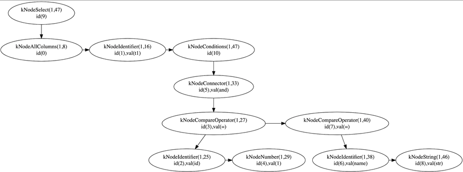
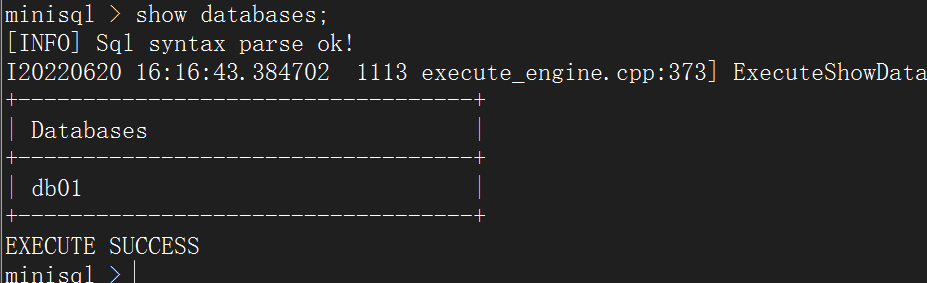
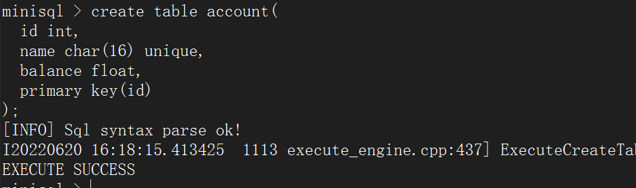
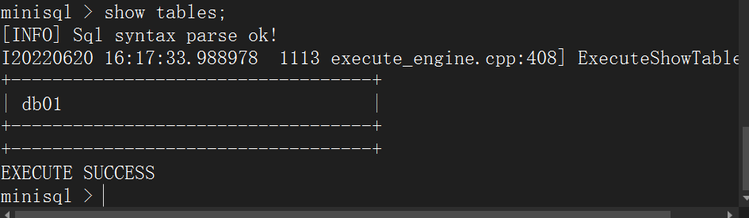
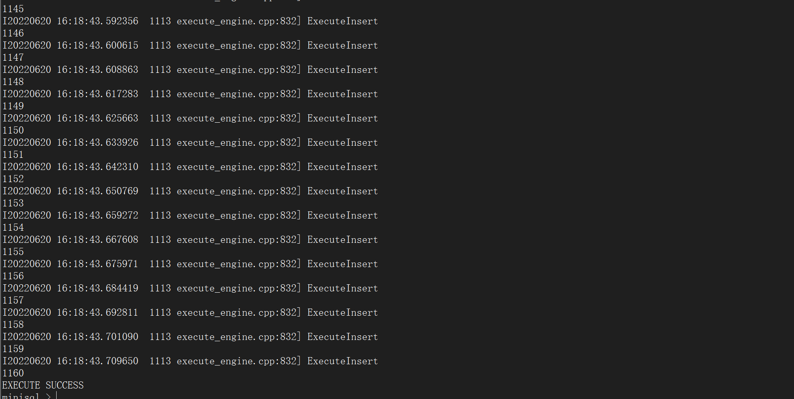
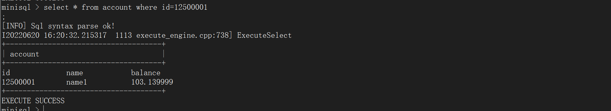
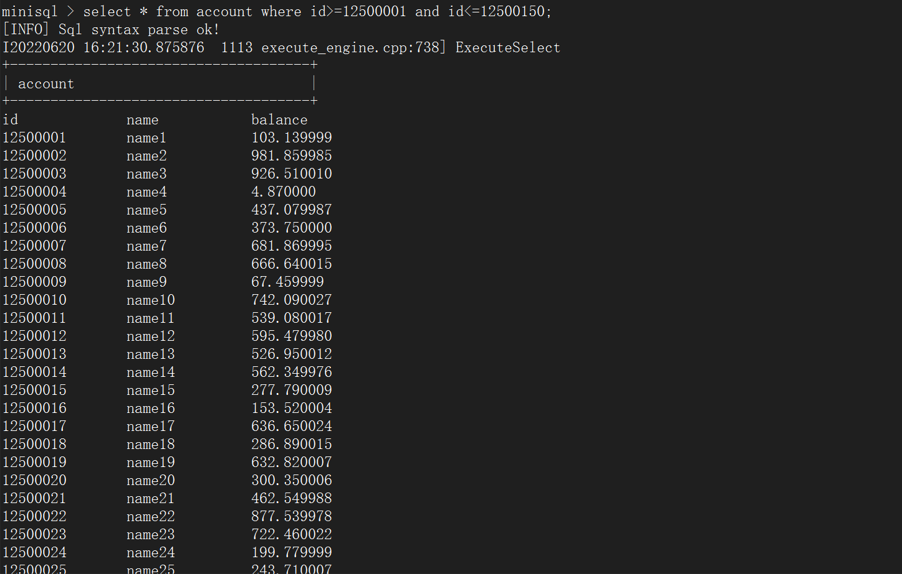
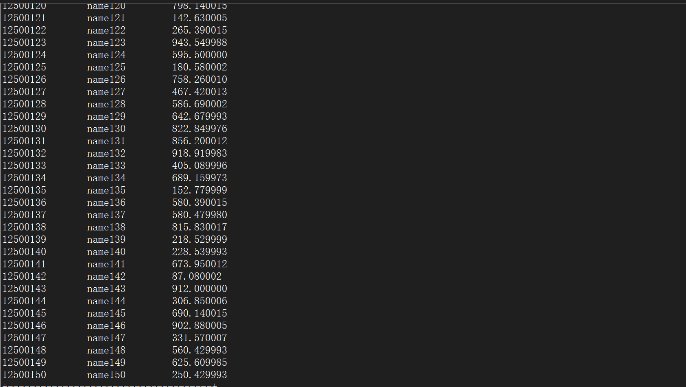
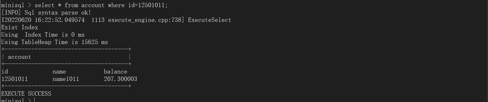

# SQL EXECUTOR

## 1. 实验概述

Executor（执行器）的主要功能是根据解释器（Parser）生成的语法树，通过Catalog Manager 提供的信息生成执行计划，并调用 Record Manager、Index Manager 和 Catalog Manager 提供的相应接口进行执行，最后通过执行上下文`ExecuteContext`将执行结果返回给上层模块。

在本实验中，助教已经在框架中设计好MiniSQL中的Parser模块，与Parser模块的相关代码如下：（具体代码可以在工程中查看修改，此处不做说明）

- `src/include/parser/minisql.l`：SQL的词法分析规则；
- `src/include/parser/minisql.y`：SQL的文法分析规则；
- `src/include/parser/minisql_lex.h`：`flex(lex)`根据词法规则自动生成的代码；
- `src/include/parser/minisql_yacc.h`：`bison(yacc)`根据文法规则自动生成的代码；
- `src/include/parser/parser.h`：Parser模块相关的函数定义，供词法分析器和语法分析器调用存储分析结果，同时可供执行器调用获取语法树根结点；
- `src/include/parser/syntax_tree.h`：语法树相关定义，语法树各个结点的类型同样在`SyntaxNodeType`中被定义。

### 1.1 语法树数据结构

以下是语法树（结点）的数据结构定义，每个结点都包含了一个唯一标识符`id_`，唯一标识符在调用`CreateSyntaxNode`函数时生成（框架中已经给出实现）。`type_`表示语法树结点的类型，`line_no_`和`col_no_`表示该语法树结点对应的是SQL语句的第几行第几列，`child_`和`next_`分别表示该结点的子结点和兄弟结点，`val_`用作一些额外信息的存储（如在`kNodeString`类型的结点中，`val_`将用于存储该字符串的字面量）。
__架构说明 :__ 此语法树节点需要注意，所有的查询语句中出现的信息都会出现在`val_`域中，包括表名，属性名，或者属性值等多种信息

```cpp
/**
 * Syntax node definition used in abstract syntax tree.
 */
struct SyntaxNode {
  int id_;    /** node id for allocated syntax node, used for debug */
  SyntaxNodeType type_; /** syntax node type */
  int line_no_; /** line number of this syntax node appears in sql */
  int col_no_;  /** column number of this syntax node appears in sql */
  struct SyntaxNode *child_;  /** children of this syntax node */
  struct SyntaxNode *next_;   /** siblings of this syntax node, linked by a single linked list */
  char *val_; /** attribute value of this syntax node, use deep copy */
};
typedef struct SyntaxNode *pSyntaxNode;
```

举一个简单的例子，`select * from t1 where id = 1 and name = "str";`这一条SQL语句生成的语法树如下。以根结点为例说明，`kNodeSelect`为结点的类型，`(1,47)`表示该结点在规约（*reduce*，编译原理中的术语）后位于行的第1行第47列（语句末），`id(9)`表示该结点的`id_`为`9`。

## 2. 解析语法树完成命令执行

Parser模块中目前能够支持以下类型的SQL语句。其中包含了一些在语法定义上正确，但在语义上错误的SQL语句（如Line 8～10）需要我们在执行器中对这些特殊情况进行处理。此外涉及到事务开启、提交和回滚相关的`begin`、`commit`和`rollback`命令在此个版本中暂未实现。

```sql
create database db0;
drop database db0;
show databases;
use db0;
show tables;
create table t1(a int, b char(20) unique, c float, primary key(a, c));
create table t1(a int, b char(0) unique, c float, primary key(a, c));
create table t1(a int, b char(-5) unique, c float, primary key(a, c));
create table t1(a int, b char(3.69) unique, c float, primary key(a, c));
create table t1(a int, b char(-0.69) unique, c float, primary key(a, c));
create table student(
  sno char(8),
  sage int,
  sab float unique,
  primary key (sno, sab)
);
drop table t1;
create index idx1 on t1(a, b);
-- "btree" can be replaced with other index types
create index idx1 on t1(a, b) using btree;
drop index idx1;
show indexes;
select * from t1;
select id, name from t1;
select * from t1 where id = 1;
-- note: use left association
select * from t1 where id = 1 and name = "str";
select * from t1 where id = 1 and name = "str" or age is null and bb not null;
insert into t1 values(1, "aaa", null, 2.33);
delete from t1;
delete from t1 where id = 1 and amount = 2.33;
update t1 set c = 3;
update t1 set a = 1, b = "ccc" where b = 2.33;
begin;
commit;
rollback;
quit;
execfile "a.txt";
```

在Parser模块调用`yyparse()`（一个示例在`src/main.cpp`中）完成SQL语句解析后，将会得到语法树的根结点`pSyntaxNode`，将语法树根结点传入执行器`ExecuteEngine`（定义于`src/include/executor/execute_engine.h`）后，`ExecuteEngine`将会根据语法树根结点的类型，分发到对应的执行函数中，以完成不同类型SQL语句的执行。

在本节中，我们需要实现`ExecuteEngine`中所有的执行函数，它们被声明为`private`类型的成员，即所有的执行过程对上层模块是隐藏的，上层模块只需要调用`ExecuteEngine::execute()`并传入语法树结点即可无感知地获取到执行结果。

此模块由于要实现的函数功能较多，并且代码实现较为复杂，生成的代码重复度较高，代码量较大，故具体的代码实现只给出部分较为重要精妙的设计，其他设计可以自行在工程文件中查看：

- `ExecuteEngine::ExecuteCreateDatabase(*ast, *context)`

  具体代码实现参照工程文件，实现较为简单

- `ExecuteEngine::ExecuteDropDatabase(*ast, *context)`

  具体代码实现参照工程文件，实现较为简单

- `ExecuteEngine::ExecuteShowDatabases(*ast, *context)`

  具体代码实现参照工程文件，实现较为简单

- `ExecuteEngine::ExecuteUseDatabase(*ast, *context)`

  具体代码实现参照工程文件，实现较为简单

- `ExecuteEngine::ExecuteShowTables(*ast, *context)`

  具体代码实现参照工程文件，实现较为简单

- `ExecuteEngine::ExecuteCreateTable(*ast, *context)`

  具体实现通过直接调用catalog模块提供的接口实现，参照工程文件

- `ExecuteEngine::ExecuteDropTable(*ast, *context)`

  具体实现通过直接调用catalog模块提供的接口实现，参照工程文件

- `ExecuteEngine::ExecuteShowIndexes(*ast, *context)`

  具体实现通过调用catalog模块提供的`GetIndexes`方法实现，参照工程文件

- `ExecuteEngine::ExecuteCreateIndex(*ast, *context)`

  具体实现通过取出语法树信息并调用catalog模块提供的`CreateIndex`方法进行实现，参照工程文件

- `ExecuteEngine::ExecuteDropIndex(*ast, *context)`

  具体实现通过调用catalog模块接口即可实现，参照工程文件

- `ExecuteEngine::ExecuteSelect(*ast, *context)`
  __接口设计说明 :__ 此处的上层调用模块无需修改，由框架提供，其中返回值需要根据各种特殊情况进行判断，最终返回一个操作状态；`context`参数在我们的实现中属于不需要使用的多余参数，`ast`参数是语法树的根节点，需要根据`next_`找到兄弟节点，或者根据`child_`找到孩子节点的方法对语法树进行遍历，解析语法树的含义。
  __实现思路说明 :__ 每个executor函数的执行思路第一步首先都是找到`Executor`类中的`StorageEngine`以及`CatalogManager`，方便后续的处理和更新。第二步都是通过遍历语法树将操作的含义进行解析（因此后续可以考虑封装），并在这个过程中将语句中不符合规范或者不应该继续执行的情况进行初步判断并返回操作错误原因。第三步对于select功能来说，是找到对应的表，并查询是否可以使用index进行加速；如果可以，直接使用index加速查找，并将返回的结果构建进行展示；如果不可以使用index，则需要使用堆表遍历，直到将所有记录遍历结束，并将结果返回，构建表格并最终展示在标准输出上。

  ```cpp
  dberr_t ExecuteEngine::ExecuteSelect(pSyntaxNode ast, ExecuteContext *context) {
  #ifdef ENABLE_EXECUTE_DEBUG
    LOG(INFO) << "ExecuteSelect" << std::endl;
  #endif
    dberr_t state = DB_FAILED;
    // Step0: Prepare StorageEngine and CatalogManager
    // Get the Storage of the DbstorageEngine
    auto StorageEngine_Iter = this->dbs_.find(this->current_db_);
    auto Current_Storage_Engine = StorageEngine_Iter->second;
    auto Current_Ctr = Current_Storage_Engine->catalog_mgr_;
  
    // Get the TableName
    pSyntaxNode ast_TableName = ast->child_->next_;
    std::string TableName(ast_TableName->val_);
    TableInfo *CurTableInfo = nullptr;
    Current_Ctr->GetTable(TableName, CurTableInfo);
    TableHeap *CurTableHeap = CurTableInfo->GetTableHeap();
  
    // We need to Do the Projection for the All Column
    std::vector<RowId> Result;
    std::vector<uint32_t> Map;
    if (ast->child_->type_ == kNodeColumnList) {
      // 1.Get the TableName
      TableName = ast->child_->next_->val_;
      // 2.Get the Column Will Show on the Result
  
      for (pSyntaxNode node = ast->child_->child_; node != nullptr; node = node->next_) {
        // Find the Column Index in the Schema
        uint32_t index = 0;
        GetColumnIndex(Current_Ctr, string(node->val_), TableName, index);
        Map.push_back(index);
      }
    }
  
    // We Do not Need to the Projection
    else {
      uint32_t length = CurTableInfo->GetSchema()->GetColumnCount();
      for (uint32_t i = 0; i < length; i++) {
        Map.push_back(i);
      }
    }
    // 3. Exist Condition StateMent
    clock_t out_diff;
    if (ast->child_->next_->next_ != nullptr) {
      clock_t start, end;
      start = clock();
      GetSatifedRowSet(ast, TableName, Current_Ctr, Result);
      end = clock();
      clock_t diff = end - start;
      out_diff = diff;
    }
  
    else {
      // 4.Not Exist the Condition StateMent- Get All Row
      for (auto iter = CurTableInfo->GetTableHeap()->Begin(nullptr); iter != CurTableInfo->GetTableHeap()->End();
           ++iter) {
        Result.push_back(iter->GetRowId());
      }
    }
    // Print the Table Name
    std::cout << "+-------------------------------------+" << endl;
    std::cout << "| " << left << setw(36) << TableName << '|' << endl;
    std::cout << "+-------------------------------------+" << endl;
  
    Schema *CurSchema = CurTableInfo->GetSchema();
    std::vector<Column *> CurColumns = CurSchema->GetColumns();
  
    for (auto i : Map) {
      std::cout << left << setw(12) << CurColumns[i]->GetName() << "\t";
    }
  
    std::cout << endl;
    std::vector<Field *> Fields;
    // Row Result Stored in the Vector
    for (auto iter : Result) {
      Row NewRow(iter);
      CurTableHeap->GetTuple(&NewRow, nullptr);
      Fields = NewRow.GetFields();
  
      for (auto i : Map) {
        string Data;
        Fields[i]->GetDataToString(Data);
        std::cout << left << setw(12) << Data << "\t";
      }
      state = DB_SUCCESS;
      std::cout << endl;
    }
    std::cout << "+-------------------------------------+" << endl;
    printf("\n\nThe total time of selection is: %ld ticks\n\n", out_diff);
    return state;
  }
  ```

- `ExecuteEngine::ExecuteInsert(*ast, *context)`

  ```cpp
  // NOTE:: Due to Index Part Has not be Implemented , So Insert to Index not Implemented yet
  dberr_t ExecuteEngine::ExecuteInsert(pSyntaxNode ast, ExecuteContext *context) {
  #ifdef ENABLE_EXECUTE_DEBUG
    LOG(INFO) << "ExecuteInsert" << std::endl;
  #endif
    if (this->current_db_.empty()) {
      std::cerr << "Choose the DataBase First" << std::endl;
      return DB_FAILED;
    } else {
      // Step0: Prepare StorageEngine and CatalogManager
      // Get the Storage of the DbstorageEngine
      auto StorageEngine_Iter = this->dbs_.find(this->current_db_);
      auto Current_Storage_Engine = StorageEngine_Iter->second;
      auto Current_Ctr = Current_Storage_Engine->catalog_mgr_;
  
      // Step1: Check the Table is in the CatalogManager or not
      // Get the Table Name
      pSyntaxNode ast_TableName = ast->child_;
      std::string TableName = (ast_TableName->val_);
      TableInfo *CurTableInfo = nullptr;
      dberr_t state = Current_Ctr->GetTable(TableName, CurTableInfo);
      std::vector<Field> Fields;
      // Get the MemHeap
      MemHeap *CurMemHeap = CurTableInfo->GetMemHeap();
  
      // Table is not Exists in the Current Database
      if (state == DB_TABLE_NOT_EXIST) {
        std::cerr << "Choose the DataBase First" << std::endl;
        return DB_FAILED;
      } else {
        // 0. Get the Shema of the Table
        Schema *CurSchema = CurTableInfo->GetSchema();
        std::vector<Column *> Columns = CurSchema->GetColumns();
        int CurPosition = 0;
        dberr_t state;
  
        for (pSyntaxNode ColumnNode = ast_TableName->next_->child_; ColumnNode != nullptr;
             ColumnNode = ColumnNode->next_, CurPosition++) {
          // 1. Check Value Type
          // 2. Check Not null
          // 3. Get the Entity of the Fields
          switch (ColumnNode->type_) {
            case SyntaxNodeType::kNodeNull:
              // Current Column can not be null
              if (Columns[CurPosition]->IsNullable() == false) {
                state = DB_FAILED;
              } else {
                char *mem = (char *)CurMemHeap->Allocate(sizeof(char) * 5);
                strcpy(mem, "null");
                Fields.push_back(Field(kTypeChar, mem, 5, true));
                state = DB_SUCCESS;
              }
              break;
  
            case SyntaxNodeType::kNodeNumber:
              if (Columns[CurPosition]->GetType() == kTypeInt || Columns[CurPosition]->GetType() == kTypeFloat) {
                if (Columns[CurPosition]->GetType() == kTypeInt) {
                  std::string str(ColumnNode->val_);
                  int Number = atoi(str.c_str());
                  Fields.push_back(Field(kTypeInt, Number));
                } else if (Columns[CurPosition]->GetType() == kTypeFloat) {
                  std::string str(ColumnNode->val_);
                  float f = atof(str.c_str());
                  Fields.push_back(Field(kTypeFloat, f));
                }
                state = DB_SUCCESS;
  
              } else {
                state = DB_FAILED;
              }
              break;
  
            case SyntaxNodeType::kNodeString:
              if (Columns[CurPosition]->GetType() == kTypeChar) {
                Fields.push_back(Field(kTypeChar, ColumnNode->val_, Columns[CurPosition]->GetLength(), true));
                state = DB_SUCCESS;
              } else {
                state = DB_FAILED;
              }
              break;
  
            default:
              state = DB_FAILED;
              break;
          }
          if (state == DB_FAILED) {
            return state;
          }
  
          // 3. Check Unique
          // Traverse the TableHeap to Check the New Inserted Column is Unique or Not
          if (Columns[CurPosition]->IsUnique() == true) {
            TableHeap *CurTableHeap = CurTableInfo->GetTableHeap();
            for (TableIterator iter = CurTableHeap->Begin(nullptr); iter != CurTableHeap->End(); iter++) {
              // if there is value in the Table Heap is Equal with the NewInserted Tuple
              if (iter->GetField(CurPosition)->CompareEquals(Fields[CurPosition]) == kTrue) {
                state = DB_FAILED;
                break;
              }
            }
          }
          if (state == DB_FAILED) {
            return state;
          }
        }
        // 4. Insert Tuple
        TableHeap *CurTableHeap = CurTableInfo->GetTableHeap();
        Row NewRow(Fields);
        bool InsertState = CurTableHeap->InsertTuple(NewRow, nullptr);
  
        if (InsertState) {
          // 5. Update the Index to The Correspoding the Index
          // Step1- Get All Index From the Correspoding TableName
          std::vector<std::string> IndexName;
          dberr_t state = Current_Ctr->GetAllIndexNames(TableName, IndexName);
          if (state != DB_INDEX_NOT_FOUND) {
            // There are Index for the Table needed to Update
            for (std::vector<std::string>::iterator iter = IndexName.begin(); iter != IndexName.end(); iter++) {
              IndexInfo *index_info = nullptr;
              if (Current_Ctr->GetIndex(TableName, (*iter), index_info) == DB_SUCCESS) {
                // Get the KeyMap
                std::vector<uint32_t> KeyMap = index_info->GetMetaData()->GetKeyMapping();
                std::vector<Field> fields;
                // Using the KeyMap to GetField In order to Get the Key Schema
                for (std::vector<uint32_t>::iterator iter = KeyMap.begin(); iter != KeyMap.end(); iter++) {
                  fields.push_back(*(NewRow.GetField(KeyMap[(*iter)])));
                }
                Row IndexRow(fields);
                RowId rid(NewRow.GetRowId());
                index_info->GetIndex()->InsertEntry(IndexRow, NewRow.GetRowId(), nullptr);
              }
            }
          }
          return DB_SUCCESS;
  
        } else {
          std::cout << "InsertTuple Failed" << endl;
          return DB_FAILED;
        }
      }
    }
  
    return DB_FAILED;
  }
  ```

- `ExecuteEngine::ExecuteDelete(*ast, *context)`

  和select实现逻辑类似，通过多种情况判断即可实现，参照工程文件

- `ExecuteEngine::ExecuteExecfile(*ast, *context)`

  ```cpp
  dberr_t ExecuteEngine::ExecuteExecfile(pSyntaxNode ast, ExecuteContext *context) {
  #ifdef ENABLE_EXECUTE_DEBUG
    LOG(INFO) << "ExecuteExecfile" << std::endl;
  #endif
    string FileName(ast->child_->val_);
    std::ifstream fin;
    fin.open(FileName, std::ios::in);
    if (!fin) {
      cout << "Open Failed" << endl;
      return DB_FAILED;
    }
    char line[1024] = {0};
    // int buf_size = 1024;
    string tmp;
  
    while (fin.getline(line, sizeof(line))) {
      std::stringstream word(line);
      string result;
      int flag = 0;
      while (word) {
        word >> tmp;
        if (flag != 0) result += " ";
        result += tmp;
        flag++;
      }
      cout << result << endl;
      YY_BUFFER_STATE bp = yy_scan_string(line);
      if (bp == nullptr) {
        LOG(ERROR) << "Failed to create yy buffer state." << std::endl;
        exit(1);
      }
      yy_switch_to_buffer(bp);
  
      // init parser module
      MinisqlParserInit();
  
      // parse
      yyparse();
  
      // parse result handle
      if (MinisqlParserGetError()) {
        // error
        printf("%s\n", MinisqlParserGetErrorMessage());
      } else {
        printf("[INFO] Sql syntax parse ok!\n");
      }
  
      ExecuteContext context;
      dberr_t exe_rst = Execute(MinisqlGetParserRootNode(), &context);
      if (exe_rst == DB_SUCCESS) {
        printf("EXECUTE SUCCESS\n");
      } else if (exe_rst == DB_FAILED) {
        printf("EXECUTE FAILED\n");
      }
  
      // clean memory after parse
      MinisqlParserFinish();
      yy_delete_buffer(bp);
      yylex_destroy();
  
      // quit condition
      if (context.flag_quit_) {
        printf("bye!\n");
        break;
      }
    }
  
    return DB_SUCCESS;
  }
  ```

- `ExecuteEngine::ExecuteQuit(*ast, *context)`

  框架已经实现，参照工程文件

- 辅助函数
  这些辅助函数由select调用，可以在多种情况判断的时候减少冗余代码，直接调用即可实现相关功能。

  ```cpp
  void GetFieldFromString(TypeId KeyTypeId, string StringValue, uint32_t length, std::vector<Field> &fields) {
    if (KeyTypeId == TypeId::kTypeChar) {
      fields.push_back(Field(KeyTypeId, const_cast<char *>(StringValue.c_str()), length, true));
    } else if (KeyTypeId == TypeId::kTypeInt) {
      int value = atoi(StringValue.c_str());
      fields.push_back(Field(KeyTypeId, value));
    } else if (KeyTypeId == TypeId::kTypeFloat) {
      float value = atof(StringValue.c_str());
      fields.push_back(Field(KeyTypeId, value));
    }
  }
  void GetColumnIndex(CatalogManager *Curr_Ctr, string ColumnName, string TableName, uint32_t &ColumnIndex) {
    Schema *TableSchema = nullptr;
    TableInfo *table_info = nullptr;
    if (Curr_Ctr->GetTable(TableName, table_info) == DB_SUCCESS) {
      TableSchema = table_info->GetSchema();
      if (TableSchema->GetColumnIndex(ColumnName, ColumnIndex) != DB_SUCCESS) {
        // Current Column is not Exist in the Table
        std::cerr << "Current Column is  not Exist in the Table" << std::endl;
      }
    }
  }
  // Note: We only can use one connector
  void GetSatisfiedRow(pSyntaxNode Curr_Node, CatalogManager *Curr_Ctr, string TableName, std::vector<RowId> &Result) {
    bool state = false;
  
    // 1.Get the KeyIndex From the Node
    string ColumnName = (Curr_Node->child_->val_);
    // 2.Get the Key From the Next Node
    string StringValue = (Curr_Node->child_->next_->val_);
    uint32_t ColumnIndex = 0;
  
    // 3. Get the Column Index in the Schema
    Schema *TableSchema = nullptr;
    TableInfo *table_info = nullptr;
    if (Curr_Ctr->GetTable(TableName, table_info) == DB_SUCCESS) {
      TableSchema = table_info->GetSchema();
      if (TableSchema->GetColumnIndex(ColumnName, ColumnIndex) != DB_SUCCESS) {
        // Current Column is not Exist in the Table
        std::cerr << "Current Column is  not Exist in the Table" << std::endl;
      }
    }
  
    // 4.Using Column Index to Judge Exist the Index Or not
    std::vector<IndexInfo *> indexes;
    // Get All Indexes For the Correspoding TableName
    dberr_t GetIndexState = Curr_Ctr->GetTableIndexes(TableName, indexes);
    IndexInfo *ExistIndexInfo = nullptr;
    int flag = 0;
    if (GetIndexState == DB_SUCCESS) {
      // Find All index For the Table
      for (auto iter : indexes) {
        std::vector<uint32_t> KeyMap = iter->GetMetaData()->GetKeyMapping();
        // Judge Exist Index Or not
        for (auto i : KeyMap) {
          if (i == ColumnIndex) {
            // Exist Index
            flag = 1;
            break;
          }
        }
        if (flag) {
          // Get IndexInfo for the Existing Index
          ExistIndexInfo = iter;
          state = true;
          break;
        }
      }
    }
  
    string Connector = string(Curr_Node->val_);
    TypeId KeyTypeId = TableSchema->GetColumn(ColumnIndex)->GetType();
    uint32_t length = TableSchema->GetColumn(ColumnIndex)->GetLength();
  
    std::vector<Field> fields;
    GetFieldFromString(KeyTypeId, StringValue, length, fields);
    if (Connector == "=") {
      if (state) {
        // Exist the Index
  
        Row row(fields);
        ExistIndexInfo->GetIndex()->ScanKey(row, Result, nullptr);
  
      } else {
        // Using Table Heap
        for (auto iter = table_info->GetTableHeap()->Begin(nullptr); iter != table_info->GetTableHeap()->End(); ++iter) {
          if (iter->GetField(ColumnIndex)->CompareEquals(fields.front()) == CmpBool::kTrue) {
            Result.push_back(iter->GetRowId());
          }
        }
      }
    } else if (Connector == "<>") {
      // Using Table Heap
      for (auto iter = table_info->GetTableHeap()->Begin(nullptr); iter != table_info->GetTableHeap()->End(); ++iter) {
        if (iter->GetField(ColumnIndex)->CompareNotEquals(fields.front()) == CmpBool::kTrue) {
          Result.push_back(iter->GetRowId());
        }
      }
  
    } else if (Connector == ">=") {
      // Using Table Heap
      for (auto iter = table_info->GetTableHeap()->Begin(nullptr); iter != table_info->GetTableHeap()->End(); ++iter) {
        if (iter->GetField(ColumnIndex)->CompareGreaterThanEquals(fields.front()) == CmpBool::kTrue) {
          Result.push_back(iter->GetRowId());
        }
      }
  
    } else if (Connector == "<=") {
      // Using Table Heap
      for (auto iter = table_info->GetTableHeap()->Begin(nullptr); iter != table_info->GetTableHeap()->End(); ++iter) {
        if (iter->GetField(ColumnIndex)->CompareLessThanEquals(fields.front()) == CmpBool::kTrue) {
          Result.push_back(iter->GetRowId());
        }
      }
  
    } else if (Connector == "<") {
      // Using Table Heap
      for (auto iter = table_info->GetTableHeap()->Begin(nullptr); iter != table_info->GetTableHeap()->End(); ++iter) {
        if (iter->GetField(ColumnIndex)->CompareLessThan(fields.front()) == CmpBool::kTrue) {
          Result.push_back(iter->GetRowId());
        }
      }
  
    } else if (Connector == ">") {
      // Using Table Heap
      for (auto iter = table_info->GetTableHeap()->Begin(nullptr); iter != table_info->GetTableHeap()->End(); ++iter) {
        if (iter->GetField(ColumnIndex)->CompareGreaterThan(fields.front()) == CmpBool::kTrue) {
          Result.push_back(iter->GetRowId());
        }
      }
    }
  }
  void AndRow(const std::vector<RowId> &Result1, const std::vector<RowId> &Result2, std::vector<RowId> &Result) {
    for (auto i : Result1) {
      for (auto j : Result2) {
        if (i == j) {
          Result.push_back(i);
          break;
        }
      }
    }
  }
  void UnionRow(std::vector<RowId> &Result1, std::vector<RowId> &Result2, std::vector<RowId> &Result) {
    for (auto i : Result1) {
      Result.push_back(i);
    }
    for (auto i : Result2) {
      int flag = 0;
      for (auto j : Result) {
        if (i == j) {
          flag = 1;
          break;
        }
      }
      // it means The Elements in the Result1 Does not Overlap With the Result2
      if (flag == 0) {
        Result.push_back(i);
      }
    }
  }
  void GetSatifedRowSet(pSyntaxNode ast, string TableName, CatalogManager *Current_Ctr, std::vector<RowId> &Result) {
    pSyntaxNode Curr_Node = ast->child_->next_->next_->child_;
  
    // Condition StateMent Exists
    // Connector Exists
    if (Curr_Node->type_ == kNodeConnector) {
      std::vector<RowId> Result1;
      GetSatisfiedRow(Curr_Node->child_, Current_Ctr, TableName, Result1);
      std::vector<RowId> Result2;
      GetSatisfiedRow(Curr_Node->child_->next_, Current_Ctr, TableName, Result2);
  
      if (string(Curr_Node->val_) == "and") {
        AndRow(Result1, Result2, Result);
      } else if (string(Curr_Node->val_) == "or") {
        UnionRow(Result1, Result2, Result);
      }
    } else if (Curr_Node->type_ == kNodeCompareOperator) {
      // If it exists Index-index_info
  
      GetSatisfiedRow(Curr_Node, Current_Ctr, TableName, Result);
    }
  }
  ```

- `ExecuteEngine::ExecuteTrxBegin(*ast, *context)`：事务相关，暂未实现

- `ExecuteEngine::ExecuteTrxCommit(*ast, *context)`：事务相关，暂未实现

- `ExecuteEngine::ExecuteTrxRollback(*ast, *context)`：事务相关，暂未实现

**Note:** 执行结果上下文`ExecuteContext`中提供了部分可能需要用到的数据，在后续拓展的时候根据需要自行定义`ExecuteContext`即可。

```cpp
/**
 * ExecuteContext stores all the context necessary to run in the execute engine
 * This struct is implemented by student self for necessary.
 *
 * eg: transaction info, execute result...
 */
struct ExecuteContext {
  bool flag_quit_{false};
  Transaction *txn_{nullptr};
};
```

通过添加构造函数和析构函数中对于记录数据库文件的文件信息，可以实现简单的多数据库文件管理，但是这样的管理必须通过quit语句才能够及时更新，如果需要每次操作都进行更新，对于IO负担又会急剧增加，故后续可以考虑其他的catalog模式从而让catalog成为单独管理的单元，独立于其他模块页即可，此处给出实现的方法，即构造与析构函数，具体代码实现如下所示：

- `ExecuteEngine::ExecuteEngine();`

  ```cpp
  ExecuteEngine::ExecuteEngine() {
    // find the file in the bin file folder, and fill the contents in the object
    // all the private value can be initialized by using the disk manager when used.
    // add the txt file implementation, format -> every line contains a database storage file's name (of course no spaces
    // and other white space)
    std::fstream db_contents;
    const std::string contents_name("content.txt");
    // read, do not need refreshing
    db_contents.open(contents_name, std::ios::in | std::ios::out);
    if (!db_contents.is_open()) {
      db_contents.clear();
      db_contents.open(contents_name, std::ios::trunc | std::ios::out);
      db_contents.close();
      db_contents.open(contents_name, std::ios::in | std::ios::out);
      if (!db_contents.is_open()) {
        std::cerr << "Can not open the content file!" << std::endl;
      }
    }
    // if the program keeps running to here, then the file has been opened successfully
    // the current_db_ needs to be initialized after usedatabase is executed.
    std::string db_file_names;
    while (db_contents >> db_file_names) {
      if (!db_file_names.empty()) {
        DBStorageEngine *store_eng = new DBStorageEngine(db_file_names, false);
        this->dbs_.emplace(db_file_names, store_eng);
      }
    }
    db_contents.close();
  }
  ```

- `ExecuteEngine::~ExecuteEngine();`

  ```cpp
  ~ExecuteEngine() {
      // add write back to file content.txt
      std::fstream db_contents;
      const std::string contents_name("content.txt");
      remove(contents_name.c_str()); // write, need refreshing
      db_contents.open(contents_name, std::ios::in | std::ios::out);
      if (!db_contents.is_open()) {
        db_contents.clear();
        db_contents.open(contents_name, std::ios::trunc | std::ios::out); // do the creation of file if the file does not exist.
        db_contents.close();
        db_contents.open(contents_name, std::ios::in | std::ios::out);
        if (!db_contents.is_open()) {
          std::cerr << "Can not open the content file!" << std::endl;
        }
      }
      for (auto it : dbs_) {
        db_contents << it.first << std::endl;
        delete it.second;
      }
      db_contents.close();
    }
  ```

## 3. 模块相关代码

- `src/main.cpp`
- `src/include/executor/execute_engine.h`
- `src/executor/execute_engine.cpp`

## 4. 整体模块测试效果

+ ShowDataBases


+ Create Database

  

+ Create Tables

  

+ Show Tables

  

+ 批量导入

  

+ Select 

  + Select * from account

    

  + Select * from account where （条件1）

    

  + Select * from account where （条件1）operator(条件2)

    

    

+ Index

  + Create Index

    

    

  + Select * from account where (condition 1) and (Condition 2)

    

+ Delete

  + Delete from account where (condition)

  