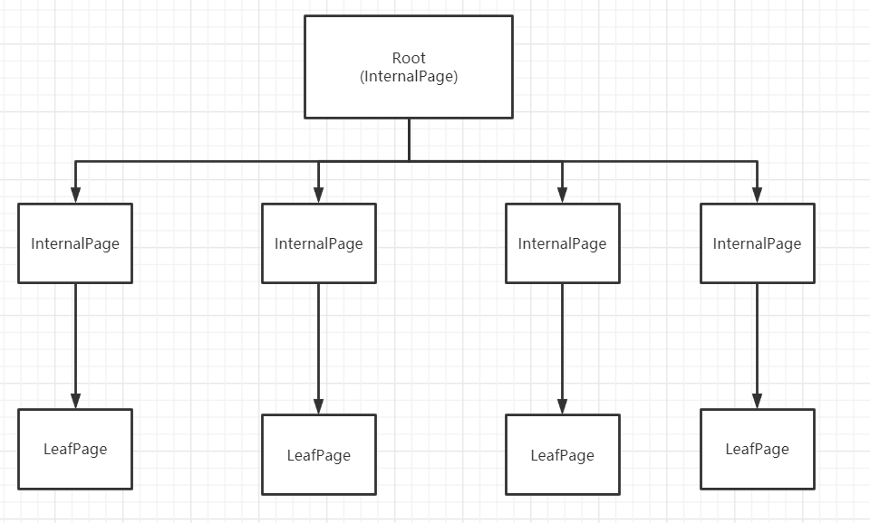
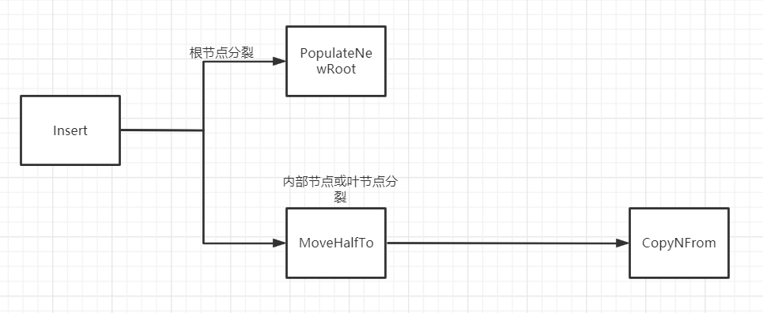
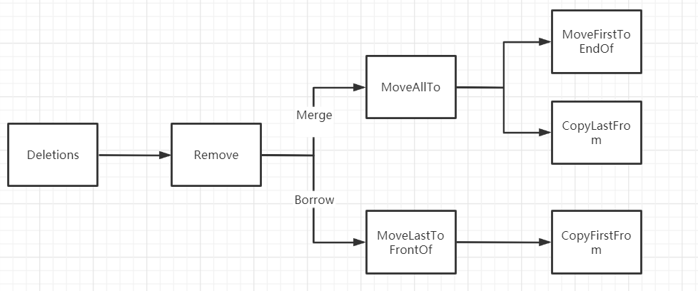
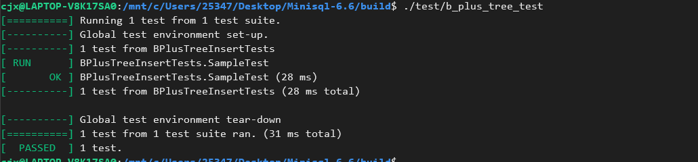
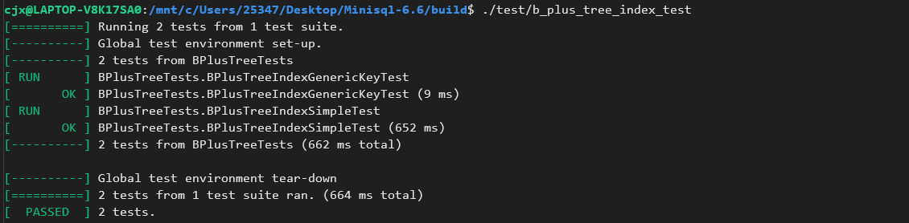
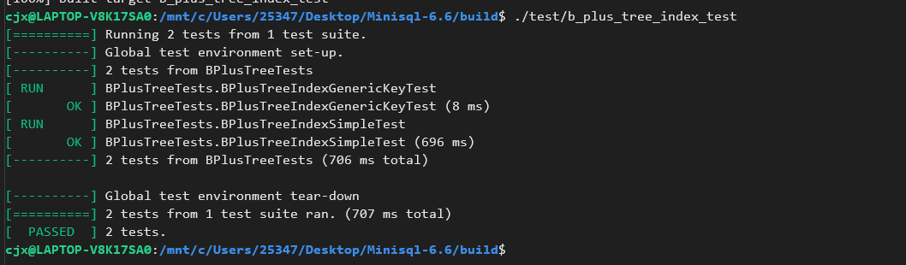

# INDEX MANAGER

## 1. 实验概述

Index Manager 负责数据表索引的实现和管理，包括：索引的创建和删除，索引键的等值查找，索引键的范围查找（返回对应的迭代器），以及插入和删除键值等操作，并对外提供相应的接口。

由于通过堆表遍历来进行查找记录效率过于低下，因此本实验实现了一个基于磁盘的B+树动态索引结构。

## 2. 实验总体框架



可以看到需要实现的B+树的结构，由于内部节点和叶节点的结构不同，因此在实现B+树需要分别实现`BPlusTreePage`和`BPlusInternalPage`，最后根据B+树的操作分别调用数据页中提供的接口函数。

## 2. B+树数据页

### 2.1 BPlusTreePage

由于`LeafPage`和`InternalPage`均是继承自`BplusTreePage`，因此需要先实现BPlusTreePage

+ 数据结构

  ```c
  ● page_type_: 标记数据页是中间结点还是叶子结点；
  ● lsn_: 数据页的日志序列号，目前不会用到，如果之后感兴趣做Crash Recovery相关的内容需要用到；
  ● size_: 当前结点中存储Key-Value键值对的数量；
  ● max_size_: 当前结点最多能够容纳Key-Value键值对的数量；
  ● parent_page_id_: 父结点对应数据页的page_id;
  ● page_id_: 当前结点对应数据页的page_id。
  ```

  

### 2.2 BPlusTreeLeafPage

+ 数据结构

  ```c
  /* 
   * Leaf page format (keys are stored in order):
   *  ----------------------------------------------------------------------
   * | HEADER | KEY(1) + RID(1) | KEY(2) + RID(2) | ... | KEY(n) + RID(n)
   *  ----------------------------------------------------------------------
   *
   *  Header format (size in byte, 24 bytes in total):
   *  ---------------------------------------------------------------------
   * | PageType (4) | CurrentSize (4) | MaxSize (4) | ParentPageId (4) |
   *  ---------------------------------------------------------------------
   *  ------------------------------
   * | PageId (4) | NextPageId (4)
   *  ------------------------------
   */
  ```

  

+ 函数

  下面我将对关键函数进行详细说明

  #### *Insert相关函数*

  + `BPlusTreeLeafPage::int Insert(const KeyType &key, const ValueType &value, const KeyComparator &comparator);`

    设计思路：
  
    1. 在相应的LeafPage插入记录，更新LeafPage的`Size`
    2. 插入完成后，返回`Size`，方便上层判断是否需要进行分裂。

    代码：
  
    ```c++
    INDEX_TEMPLATE_ARGUMENTS
    int B_PLUS_TREE_LEAF_PAGE_TYPE::Insert(const KeyType &key, const ValueType &value, const KeyComparator &comparator) {
      int index = -1;
      if (this->GetSize() + 1 <= this->GetMaxSize()) {
        for (int i = 0; i < this->GetSize(); i++) {
          // Find the Position Which the Key will insert into.
          if (comparator(key, this->array_[i].first) < 0) {
            index = i;
            break;
          }
        }
        // NewKey &Value should insert into end of the NewNode
        if (index == -1) {
          index = this->GetSize();
          if (this->GetSize() < this->GetMaxSize()) this->array_[index] = {key, value};
    
          this->IncreaseSize(1);
      /*    for (int i = 0; i < this->GetSize(); i++) {
            std::cout << this->array_[i].first  << endl;
          }*/
          return this->GetSize();
        }
        // NewKey& Value should insert into middle of the NewNode
        else {
          // Copy From the End to First
          for (int i = this->GetSize(); i > index; i--) {
            this->array_[i] = this->array_[i - 1];
          }
          // Insert the NewKey&Value into Right Position
          if (this->GetSize() < this->GetMaxSize()) this->array_[index] = {key, value};
          this->IncreaseSize(1);
          return this->GetSize();
        }
      } else {
        return this->GetSize()+1;
      }
    
    }
    ```
    
  + ` void MoveHalfTo(BPlusTreeLeafPage *recipient, BufferPoolManager *bufferpoolManager);`

    设计思路：

    在上述`Insert`操作之后，节点个数大于临界值，需要进行`Split`
  
    + 将此页一半的Key移动到接收页中
    + 更新相邻节点的页号
  
    代码：
  
    ```c++
    INDEX_TEMPLATE_ARGUMENTS
    void B_PLUS_TREE_LEAF_PAGE_TYPE::MoveHalfTo(BPlusTreeLeafPage *recipient,BufferPoolManager* bufferpoolManager) { 
    
        int DeleteSize = (this->GetMinSize());
        recipient->CopyNFrom(&this->array_[(this->GetSize()-this->GetMinSize())], DeleteSize);  // Recipient Increase Size Here
        if (this->GetNextPageId() != INVALID_PAGE_ID) {
          recipient->SetNextPageId(this->GetNextPageId());
        }
        this->SetNextPageId(recipient->GetPageId());
       
        //Decrease Size
        this->IncreaseSize(-recipient->GetSize());
    
    
    }
    ```
  
    
  
  + `void CopyNFrom(MappingType *items, int size);`
  
    设计思路：

    此函数是在MoveHalfTo函数的子函数，主要完成，复制的功能。
  
    + 将items[0]--items[size]的Element复制到此页中
  
    代码:
  
    ```c++
    INDEX_TEMPLATE_ARGUMENTS
    void B_PLUS_TREE_LEAF_PAGE_TYPE::CopyNFrom(MappingType *items, int size) { 
        
       
      // Copy Entries into This Page
      for (int i = 0; i < size; i++) {
           
          this->array_[i].first = items[i].first;
          this->array_[i].second = items[i].second;
        
      }
      // Increment the Size
      this->IncreaseSize(size);
    
    }
    ```
  
    
  
  #### *Remove相关函数*
  
  + `int RemoveAndDeleteRecord(const KeyType &key, const KeyComparator &comparator);`
  
    设计思路：
  
    + 首先在LeafPage进行查找相应的想要删除的`Key`
    + 如果存在，进行删除，不存在，返回
    + 返回值说明：返回`Size`以方便上层，进行判断，是否需要从兄弟节点`Merge`或者`Redistribute`。
  
    代码：
  
    ```c++
    INDEX_TEMPLATE_ARGUMENTS
    int B_PLUS_TREE_LEAF_PAGE_TYPE::RemoveAndDeleteRecord(const KeyType &key, const KeyComparator &comparator) { 
        bool state = false;
      
        for (int i = 0; i < this->GetSize(); i++) {
          if (comparator(key, this->array_[i].first) == 0) {
            state = true;
            int index = i;
            for (int i = index + 1; i < this->GetSize(); i++) {
              this->array_[i - 1].first = this->array_[i].first;
              this->array_[i - 1].second = this->array_[i].second;
            }
            this->IncreaseSize(-1);
            break;
          }
        }
     
        if (state == false) {
          return this->GetSize();
        }
        return this->GetSize();
    }
    ```
  
    


  + `  void MoveAllTo(BPlusTreeLeafPage *recipient);`

    设计思路：

    上述`RemoveAndDelete`函数可能出现Merge，此函数就是用来Merge功能的函数

    + 将所有的key，Value全部复制到接受页中

    代码：

    ```c++
    INDEX_TEMPLATE_ARGUMENTS
    void B_PLUS_TREE_LEAF_PAGE_TYPE::MoveAllTo(BPlusTreeLeafPage *recipient ) { 
        //Copy the Instance into the recipient Page
        for (int i = 0; i < this->GetSize(); i++) {
          recipient->CopyLastFrom(this->array_[i]);  // Add Size Here
        }
        
        this->IncreaseSize(-this->GetSize());                     // Decrease Size of this Page
        //Set the Next Page id.
        recipient->SetNextPageId(this->GetNextPageId());
    }
    ```

    

  + `void MoveFirstToEndOf(BPlusTreeLeafPage *recipient);`

    设计思路：

    上述`RemoveAndDelete`函数可能出现`Redistribute`，此函数就是用来`Redistribute`功能的函数

    + 将此页的 第一个 `key & value` 复制到 `recipient`

    代码：

    ```c++
    INDEX_TEMPLATE_ARGUMENTS
    void B_PLUS_TREE_LEAF_PAGE_TYPE::MoveFirstToEndOf(BPlusTreeLeafPage *recipient) { 
        recipient->CopyLastFrom(this->array_[0]);//Add Size Here
        //Remove the First Key
        for (int i = 0; i < this->GetSize()-1; i++) {
          this->array_[i] = this->array_[i + 1];  
        }
        this->IncreaseSize(-1);
    }
    
    ```

    

  + `  void MoveLastToFrontOf(BPlusTreeLeafPage *recipient);`

    设计思路：

    上述`RemoveAndDelete`函数可能出现`Redistribute`，此函数就是用来`Redistribute`功能的函数

    + 将此页的 末尾的 `key & value` 复制到 `recipient`

    代码：

    ```c++
    INDEX_TEMPLATE_ARGUMENTS
    void B_PLUS_TREE_LEAF_PAGE_TYPE::MoveLastToFrontOf(BPlusTreeLeafPage *recipient) {
    
      recipient->CopyFirstFrom(this->array_[this->GetSize() - 1]);
      this->IncreaseSize(-1);
    }
    
    ```


### 2.3 BPlusTreeInternalPage

+ 数据结构

  ```
  /*
   * Internal page format (keys are stored in increasing order):
   *  --------------------------------------------------------------------------
   * | HEADER | KEY(1)+PAGE_ID(1) | KEY(2)+PAGE_ID(2) | ... | KEY(n)+PAGE_ID(n) |
   *  --------------------------------------------------------------------------
   */
  ```

  

+ 函数说明

  #### *Insert相关函数*

  + `void PopulateNewRoot(const ValueType &old_value, const KeyType &new_key, const ValueType &new_value);`

    设计思路：

    此函数应用在如果Insert一直进行分裂，并且一直分裂到根节点，需要产生新的Root。

    + 将新产生的键值对插入RootNode

    代码：

    ```c++
    INDEX_TEMPLATE_ARGUMENTS
    void B_PLUS_TREE_INTERNAL_PAGE_TYPE::PopulateNewRoot(const ValueType &old_value, const KeyType &new_key,
                                                         const ValueType &new_value) 
    {
        
        //old_value means Old root-page id
      this->array_[0].second = old_value;
        SetKeyAt(1, new_key);
      this->array_[1].second = new_value;
      //Increase Size by two
      this->IncreaseSize(2);
    
    }
    ```

    

  + `int InsertNodeAfter(const ValueType &old_value, const KeyType &new_key, const ValueType &new_value);`

    设计思路：

    + 将键值对插入到`OldValue`之后。
    + 返回Size，来判断是否需要进行`Split`

    代码：

    ```
    INDEX_TEMPLATE_ARGUMENTS
    int B_PLUS_TREE_INTERNAL_PAGE_TYPE::InsertNodeAfter(const ValueType &old_value, const KeyType &new_key,
                                                        const ValueType &new_value) {
      //Get Index Of the old_value
      int index = ValueIndex(old_value);
      //If the index do not overflow 
      if (index + 1 < this->GetMaxSize()) {
        for (int i = this->GetSize(); i > index+1; i--) {
          if (i - 1 > 0) {
            this->array_[i] = this->array_[i - 1];
          } else {
            this->array_[i].second = this->array_[i - 1].second;      
          }
        }
        this->SetKeyAt(index + 1, new_key);
        array_[index + 1].second = new_value;
        this->IncreaseSize(1);
      } else {
        throw "B_PLUS_TREE_INTERNAL_PAGE_TYPE::InsertNodeAfter-OverFlow" ;
        return this->GetSize() + 1;
      }
      
      return this->GetSize();
    }
    ```
    
  + ` void MoveHalfTo(BPlusTreeInternalPage *recipient, BufferPoolManager *buffer_pool_manager);` 

    设计思路：

    + 将一半的键值对复制到接受页

    代码：

    ```
    INDEX_TEMPLATE_ARGUMENTS
    void B_PLUS_TREE_INTERNAL_PAGE_TYPE::MoveHalfTo(BPlusTreeInternalPage *recipient,
                                                    BufferPoolManager *buffer_pool_manager) {
      
      // Copy into the recipient Page
      recipient->CopyNFrom(&this->array_[this->GetSize()-this->GetMinSize()],this->GetMinSize(),buffer_pool_manager);
      // Remove From the Current Page
      this->IncreaseSize(-recipient->GetSize());
      
      //buffer_pool_manager->UnpinPage(this->GetPageId(),true);
     
    
    } 
    ```
  
    ​		
  
  #### *Remove 相关函数*
  
  + `void Remove(int index);`
  
    设计思路：
  
    + 将index对应的键值对进行删除
    + 更新Size
  
    代码：
  
    ```
    INDEX_TEMPLATE_ARGUMENTS
    void B_PLUS_TREE_INTERNAL_PAGE_TYPE::Remove(int index) { 
    
        //Delete the first Child
        if (index == 0&&this->GetSize()>=2) {
            //Remove from the first Value
          for (int i = 0; i < this->GetSize(); i++) {
              if (i == 0) {
              this->array_[i].second = this->array_[i + 1].second;
              } else {
                this->array_[i] = this->array_[i + 1];
              }
          }
          this->IncreaseSize(-1);
        }
    
        if (this->GetSize()==0) {
        std::cerr << "Can not Remove" << endl;
        } else {
          //Move Forward the array_
           if (this->GetSize() == 2) {
              // it means it only has one child and one pair key& value
              // it delete the last element, so we need to delete the last pair,
              // it does not need to remove 
    
              this->IncreaseSize(-1);
              return;
          
          } else {
            for (int i = index + 1; i < this->GetSize(); i++) {
              this->array_[i - 1].first = this->array_[i].first;
              this->array_[i - 1].second = this->array_[i].second;
            }
        
          }
          
        }
        this->IncreaseSize(-1);
    }
    ```
  
    
  
  + ` void MoveAllTo(BPlusTreeInternalPage *recipient, const KeyType &middle_key, BufferPoolManager *buffer_pool_manager);`
  
  设计思路：
  
  + 将此页的所有key&Value和Middle_key全部复制到接受页中

​	代码：

```c++
INDEX_TEMPLATE_ARGUMENTS
void B_PLUS_TREE_INTERNAL_PAGE_TYPE::MoveAllTo(BPlusTreeInternalPage *recipient, const KeyType &middle_key,
                                               BufferPoolManager *buffer_pool_manager) {
  MappingType NewPair = {middle_key, this->array_[0].second};
  for (int i = 0; i < this->GetSize(); i++) {
    if (i != 0)
      recipient->CopyLastFrom(this->array_[i], buffer_pool_manager);
    else
      recipient->CopyLastFrom(NewPair, buffer_pool_manager);
  }
  //Remove the Key from this Page
  this->IncreaseSize(-this->GetSize());
}
```


  + `  void MoveFirstToEndOf(BPlusTreeInternalPage *recipient, const KeyType &middle_key,BufferPoolManager *buffer_pool_manager);`

设计思路：

上述`RemoveAndDelete`函数可能出现`Redistribute`，此函数就是用来`Redistribute`功能的函数

+ 将此页的 第一个 `key & value` 复制到 `recipient`


代码：

```
INDEX_TEMPLATE_ARGUMENTS
void B_PLUS_TREE_INTERNAL_PAGE_TYPE::MoveFirstToEndOf(BPlusTreeInternalPage *recipient, const KeyType &middle_key,
                                                      BufferPoolManager *buffer_pool_manager) {
  MappingType NewPair = {middle_key, this->array_[0].second};
  recipient->CopyLastFrom(NewPair,buffer_pool_manager);//Add Size Here
  //Remove the First Key
  // If we need to Update the Middle_key in the Parent node
  // We just Get from the Index ==0
  for (int i = 0; i < this->GetSize()-1; i++) {
    this->array_[i] = this->array_[i + 1];
  }
  this->IncreaseSize(-1);
  
  
}
```


  + `void MoveLastToFrontOf(BPlusTreeInternalPage *recipient, const KeyType &middle_key,
    BufferPoolManager *buffer_pool_manager);`

    

    设计思路：

    上述`RemoveAndDelete`函数可能出现`Redistribute`，此函数就是用来`Redistribute`功能的函数

    + 将此页的 末尾的 `key & value` 复制到 `recipient`

      

    

    代码：
    
    ```
    INDEX_TEMPLATE_ARGUMENTS
    void B_PLUS_TREE_INTERNAL_PAGE_TYPE::MoveLastToFrontOf(BPlusTreeInternalPage *recipient, const KeyType &middle_key,
                                                           BufferPoolManager *buffer_pool_manager) {
    
      MappingType NewPair = {middle_key, this->array_[this->GetSize()-1].second};
      recipient->CopyFirstFrom(NewPair, buffer_pool_manager);//AddSize Here
      //If we need to update the Parent's middle_key just get from the index==GetSize
      this->IncreaseSize(-1);
    
    }
    ```

    
    
  + ` void ResetParent(const page_id_t &old_node, const page_id_t &new_node,  BufferPoolManager *buffer_pool_manager_);`

​	设计思路：

​	将此页的 末尾的 `key & value` 复制到 `recipient`

​	代码：

```
INDEX_TEMPLATE_ARGUMENTS
void B_PLUS_TREE_INTERNAL_PAGE_TYPE::ResetParent(const page_id_t &old_node, const page_id_t &new_node,BufferPoolManager* buffer_pool_manager_) {
  // Read the old_page and new_page
  BPlusTreePage *old_page = reinterpret_cast<BPlusTreePage *>(buffer_pool_manager_->FetchPage(old_node));
  BPlusTreePage *new_page = reinterpret_cast<BPlusTreePage *>(buffer_pool_manager_->FetchPage(new_node));
  old_page->SetParentPageId(this->GetPageId());
  new_page->SetParentPageId(this->GetPageId());
  buffer_pool_manager_->UnpinPage(old_node, true);
  buffer_pool_manager_->UnpinPage(new_node, true);
}
```


## 3. B+树索引

### 3.1 总体框架

由于B+树索引主要就是`Insert`和`Remove`两个操作，下面图片将说明这两个操作和上述两个数据页中的函数之间的关系。

*1.Insert*



*2.Remove*



### 3.2 函数说明

+ Insert

  伪代码：

  ```
  step1:若为空树，创建一个叶子结点，然后将记录插入其中，此时这个叶子结点也是根结点，插入操作结束。
  
  step2: 
  	针对叶子类型结点：根据key值找到叶子结点，
  	if(插入后节点的个数<=n-1)
      	插入结束
      else
      	//split
      	divide into (1,2 ......n/2) and ((n/2)+1,.....n-1)
      	将(n/2)+1节点推到父节点
      	当前节点指向父节点
      	//Insert Into Parent
      	//索引类型节点
      	while(当前的个数>=n-1)
      	//split
      	分成(m-1)/2,m-(m-1)/2两组
      	将当前节点指向父节点
  ```

  代码:

  ```
  INDEX_TEMPLATE_ARGUMENTS
  bool BPLUSTREE_TYPE::Insert(const KeyType &key, const ValueType &value, Transaction *transaction) { 
      bool state = false;
      //Empty Tree
      if (this->IsEmpty()) {
        //std::cout << "Insert::StartNewTree" << endl;
        this->StartNewTree(key, value);
        state = true;
      } else {
        //std::cout << "Insert::InsertIntoLeaf" << endl;
        state=InsertIntoLeaf(key, value, transaction);
      }
      return state;
  }
  ```

  #### Split相关函数

  + `INDEX_TEMPLATE_ARGUMENTS
    template<typename N>
    N *BPLUSTREE_TYPE::Split(N *node)`

  代码：

  ```c++
  INDEX_TEMPLATE_ARGUMENTS
  template<typename N>
  N *BPLUSTREE_TYPE::Split(N *node) {
       page_id_t NewId = INVALID_PAGE_ID;
       auto *page = buffer_pool_manager_->NewPage(NewId);
       if (page != nullptr) {
         N *NewNode = reinterpret_cast<N *>(page->GetData());
         //Init 
         NewNode->Init(NewId, INVALID_PAGE_ID,node->GetMaxSize());
         
        
         node->MoveHalfTo(NewNode,buffer_pool_manager_);
         
         //Set the Sibbling point to the Same Parent
         NewNode->SetParentPageId(node->GetParentPageId());
         buffer_pool_manager_->UnpinPage(NewId, true);
        
         return NewNode;
       } else {
         buffer_pool_manager_->UnpinPage(NewId, false);
         std::cerr << "BPLUSTREE_TYPE::InsertIntoParent---Can not Allocate Memory AnyMore" << endl;
         return nullptr;
       }
    
  }
  ```

  #### InsertIntoParent相关函数

  + `INDEX_TEMPLATE_ARGUMENTS void BPLUSTREE_TYPE::InsertIntoParent(BPlusTreePage *old_node, const KeyType &key, BPlusTreePage *new_node,Transaction *transaction) `

    代码：

    ```
    INDEX_TEMPLATE_ARGUMENTS
    void BPLUSTREE_TYPE::InsertIntoParent(BPlusTreePage *old_node, const KeyType &key, BPlusTreePage *new_node,
        Transaction *transaction) {
      KeyType NewKey = key;
      while (1) {
          //old_node is root
        if (old_node->GetPageId() == this->root_page_id_) {
          page_id_t NewId = INVALID_PAGE_ID;
          auto *page = buffer_pool_manager_->NewPage(NewId);
          if (page != nullptr) {
            auto *node = reinterpret_cast<InternalPage *>(page->GetData());
            node->Init(NewId, INVALID_PAGE_ID,this->internal_max_size_);
            //Generate the New Root
            node->PopulateNewRoot(old_node->GetPageId(), NewKey, new_node->GetPageId());
            //Reset Parent
            node->ResetParent(old_node->GetPageId(), new_node->GetPageId(),buffer_pool_manager_);
           
            //Update the New Root
            this->root_page_id_ = NewId;
            this->UpdateRootPageId(false);
            buffer_pool_manager_->UnpinPage(NewId, true);
            //std::cout << "BPLUSTREE_TYPE::InsertIntoParent------286" << endl;
            break;
          } 
          else {
            buffer_pool_manager_->UnpinPage(NewId, false);
            std::cerr << "BPLUSTREE_TYPE::InsertIntoParent---Can not Allocate Memory AnyMore" << endl;
          }
        } 
        else 
        {
            //Percolate Up
            //Get Parent Page From the BufferPoolManager
            page_id_t Id = old_node->GetParentPageId();
            auto *page = buffer_pool_manager_->FetchPage(Id);
            if (page != nullptr) 
            {
                auto * ParentNode = reinterpret_cast<InternalPage *>(page->GetData());
                //Insert NewKey into the Parent Node
                /*for (int i = 0; i < ParentNode->GetSize(); i++) cout << ParentNode->array_[i].first << " ";
                cout << endl;*/
                int size = ParentNode->InsertNodeAfter(old_node->GetPageId(), NewKey, new_node->GetPageId());
                /*for (int i = 0; i < ParentNode->GetSize(); i++) cout << ParentNode->array_[i].first << " ";
                cout << endl;*/
                // if the Parent Node is not OverFlow
                if (size < this->internal_max_size_) {
                buffer_pool_manager_->UnpinPage(Id, true);
                  //std::cout << "BPLUSTREE_TYPE::InsertIntoParent------311" << endl;
                break;
                }
                else {
                //If the Parent Node is Full        
                KeyType middle_key = ParentNode->KeyAt(ParentNode->GetSize()-ParentNode->GetMinSize());
                InternalPage *Sibbling = this->Split(ParentNode);
                old_node = ParentNode;
                NewKey = middle_key;
                new_node = Sibbling;
                buffer_pool_manager_->UnpinPage(Id, true);
                //std::cout << "BPLUSTREE_TYPE::InsertIntoParent------321" << endl;
                continue;
                }
            } 
            else 
            {
              buffer_pool_manager_->UnpinPage(Id, false);
              //std::cerr << "BPLUSTREE_TYPE::InsertIntoParent---2Can not Allocate Memory AnyMore" << endl;
            }
        }
      }
      
    }
    ```

    

+ Remove

  伪代码：

  ```
  
  step1:删除叶子结点中对应的key。删除后若结点的key的个数大于等于Math.ceil(m-1)/2 – 1，删除操作结束,否则执行第2步。
  
  step2:
  	if(兄弟结点key有富余（大于Math.ceil(m-1)/2 – 1）)，
  		向兄弟结点借一个记录
  		同时用借到的key替换父结（指当前结点和兄弟结点共同的父结点）点中的key，删除结束。
  	else 
  		if(兄弟结点中没有富余的key)
  		则当前结点和兄弟结点合并成一个新的叶子结点，并删除父结点中的key
  		（父结点中的这个key两边的孩子指针就变成了一个指针，正好指向这个新的叶子结点）
  		将当前结点指向父结点（必为索引结点）
  		else
  			while(索引结点的key的个数<Math.ceil(m-1)/2 – 1)
  				if(兄弟结点有富余)
  					父结点key下移，兄弟结点key上移
  					break
  				else
  					当前结点和兄弟结点及父结点下移key合并成一个新的结点。
  					将当前结点指向父结点
  ```

  相关函数:

  + `INDEX_TEMPLATE_ARGUMENTS
    void BPLUSTREE_TYPE::Remove(const KeyType &key, Transaction *transaction)`

    代码：

    ```
    INDEX_TEMPLATE_ARGUMENTS
    void BPLUSTREE_TYPE::Remove(const KeyType &key, Transaction *transaction) { 
        if (this->IsEmpty()) return;
        auto page = FindLeafPage(key, false);
        auto node = reinterpret_cast<BPlusTreePage*> (page->GetData());
        page_id_t FirstLeafId = page->GetPageId();
    
        
      
        if (node->IsRootPage()) {
          LeafPage* Root = reinterpret_cast<LeafPage *> (node);
          int size=Root->RemoveAndDeleteRecord(key, comparator_);
          if (size == 0) {
            if (this->AdjustRoot(node)) {
              buffer_pool_manager_->UnpinPage(node->GetPageId(),true);       
              bool state=buffer_pool_manager_->DeletePage(node->GetPageId());
              if (state == false) {
                throw "fuck";
              }
            }
          }
        } 
    
        else {
          auto Leaf = reinterpret_cast<LeafPage *>(page->GetData());
          int size = Leaf->RemoveAndDeleteRecord(key, comparator_);
          //After the Deletetion the Leaf size >= MinSize
          if (size >= (Leaf->GetMinSize())) {
            buffer_pool_manager_->UnpinPage(FirstLeafId, true);
           
            return;
          }
        
          else {
            //After the Deletion the Leaf size < MinSize
              //Merge or Borrow
              ///
         
            if (this->CoalesceOrRedistribute(&Leaf, transaction) == false) {
              buffer_pool_manager_->UnpinPage(FirstLeafId, true);
              
              return;
            }
            else {
                // We need to Adjust Percolate Up
              
                auto ParentPage = buffer_pool_manager_->FetchPage(Leaf->GetParentPageId());
                page_id_t ParentId = ParentPage->GetPageId();
                InternalPage *node = reinterpret_cast<InternalPage*> (ParentPage->GetData());
                buffer_pool_manager_->UnpinPage(Leaf->GetPageId(), true);
                bool state=buffer_pool_manager_->DeletePage(Leaf->GetPageId());
                if (state == false) {
                  throw "fuck";
                }
                InternalPage *Parent = nullptr;
    
              
    
               
                while (1) {
                  if (this->CoalesceOrRedistribute(&node, transaction) == false) {
                    buffer_pool_manager_->UnpinPage(FirstLeafId, true);
                    buffer_pool_manager_->UnpinPage(ParentId,true);
                   
                    break;
                  }
                  else {   
                     
                    Parent = reinterpret_cast<InternalPage *>(buffer_pool_manager_->FetchPage(node->GetParentPageId())->GetData());
                    buffer_pool_manager_->UnpinPage(ParentId, true);
                    buffer_pool_manager_->UnpinPage(node->GetPageId(), true);
                    bool state = buffer_pool_manager_->DeletePage(node->GetPageId());
                    ParentId = Parent->GetPageId();
                    if (state == false) {              
                      throw "fuck";
                    }
                    node = Parent;
                  }
                }
            }
          
          }
        }
        buffer_pool_manager_->UnpinPage(node->GetPageId(), true);
        
    
    
    }
    ```

    

  + `INDEX_TEMPLATE_ARGUMENTS
    template<typename N>
    bool BPLUSTREE_TYPE::CoalesceOrRedistribute(N **node, Transaction *transaction) `

  + 代码：

    ```c++
    INDEX_TEMPLATE_ARGUMENTS
    template<typename N>
    bool BPLUSTREE_TYPE::CoalesceOrRedistribute(N **node, Transaction *transaction) 
    {
    
      bool state = false;
      if (this->IsEmpty() == true) return false;
      InternalPage *ParentNode = nullptr;
      // Root Page
      if ((* node)->IsRootPage()) {
        if (( * node)->GetSize() == 1) {
          state=this->AdjustRoot(*node);
          if (state) {
         
            page_id_t PageId = (*node)->GetPageId();
            buffer_pool_manager_->UnpinPage(PageId, true);
    
            bool state=buffer_pool_manager_->DeletePage(PageId);
            if (state == false) {
              throw "fuck";
            }
          }
        }
        return false;
      }
    
          //Get the Parent Page
        page_id_t ParentPageId = (*node)->GetParentPageId();
        auto Page=buffer_pool_manager_->FetchPage(ParentPageId);
        ParentNode = reinterpret_cast<InternalPage *>(Page->GetData());
        //Get the child node index in the ParentNode 
        int index = ParentNode->ValueIndex((*node)->GetPageId());
    
        //If the Node is LeafNode
        if (( * node)->IsLeafPage()) {
           // If the Node is the right Most Element
          if (index == ParentNode->GetSize() - 1) {
            // node is last child of the Parent Node
            int SibblingIndex = index - 1;
            page_id_t Sibbling_Page_Id = ParentNode->ValueAt(SibblingIndex);
            // Merge or Borrow from the Left Page
            auto SibblingPage = buffer_pool_manager_->FetchPage(Sibbling_Page_Id);
            LeafPage *SibblingNode = reinterpret_cast<LeafPage *>(SibblingPage->GetData());
            LeafPage *Node = reinterpret_cast<LeafPage *>(*node); 
            //case 1----Borrow From the Sibbiling Node ----Test---Not Check
            if (SibblingNode->GetSize() + Node->GetSize() > Node->GetMaxSize()) {
              // Move the Sibbling Last Pair into the This Node
              this->Redistribute(SibblingNode, Node, 1);
              int index = ParentNode->ValueIndex(Node->GetPageId());
              ParentNode->SetKeyAt(index, Node->KeyAt(0));
              state = false;
            } 
            //case 2---- Merge with the Sibbling Node  ----Test---OK
            else {
              state = this->Coalesce(&SibblingNode, &Node, &ParentNode, index, transaction,true);
            }
            buffer_pool_manager_->UnpinPage(Sibbling_Page_Id, true);
          } 
          // if the node is not right most Node
          else {
            page_id_t Sibbling_Page_Id = ParentNode->ValueAt(index + 1);
            auto SibblingPage = buffer_pool_manager_->FetchPage(Sibbling_Page_Id);
            LeafPage *SibblingNode = reinterpret_cast<LeafPage *>(SibblingPage->GetData());
            LeafPage *Node = reinterpret_cast<LeafPage *>(*node); 
            //case 1--- Borrow From the Sibbling Node------ Test----Not Check
            if (SibblingNode->GetSize() + Node->GetSize() > Node->GetMaxSize()) {
              // Move the Redistribute First Pair into the End of this node
              this->Redistribute(SibblingNode, Node, 0);
              // Adjust the Key in the Parent Node
              int index = ParentNode->ValueIndex(SibblingNode->GetPageId());
              ParentNode->SetKeyAt(index, SibblingNode->KeyAt(0));
              state = false;
            }
            // case 2----Merge With the Sibbling Node -----Test---Ok
            else {
              state = this->Coalesce(&Node, &SibblingNode, &ParentNode, index + 1, transaction,false);
              *node = (reinterpret_cast<N*> (SibblingNode));
            }
            buffer_pool_manager_->UnpinPage(Sibbling_Page_Id, true);
          }
    
          buffer_pool_manager_->UnpinPage(ParentPageId, true);
        
        
       } else {
       // If the node is Internal Node
            // node is >= MinSize
         if (( * node)->GetSize() >= (*node)->GetMinSize()) {
         buffer_pool_manager_->UnpinPage(ParentPageId,true);
          
                 return false;
         }
         // If the Node is the right Most Element
         if (index == ParentNode->GetSize() - 1) {
           // node is last child of the Parent Node
           int SibblingIndex = index - 1;
           page_id_t Sibbling_Page_Id = ParentNode->ValueAt(SibblingIndex);
           // Merge or Borrow from the Left Page
           auto SibblingPage = buffer_pool_manager_->FetchPage(Sibbling_Page_Id);
    
           InternalPage *SibblingNode = reinterpret_cast<InternalPage *>(SibblingPage->GetData());
           InternalPage *Node = reinterpret_cast<InternalPage *>(*node);
    
           
           // case 1----Borrow From the Sibbiling Node ----  Test Not Check
           if (SibblingNode->GetSize() + Node->GetSize() > Node->GetMaxSize()) {
             // Move the Sibbling Last Pair into the This Node
             this->Redistribute(SibblingNode, Node, 1);
             int index = ParentNode->ValueIndex(Node->GetPageId());
             ParentNode->SetKeyAt(index, Node->KeyAt(SibblingNode->GetSize()));
             state = false;
           }
           // case 2---- Merge with the Sibbling Node  ----Test Not Check
           else {
             state = this->Coalesce(&SibblingNode, &Node, &ParentNode, index, transaction,true);
           }
           buffer_pool_manager_->UnpinPage(Sibbling_Page_Id, true);
         }
         // if the node is not right most Node
         else 
         {
           page_id_t Sibbling_Page_Id = ParentNode->ValueAt(index + 1);
           auto SibblingPage = buffer_pool_manager_->FetchPage(Sibbling_Page_Id);
           
           InternalPage *SibblingNode = reinterpret_cast<InternalPage *>(SibblingPage->GetData());
           InternalPage *Node = reinterpret_cast<InternalPage *>(*node);
    
           // case 1--- Borrow From the Sibbling Node------ Test-Not Check
           if (SibblingNode->GetSize() + Node->GetSize() > Node->GetMaxSize()) {
             // Move the Redistribute First Pair into the End of this node
             this->Redistribute(SibblingNode, Node, 0);
             // Adjust the Key in the Parent Node
             int index = ParentNode->ValueIndex(SibblingNode->GetPageId());
             ParentNode->SetKeyAt(index, SibblingNode->KeyAt(0));
             state = false;
           }
           // case 2----Merge With the Sibbling Node -----Test-Not Check
           else {
             state = this->Coalesce(&Node, &SibblingNode, &ParentNode, index + 1, transaction,false);
             *node = (reinterpret_cast<N *>(SibblingNode));
           }
          //
           buffer_pool_manager_->UnpinPage(Sibbling_Page_Id, true);
         }
    
         buffer_pool_manager_->UnpinPage(ParentPageId, true);
       
       
       
       
       }
      
    
      
      return state;
      
    }
    ```

    

### 3.3 测试结果

+ 测试BplusTree的`Insert`和`Remove`

  

  


## 4.BPlusTreeIndexIterator

+ 成员定义

  为了方便索引查询，提供迭代器，方便上层进行调用。

  ```c++
  private:
    // add your own private member variables here
  	BufferPoolManager *bufferPoolManager;
  		page_id_t CurrPageId;
          int CurrLocation;
  		// if we Read the Tuple from the Leaf Page , We need to Copy the Item
          MappingType *Item = nullptr;
  ```

  

+ 基本操作

  + `const MappingType &operator*();`

    实现逻辑:

    取出叶节点的键值对

    代码:

    ```c++
    INDEX_TEMPLATE_ARGUMENTS const MappingType &INDEXITERATOR_TYPE::operator*() {
    
      auto page = bufferPoolManager->FetchPage(this->CurrPageId);
      auto node = reinterpret_cast<LeafPage *>(page);
      // Free the preview Item
      if (this->Item != nullptr) delete this->Item;
      this->Item = new MappingType;
      MappingType *Pair = new (this->Item) MappingType(node->GetItem(this->CurrLocation));
      bufferPoolManager->UnpinPage(this->CurrPageId,false);
      return *Pair;
      
    }
    ```

    

  + `IndexIterator &operator++();`

    实现逻辑：

    完成`++`的Overload

    ```c++
    
    INDEX_TEMPLATE_ARGUMENTS INDEXITERATOR_TYPE &INDEXITERATOR_TYPE::operator++() {
       auto page = bufferPoolManager->FetchPage(this->CurrPageId);
       auto node = reinterpret_cast<LeafPage *>(page);
       int Capacity = node->GetSize();
      // just Point to Next Pair in this Page
       if (this->CurrLocation + 1 < Capacity) {
         bufferPoolManager->UnpinPage(this->CurrPageId, false);
         CurrLocation++;
       } else {
         page_id_t NextPage = node->GetNextPageId();
        
         bufferPoolManager->UnpinPage(this->CurrPageId,false);
         // It means NextPage is the Last Page
         if (NextPage == INVALID_PAGE_ID) {
           this->CurrPageId = INVALID_PAGE_ID;
           this->CurrLocation = 0;
         } else {
           // Update Next Page
           this->CurrPageId = NextPage;
           // Update Next Position
           this->CurrLocation = 0;
         }
         
       }
       return *this;
    }
    ```

    

  + ` bool operator==(const IndexIterator &itr) const;`

    实现逻辑：

    判断当前的迭代器，是否和待比较的迭代器相等

    代码:

    ```
    INDEX_TEMPLATE_ARGUMENTS
    bool INDEXITERATOR_TYPE::operator==(const IndexIterator &itr) const {
      if (this->CurrLocation == itr.CurrLocation && this->CurrPageId == itr.CurrPageId) {
        return true;
      } else
        return false;
    }
    ```

    

  + ` bool operator!=(const IndexIterator &itr) const;`

    实现逻辑：

    判断当前的迭代器，是否和待比较的迭代器不相等

​		代码:

```
INDEX_TEMPLATE_ARGUMENTS
bool INDEXITERATOR_TYPE::operator!=(const IndexIterator &itr) const { 
    
    return !(*this == itr);
 
}
```

+ 测试BplusTree的`Iterator`



### 3.5 总体测试

+ 测试BPlusTreeIndex的`BplusTree`和`Iterator`

  

## 5. 模块相关代码

- `src/include/storage/page/b_plus_tree_page.h`
- `src/page/b_plus_tree_page.cpp`
- `src/include/storage/page/b_plus_tree_internal_page.h`
- `src/storage/page/b_plus_tree_internal_page.cpp`
- `src/include/storage/page/b_plus_tree_leaf_page.h`
- `src/storage/page/b_plus_tree_leaf_page.cpp`
- `src/include/storage/index/b_plus_tree.h`
- `src/storage/index/b_plus_tree.cpp`
- `src/include/storage/index/index_iterator.h`
- `src/storage/index/index_iterator.cpp`

## 

