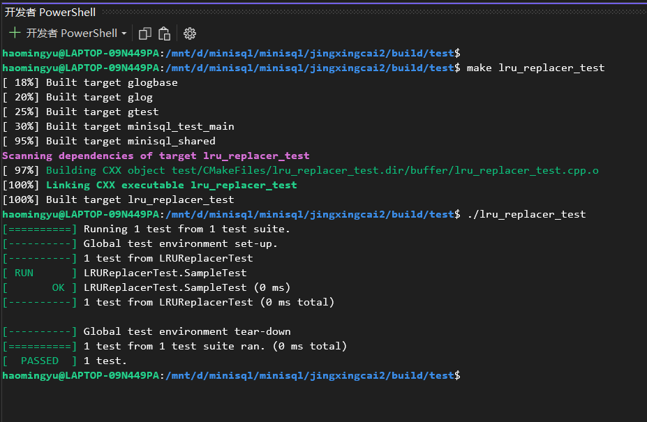
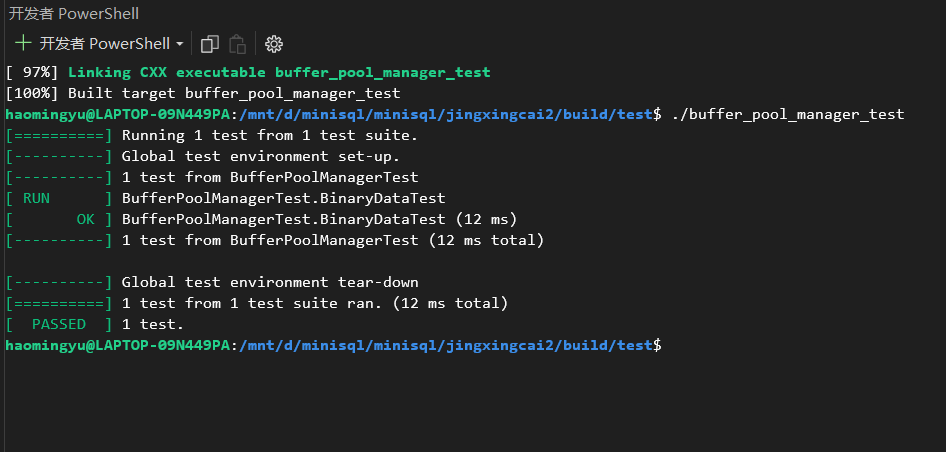

# BUFFER POOL MANAGER

## 1. LRU替换策略

Buffer Pool Replacer负责跟踪Buffer Pool中数据页的使用情况，并在Buffer Pool没有空闲页时决定替换哪一个数据页。在本节中，我们需要实现一个基于LRU替换算法的`LRUReplacer`，`LRUReplacer`类在`src/include/buffer/lru_replacer.h`中被定义，其扩展了抽象类`Replacer`（在`src/include/buffer/replacer.h`中被定义，Replacer class 作为虚拟的父类存在提供了可拓展空间，对于后续增加新的替换策略减少IO具有重要的意义；如果需要增加新的替换方法，只需要在replacer类下进行继承即可，比如后续实现join拓展的时候可以增加MRU或者混合替换策略从而降低非必要的IO开销）。`LRUReplacer`的大小默认与Buffer Pool的大小相同。

因此，在这个模块中，需要重点实现以下函数，与之相关的代码位于`src/buffer/lru_replacer.cpp`中。

- ___LRU___模块__接口设计思路 :__ LRU模块通过提供给上层的BUFFER POOL MANAGER对页的pin和unpin管理不同模块协同访问页的方法，上层模块仅需要提供给LRU具体的内存中的frame_id，即可实现对LRU中的least recently used的页的查找，也可以对LRU中的页进行pin和unpin操作。

- ___LRU___模块__具体实现思路 :__ 主要通过一个双向链表和一个哈希表和双向链表迭代器的符合映射来实现LRU。其中双向链表中靠近表头的代表刚刚使用过，靠近表尾的代表最少使用的块。使用哈希表到迭代器的映射可以在O(1)的时间实现对表中的任意一个块元素的快速访问，同时使用双向链表记录使用次序的方法也可以保证O(1)的时间实现表中任意块的序更新，不需要进行所有块的更新，只需要将被访问的块提到表头即可。具体的类实现代码如下：(lru_replacer.h)

  ```cpp
  /**
   * LRUReplacer implements the Least Recently Used replacement policy.
   */
  class LRUReplacer : public Replacer {
   public:
    /**
     * Create a new LRUReplacer.
     * @param num_pages the maximum number of pages the LRUReplacer will be required to store
     */
    explicit LRUReplacer(size_t num_pages);
  
    /**
     * Destroys the LRUReplacer.
     */
    ~LRUReplacer() override;
  
    bool Victim(frame_id_t *frame_id) override;
  
    void Pin(frame_id_t frame_id) override;
  
    void Unpin(frame_id_t frame_id) override;
  
    size_t Size() override;
  
   private:
    // add your own private member variables here
    std::mutex mutx_;                // lock for threads
    std::list<frame_id_t> LRU_list;  // doubly-linked list for storage of frame_id_t -> implementation of least-recently
                                     // used (LRU algorithm)
    std::unordered_map<frame_id_t, std::list<frame_id_t>::iterator> LRU_hash;
    // hash table, for frame_id_t storage (first find the corresponding key, frame_id_t(hash version) ---map--->
    // linked_list's iterator) which can be accessed by using frame_id_t as a index, and the content is the iterator of
    // std::list -> which can be used to directly modify the linked-list's element and structure.
    size_t max_size;
  };
  ```

- `LRUReplacer::Victim(*frame_id)`：替换（即删除）与所有被跟踪的页相比最近最少被访问的页，将其页帧号（即数据页在Buffer Pool的Page数组中的下标）存储在输出参数`frame_id`中输出并返回`true`，如果当前没有可以替换的元素则返回`false`；
  __实现思路说明 :__ 仅需将末尾的元素(即least recently used)的元素从LRU双向列表中剔除，并将其返回给上层模块，已经找到可以替换的一页。

  ```cpp
  // find the least-recently used element and clear it out.
  bool LRUReplacer::Victim(frame_id_t *frame_id) {
    // C++17 std::scoped_lock(in <mutex> header) can avoid the deadlock automatically.
    // The ctors can lock automatically on thread level.
    // The dtors will unlock automatically. Therefore keep the thread safe.
    std::scoped_lock lock{mutx_};
    if (LRU_list.empty()) {
      return false;
    }  // if the current buffer frame do not have elements which can be replaced, return false, the victim replacement
       // fails.
    *frame_id = LRU_list.back();  // get the least-recently used element -> lies at the tail of the doubly-linked list
    LRU_hash.erase(*frame_id);    // delete the mapping of the frame_id in the hash table.
    LRU_list.pop_back();          // remove the least-recently used element as a victim from the LRU list.
    return true;
  }
  ```

- `LRUReplacer::Pin(frame_id)`：将数据页固定使之不能被`Replacer`替换，即从`lru_list_`中移除该数据页对应的页帧。`Pin`函数应当在一个数据页被Buffer Pool Manager固定时被调用；
  __实现思路说明 :__ 此处注意，双向链表中存储的一定是可以被替换的页，不可以被替换的页需要从中移除。移除的具体方法，首先时通过哈希表找到对应的双向链表的迭代器，并将哈希表和迭代器中的页信息全部移除即可。

  ```cpp
  // get the specified frame_id out of the buffer frame. -> so that it can not be seen by the LRU algorithm, thus locked
  // into the buffer.
  void LRUReplacer::Pin(frame_id_t frame_id) {
    std::scoped_lock lock{mutx_};
    // if can not find the element in the hash table. Nothing to remove from the list. Just return, stop the execution.
    if (LRU_hash.count(frame_id) == 0) {
      return;
    }
    auto iter = LRU_hash[frame_id];
    LRU_list.erase(iter);  // remove the specified element(random access) in the doubly-linked list using a iterator of
                           // the linked-list
    LRU_hash.erase(frame_id);  // remove the corresponding element in the hash table.
  }
  ```

- `LRUReplacer::Unpin(frame_id)`：将数据页解除固定，放入`lru_list_`中，使之可以在必要时被`Replacer`替换掉。`Unpin`函数应当在一个数据页的引用计数变为`0`时被Buffer Pool Manager调用，使页帧对应的数据页能够在必要时被替换；
  __实现思路说明 :__ 将对应数据页解除固定，放入LRU替换策略中，需要注意的是此处添加的时候直接要添加到双向链表的头部，因为是刚刚使用过，默认为最常使用的页，序最大。需要先添加到双向链表中生成迭代器之后，再将对应的frame_id到迭代器的映射添加到哈希表中即可。

  ```cpp
  // put the frame_id into the buffer frame. Or get the pinned element into the LRU algorithm again.
  void LRUReplacer::Unpin(frame_id_t frame_id) {
    std::scoped_lock lock{mutx_};
    // case 1: already have this frame_id in the buffer frame.
    // If the hash_table already has this frame_id, return to stop execution directly.
    // avoid the repeated addition of the element (the frame_id of the disk should be unique in the buffer frame.)
    if (LRU_hash.count(frame_id) != 0) {
      return;
    }
    // case 2: already reached the maximum size of buffer frame.
    // Have reached the maximum size of the buffer frame, can not unpin any more, should do the victim replacement first.
    if (LRU_list.size() == max_size) {
      return;
    }
    // case 3: normal case, add the frame_id to the head of the linked list -> most recently used.
    LRU_list.push_front(frame_id);
    LRU_hash.emplace(frame_id, LRU_list.begin());  // refresh the hash table
  }
  ```

- `LRUReplacer::Size()`：此方法返回当前`LRUReplacer`中能够被替换的数据页的数量。

  ```cpp
  size_t LRUReplacer::Size() { return LRU_list.size(); }  
  // return the current size of the buffer frame.
  ```

- LRUReplacer测试结果
  

## 2. 缓冲池管理

在实现Buffer Pool的替换算法`LRUReplacer`后，我们需要实现整个`BufferPoolManager`，与之相关的代码位于`src/include/buffer/buffer_pool_manager.h`和`src/buffer/buffer_pool_manager.cpp`中。Buffer Pool Manager负责从Disk Manager中获取数据页并将它们存储在内存中，并在必要时（dirty为1时才进行写回，如果为0则不进行写回，减少不必要的IO）将脏页面转储到磁盘中（如需要为新的页面腾出空间）。

数据库系统中，所有内存页面都由`Page`对象（`src/include/page/page.h`）表示，每个`Page`对象都包含了一段连续的内存空间`data_`和与该页相关的信息（如是否是脏页，页的引用计数等等）。注意，`Page`对象并不作用于唯一的数据页，它只是一个用于存放从磁盘中读取的数据页的容器。这也就意味着同一个`Page`对象在系统的整个生命周期内，可能会对应很多不同的物理页。`Page`对象的唯一标识符`page_id_`用于跟踪它所包含的物理页，如果`Page`对象不包含物理页，那么`page_id_`必须被设置为`INVALID_PAGE_ID`。每个`Page`对象还维护了一个计数器`pin_count_`，它用于记录固定(Pin)该页面的线程数。Buffer Pool Manager将不允许释放已经被固定的`Page`。每个`Page`对象还将记录它是否脏页，在复用`Page`对象之前必须将脏的内容转储到磁盘中。

在`BufferPoolManager`的实现中，你需要用到此前已经实现的`LRUReplacer`或是其它的`Replacer`，它将被用于跟踪`Page`对象何时被访问，以便`BufferPoolManager`决定在Buffer Pool中没有空闲页可以用于分配时替换哪个数据页。

- __上层接口调用规则 :__ 需要注意的是上层调用的时候不可以Fetch一个不存在的page，需要对第一次的page进行new操作才可以后续fetch，除此之外，需要在new或者fetch使用完成之后对页进行unpin操作。

因此，在这个模块中，需要实现以下函数：

- `BufferPoolManager::FetchPage(page_id)`：根据逻辑页号获取对应的数据页，如果该数据页不在内存中，则需要从磁盘中进行读取；

- ```cpp
  Page *BufferPoolManager::FetchPage(page_id_t page_id) {
    // 1.     Search the page table for the requested page (P).
    // 1.1    If P exists, pin it and return it immediately.
    // 1.2    If P does not exist, find a replacement page (R) from either the free list or the replacer.
    //        Note that pages are always found from the free list first.
    // 2.     If R is dirty, write it back to the disk.
    // 3.     Delete R from the page table and insert P.
    // 4.     Update P's metadata, read in the page content from disk, and then return a pointer to P.
    std::scoped_lock lock{latch_};
    auto search_page = page_table_.find(page_id);
    if (search_page != page_table_.end()) {
      // this page exists in the page_table_ (this page is in the buffer pool)
      frame_id_t frame_id = search_page->second;
      Page *page = &(pages_[frame_id]);  // get the specified page in the buffer pool
      replacer_->Pin(frame_id);          // pin it, so it can not be replaced by the LRU algorithm
      page->pin_count_++;                // after the pin of LRU replacer, need to refresh the pin_count_ label.
      return page;                       // return the page fetched from the memory to the executor.
    } else {                             // this page is not in the buffer pool, in the disk
      frame_id_t frame_id = -1;
      // use the self-defined function find_victim_page to find the victim page from 2 case
      // -> free_list_ or LRU replacer's advice.
      if (!find_victim_page(&frame_id)) {  // no replacement solution, fetching fails.
        return nullptr;
      }
      // the victim page has been found, now replace the data with the page's content.
      Page *page = &(pages_[frame_id]);
      update_page(page, page_id, frame_id);
      // clear the data to be zero. If the page is dirty, write it into disk, and then set dirty to be false. Clear the
      // data to be zero as well.
      disk_manager_->ReadPage(page_id, page->data_);  // read the database file (page_id position) to new page->data
      replacer_->Pin(frame_id);                       // pin the new data read in
      page->pin_count_ = 1;  // "++" is OK, but here is equal to create a page, so "= 1" is better. Cause this page is
                             // loaded from the disk(new to memory), therefore, just set the pin_count to be 1.
      // actually, every time we read a disk page into memory, only the data_ will be read, the other infomations are
      // created again. is_Dirty_ is defaultly set to be false, here no need to change it. -> The page is already Pin
      return page;
    }
  }
  ```

- `BufferPoolManager::NewPage(&page_id)`：分配一个新的数据页，并将逻辑页号于`page_id`中返回；

  ```cpp
  Page *BufferPoolManager::NewPage(page_id_t &page_id) {
    // 0.   Make sure you call AllocatePage!
    // 1.   If all the pages in the buffer pool are pinned, return nullptr.
    // 2.   Pick a victim page P from either the free list or the replacer. Always pick from the free list first.
    // 3.   Update P's metadata, zero out memory and add P to the page table.
    // 4.   Set the page ID output parameter. Return a pointer to P.
    std::scoped_lock lock{latch_};
    frame_id_t frame_id = -1;
    // case 1: can not get victim frame_id, the new page operation fails.
    if (!find_victim_page(&frame_id)) {
      return nullptr;
    }
    // case 2: got victim frame_id
    page_id = AllocatePage();          // allocate a new disk page_id, change the argument page_id.
    Page *page = &(pages_[frame_id]);  // get buffer pool page from the frame_id
    page->pin_count_ = 1;  // set the pin_count_ to be 1 when a new disk page is loaded into memory buffer pool.f
    update_page(page, page_id,
                frame_id);     // update the page content to be the disk_page -> page_id, and buffer pool_page -> frame_id
    replacer_->Pin(frame_id);  // pin the new updated frame_id when a new disk page has just been put into the memory
   
    return page;
  }
  ```

- `BufferPoolManager::UnpinPage(page_id, is_dirty)`：取消固定一个数据页；

  ```cpp
  // the page_id argument is the disk page id.
  bool BufferPoolManager::UnpinPage(page_id_t page_id, bool is_dirty) {
    std::scoped_lock lock{latch_};
    auto search = page_table_.find(page_id);
    // case 1: the page doesn't exist in the buffer
    if (search == page_table_.end()) {
      return false;
    }
  
    // case 2: the page exist in the page table
    frame_id_t frame_id = search->second;
    Page *page = &(pages_[frame_id]);
    // case 2.1: if the pin_count_ = 0; -> the page has not been pinned before
    if (page->pin_count_ == 0) {
      return false;
    }
  
    // case 2.2: the pin_count_ > 0
    page->pin_count_--;
    if (page->pin_count_ == 0) {
      // only when the pin_count_ has reduced to 0, can the replacer do the unpin operation!
      // or some unpin operation will fail because the directly unpin of replacer.
      // must ensure all the thread and pins work until they are all unpinned. When a page is unpinned in the replacer, it
      // might be deleted from the buffer pool
      replacer_->Unpin(frame_id);
    }
    if (is_dirty) {
      page->is_dirty_ = true;  // if the unpinned page is now dirty, then change the page infomation about this page
      // if the pinned page is not dirty now, do not change it, because it might be dirty originally.
      // this is not equal to: page->is_dirty_ = is_dirty
    }
  
    return true;
  }
  ```

- `BufferPoolManager::FlushPage(page_id)`：将数据页转储到磁盘中；

  ```cpp
  // flush the correspondence page into disk, return the operation state.
  // This function only does a refreshing mechanism in disk. Do not change the memory contents actually
  bool BufferPoolManager::FlushPage(page_id_t page_id) {
    std::scoped_lock lock{latch_};
    if (page_id == INVALID_PAGE_ID) {
      return false;
    }
    auto search = page_table_.find(page_id);  // search is the pointer(iterator) to the mapping tuple.
    if (search != page_table_.end()) {
      // found the corresponding frame page in memory.
      frame_id_t frame_id = search->second;
      Page *page = &(pages_[frame_id]);
      disk_manager_->WritePage(page->page_id_, page->data_);  // here the page_id_ labels the disk page_id
      page->is_dirty_ = false;  // When we've flush the page into the disk, we need to set dirty label to be false.
    } else {
      // the required physical page does have corresponding frame page in the buffer memory.
      return false;
    }
  
    return true;
  }
  ```

- `BufferPoolManager::DeletePage(page_id)`：释放一个数据页；

  ```cpp
  // here the page_id is the disk page id -> also the key of hash table
  bool BufferPoolManager::DeletePage(page_id_t page_id) {
    // 0.   Make sure you call DeallocatePage!
    // 1.   Search the page table for the requested page (P).
    // 1.   If P does not exist, return true.
    // 2.   If P exists, but has a non-zero pin-count, return false. Someone is using the page.
    // 3.   Otherwise, P can be deleted. Remove P from the page table, reset its metadata and return it to the free list.
    std::scoped_lock lock{latch_};
    auto search = page_table_.find(page_id);
    // case 1: the page does not exist, just return true.
    if (search == page_table_.end()) {
      return true;
    }
    // case 2: normal case, the page exists in the buffer pool
    frame_id_t frame_id = search->second;
    Page *page = &(pages_[frame_id]);
    // case 2.1: the page is still used by some thread, can not delete
    if (page->pin_count_ > 0) {
      return false;
    }
    // case 2.2: pin_count_ == 0, can be deleted
    /*if (page_id == 3) {
      static int i = 1;
      cout << "fuck " << i << " times" << endl;
      i++;
    }*/
    DeallocatePage(page_id);                       // deallocate the corresponding disk file
    update_page(page, INVALID_PAGE_ID, frame_id);  // set the page's disk page to INVALID value.
    free_list_.push_back(frame_id);                // add the free frame page to tail of the free list.
  
    return true;
  }
  ```

- `BufferPoolManager::FlushAllPages()`：将所有的页面都转储到磁盘中；

  ```cpp
  void BufferPoolManager::FlushAllPages() {
    std::scoped_lock lock{latch_};
    for (size_t i = 0; i < pool_size_; i++) {
      Page *page = &(pages_[i]);
      if (page->page_id_ != INVALID_PAGE_ID && page->IsDirty()) {
        disk_manager_->WritePage(page->page_id_, page->data_);
        page->is_dirty_ = false;
      }
      /**
       * another way to implement this part:
       * FlushPage(page->page_id_);
       */
    }
  }
  ```

- 测试结果
  

- 辅助函数，会在多处使用，使用封装的方法使代码风格更加简洁

  ```cpp
  void BufferPoolManager::update_page(Page *page, page_id_t new_page_id, frame_id_t new_frame_id) {
    // step 1: if it is dirty -> write it back to disk, and set dirty to false.
    if (page->IsDirty()) {
      disk_manager_->WritePage(page->page_id_, page->data_);
      page->is_dirty_ = false;
    }
  
    // step 2: refresh the page table
    page_table_.erase(page->page_id_);     // delete the page_id and its frame_id in the original page_table_
    if (new_page_id != INVALID_PAGE_ID) {  // the object contains a physical page. If INVALID_PAGE_ID, then do not add it
                                           // to the page_table_
      page_table_.emplace(new_page_id, new_frame_id);  // add new page_id and the corresponding frame_id into page_table_
    }
  
    // step 3: reset the data in the page(clear out it to be zero), and page id
    page->ResetMemory();
    page->page_id_ = new_page_id;
  }
  
  bool BufferPoolManager::find_victim_page(frame_id_t *frame_id) {
    // case 1: the buffer pool is not full, the free_list still have elements
    //         in this case, just get one out of the free_list -> get frame_id from the head of free_list.
    // (in DeletePage function, we add frame_id at the tail of free_list)
    if (!free_list_.empty()) {
      *frame_id = free_list_.front();
      free_list_.pop_front();
      return true;
    }
    // case 2: the buffer pool is already full, need to call LRU replacer.
    return replacer_->Victim(frame_id);
  }
  ```

对于`FetchPage`操作，如果空闲页列表（`free_list_`）中没有可用的页面并且没有可以被替换的数据页，则应返回 `nullptr`。`FlushPage`操作应该将页面内容转储到磁盘中，无论其是否被固定。

## 3. 模块相关代码

- `src/include/buffer/lru_replacer.h`
- `src/buffer/lru_replacer.cpp`
- `src/include/buffer/buffer_pool_manager.h`
- `src/buffer/buffer_pool_manager.cpp`
- `test/buffer/buffer_pool_manager_test.cpp`
- `test/buffer/lru_replacer_test.cpp`