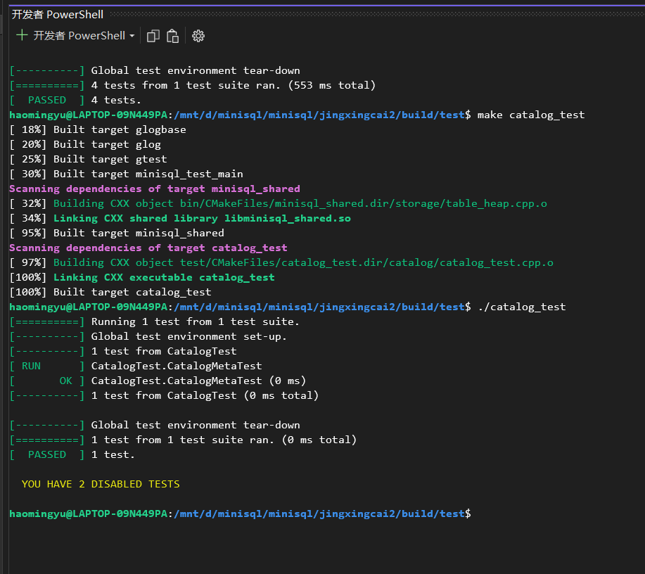
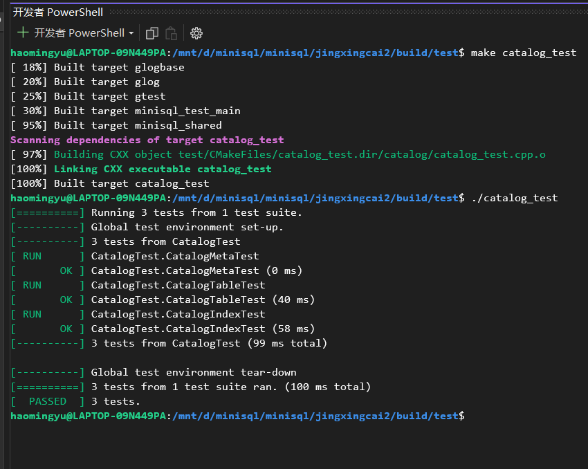

# CATALOG MANAGER

## 1. 实验概述

Catalog Manager 负责管理和维护数据库的所有模式信息，包括：

- 数据库中所有表的定义信息，包括表的名称、表中字段（列）数、主键、定义在该表上的索引。
- 表中每个字段的定义信息，包括字段类型、是否唯一等。
- 数据库中所有索引的定义，包括所属表、索引建立在那个字段上等。

- 

这些模式信息在被创建、修改和删除后还应被持久化到数据库文件中。此外，Catalog Manager还需要为上层的执行器Executor提供公共接口以供执行器获取目录信息并生成执行计划。

## 2. 目录元信息

数据库中定义的表和索引在内存中以 `TableInfo` 和 `IndexInfo` 的形式表现，它们分别定义于 `src/include/catalog/table.h` 和 `src/include/catalog/indexes.h`，其维护了与之对应的表或索引的元信息和操作对象。以 `IndexInfo` 为例，它包含了这个索引定义时的元信息 `meta_data_`，该索引对应的表信息 `table_info_`，该索引的模式信息 `key_schema_` 和索引操作对象 `index_`。除元信息 `meta_data_` 外，其它的信息（如 `key_schema_`、`table_info_` 等）都是通过反序列化后的元信息生成的。也就是说，为了能够将所有表和索引的定义信息持久化到数据库文件并在重启时从数据库文件中恢复，我们需要为表和索引的元信息 `TableMetadata` 和 `IndexMetadata` 实现序列化和反序列化操作。它们与 `TableInfo` 和 `IndexInfo` 定义在相同文件中。在序列化时，为了简便处理，我们为每一个表和索引都分配一个单独的数据页用于存储序列化数据。因此，在这样的设计下，我们同样需要一个数据页和数据对象 `CatalogMeta`（定义在src/include/catalog/catalog.h）来记录和管理这些表和索引的元信息被存储在哪个数据页中。`CatalogMeta` 的信息将会被序列化到数据库文件的第 `CATALOG_META_PAGE_ID` 号数据页中（逻辑意义上），`CATALOG_META_PAGE_ID` 默认值为0。

因此，在本节中，我们需要实现与Catalog相关的元信息的序列化和反序列化操作，重要的函数设计如下所示：

- `CatalogMeta::SerializeTo(*buf)`

  ```cpp
  void CatalogMeta::SerializeTo(char *buf) const {
    // 1. first serialize the magic number into the buf
    MACH_WRITE_UINT32(buf, CATALOG_METADATA_MAGIC_NUM);
    buf += sizeof(uint32_t);
  
    // 2. then write the number of pairs in table_meta_pages_ map, (will be used in the deserialization)
    MACH_WRITE_TO(std::size_t, buf, table_meta_pages_.size());
    buf += sizeof(std::size_t);
  
    // 3. write the pairs of table_meta_page_ into the buf
    for (auto i = table_meta_pages_.begin(); i != table_meta_pages_.end(); ++i) {
      MACH_WRITE_UINT32(buf, i->first);
      buf += sizeof(uint32_t);
      MACH_WRITE_INT32(buf, i->second);
      buf += sizeof(int32_t);
    }
  
    // 4. write the number of pairs in index_meta_pages
    MACH_WRITE_TO (std::size_t, buf, index_meta_pages_.size());
    buf += sizeof(std::size_t);
  
    // 5. write the pairs of index_meta_pages into the buf
    for (auto i = index_meta_pages_.begin(); i != index_meta_pages_.end(); ++i) {
      MACH_WRITE_UINT32(buf, i->first);
      buf += sizeof(uint32_t);
      MACH_WRITE_INT32(buf, i->second);
      buf += sizeof(int32_t);
    }
  }
  ```

- `CatalogMeta::GetSerializedSize()`

  ```cpp
  uint32_t CatalogMeta::GetSerializedSize() const {
    uint32_t cnt = 0;
    cnt = sizeof(uint32_t) + sizeof(std::size_t) * 2;
    cnt += table_meta_pages_.size() * (sizeof(uint32_t) + sizeof(int32_t));
    cnt += index_meta_pages_.size() * (sizeof(uint32_t) + sizeof(int32_t));
  
    return cnt;
  }
  ```

- `CatalogMeta::DeserializeFrom(*buf, *heap)`

  ```cpp
  CatalogMeta *CatalogMeta::DeserializeFrom(char *buf, MemHeap *heap) {
    if (buf == nullptr) {
      return nullptr; // nothing to deserializefrom, then return the metadata is nullptr
    }
    // 1. first deserialize the magic number
    uint32_t magic_num = MACH_READ_UINT32(buf);
    buf += sizeof(uint32_t);
    ASSERT(magic_num == CATALOG_METADATA_MAGIC_NUM, "Catalog_metadata does not match");
  
    CatalogMeta *rst = NewInstance(heap);  // allocate space for the catalogmeta will be returned
  
    // 2. then deserialize the size of table_meta_pages
    uint32_t table_num = MACH_READ_FROM (std::size_t, buf);
    buf += sizeof(std::size_t);
  
    // 3. read the map pairs out
    for (uint32_t i = 0; i < table_num; i++) {
      table_id_t table_id_tmp = MACH_READ_UINT32(buf);
      buf += sizeof(uint32_t);
      page_id_t page_id_tmp = MACH_READ_INT32(buf);
      buf += sizeof(int32_t);
      (rst->table_meta_pages_).emplace(table_id_tmp, page_id_tmp);
    }
  
    // 4. read the number of index_meta_pages' pairs
    uint32_t index_num = MACH_READ_FROM (std::size_t, buf);
    buf += sizeof(std::size_t);
  
    // 5. read the map pairs out
    for (uint32_t i = 0; i < index_num; i++) {
      index_id_t index_id_tmp = MACH_READ_UINT32(buf);
      buf += sizeof(uint32_t);
      page_id_t page_id_tmp = MACH_READ_INT32(buf);
      buf += sizeof(int32_t);
      (rst->index_meta_pages_).emplace(index_id_tmp, page_id_tmp);
    }
  
    return rst;
  }
  ```

- `IndexMetadata::SerializeTo(*buf)`

  ```cpp
  uint32_t IndexMetadata::SerializeTo(char *buf) const {
    uint32_t ofs = 0;
  
    // 1. write the magic number
    MACH_WRITE_UINT32(buf, INDEX_METADATA_MAGIC_NUM);
    ofs += sizeof(uint32_t);
  
    // 2. write the length of index name
    MACH_WRITE_UINT32(buf + ofs, index_name_.size());
    ofs += sizeof(uint32_t);
  
    // 3. write the string of index_name_
    MACH_WRITE_STRING(buf + ofs, index_name_);
    ofs += index_name_.size();
  
    // 4. write the index_id_
    MACH_WRITE_UINT32(buf + ofs, index_id_);
    ofs += sizeof(index_id_t);
  
    // 5. write the table_id_
    MACH_WRITE_UINT32(buf + ofs, table_id_);
    ofs += sizeof(table_id_t);
  
    // 6. write the size of vector
    MACH_WRITE_UINT32(buf + ofs, key_map_.size());
    ofs += sizeof(uint32_t);
  
    // 7. write the vector into buf
    for (long unsigned int i = 0; i < key_map_.size(); i++) {
      MACH_WRITE_UINT32(buf + ofs, key_map_[i]);
      ofs += sizeof(uint32_t);
    }
  
    return ofs;
  }
  ```

- `IndexMetadata::GetSerializedSize()`

  ```cpp
  uint32_t IndexMetadata::GetSerializedSize() const {
    if (index_name_.size() == 0) {
      return 0;
    }
    return sizeof(uint32_t) * 5 + index_name_.size() + key_map_.size() * sizeof(uint32_t);
  }
  ```

- `IndexMetadata::DeserializeFrom(*buf, *&index_meta, *heap)`

  ```cpp
  uint32_t IndexMetadata::DeserializeFrom(char *buf, IndexMetadata *&index_meta, MemHeap *heap) {
    if (index_meta != nullptr) {
      std::cerr << "Pointer to index meta data is not null in index meta data deserialization" << std::endl;
    }
    if (buf == nullptr) {
      return 0;
    }
  
    // 1. Read the magic number
    uint32_t magic_num = MACH_READ_UINT32(buf);
    ASSERT(magic_num == INDEX_METADATA_MAGIC_NUM, "INDEX_METADATA_MAGIC_NUM does not match");
    buf += sizeof(uint32_t);
  
    // 2. read the length of name
    uint32_t length_name = MACH_READ_UINT32(buf);
    buf += sizeof(uint32_t);
  
    // 3. read the name string out
    std::string name_tmp;
    for (uint32_t i = 0; i < length_name; i++) {
      name_tmp.push_back(buf[i]);
    }
    buf += length_name;
  
    // 4. read the index_id_
    index_id_t index_tmp = MACH_READ_UINT32(buf);
    buf += sizeof(index_id_t);
  
    // 5. read the table_id_
    table_id_t table_tmp = MACH_READ_UINT32(buf);
    buf += sizeof(table_id_t);
  
    // 6. read the size of vector map
    uint32_t map_size = MACH_READ_UINT32(buf);
    buf += sizeof(uint32_t);
  
    // 7. read the key_map_ vector out
    std::vector<uint32_t> map_tmp;
    for (uint32_t i = 0; i < map_size; i++) {
      uint32_t tmp = MACH_READ_UINT32(buf);
      map_tmp.push_back(tmp);
      buf += sizeof(uint32_t);
    }
  
    index_meta = Create(index_tmp, name_tmp, table_tmp, map_tmp, heap);
  
    return sizeof(uint32_t) * 5 + length_name + map_size * sizeof(uint32_t);
  }
  ```

- `TableMetadata::SerializeTo(*buf)`

  ```cpp
  uint32_t TableMetadata::SerializeTo(char *buf) const {
    // serialize the information into buf array, return the offset of buf array caused by me
    uint32_t ofs = 0; // record the total offset returned
  
    // 1. first write in the magic number for recognization of TableMetaData
    MACH_WRITE_UINT32(buf + ofs, TABLE_METADATA_MAGIC_NUM);
    ofs += sizeof(uint32_t);
  
    // 2. then write in the table_id_
    MACH_WRITE_UINT32(buf + ofs, table_id_);
    ofs += sizeof(table_id_);
  
    // 3. then write the length of the table_name_
    MACH_WRITE_UINT32(buf + ofs, table_name_.size());
    ofs += sizeof(uint32_t);
  
    // 4. then write in the table_name_
    MACH_WRITE_STRING(buf + ofs, table_name_);
    ofs += table_name_.size();
  
    // 5. then write in the root_page_id_
    MACH_WRITE_INT32(buf + ofs, root_page_id_);
    ofs += sizeof(root_page_id_);
  
    // 6. then write in the schema pointer
    this->schema_->SerializeTo(buf + ofs);
    ofs += this->schema_->GetSerializedSize();
  
    return ofs;
  }
  ```

- `TableMetadata::GetSerializedSize()`

  ```cpp
  // this function can only be called after the Deserialization is used.
  uint32_t TableMetadata::GetSerializedSize() const {
    if (table_name_.length() == 0) {
      return 0;
    }
    return this->schema_->GetSerializedSize() + sizeof(root_page_id_) + table_name_.size() + sizeof(table_id_) +
           sizeof(uint32_t) * 2;
  }
  ```

- `TableMetadata::DeserializeFrom(*buf, *&table_meta, *heap)`

  ```cpp
  /**
   * @param heap Memory heap passed by TableInfo
   */
  uint32_t TableMetadata::DeserializeFrom(char *buf, TableMetadata *&table_meta, MemHeap *heap) {
    if (table_meta != nullptr) {
      std::cerr << "Pointer to column is not null in table meta data deserialize." << std::endl;
    }
    if (buf == nullptr) {
      return 0;
    }
  
    char *orig_buf = buf;
    // 1. read and check the magic number
    uint32_t magic_num = MACH_READ_UINT32(buf);
    ASSERT(magic_num == TABLE_METADATA_MAGIC_NUM, "TABLE_META_DATA_MAGIC_NUM does not match");
    buf += sizeof(uint32_t);
  
    // 2. read the table_id_
    table_id_t table_id_tmp = MACH_READ_UINT32(buf);
    buf += sizeof(table_id_t);
  
    // 3. read the length of table_name_
    uint32_t length = MACH_READ_UINT32(buf);
    buf += sizeof(uint32_t);
  
    // 4. read the string out
    std::string name_tmp;
    for (uint32_t i = 0; i < length; i++) {
      name_tmp.push_back(buf[i]);
    }
    buf += length;
  
    // 5. read the root_page_id_
    page_id_t root_id_tmp = MACH_READ_INT32(buf);
    buf += sizeof(page_id_t);
  
    // 6. read the schema pointer out
    Schema *schema_tmp = nullptr;
    buf += Schema::DeserializeFrom(buf, schema_tmp, heap);
     
    table_meta = Create(table_id_tmp, name_tmp, root_id_tmp, schema_tmp, heap);
  
    return buf - orig_buf;
  }
  ```

- `IndexInfo::Init(*index_meta_data, *table_info, *buffer_pool_manager)` 

  __设计思路说明 :__ 传入事先创建好的`IndexMetadata`和从`CatalogManager`中获取到的`TableInfo`，创建索引本身的`key_schema_`和`Index`对象。这里的`key_schema_`可以通过Schema::ShallowCopySchema来创建，且key_schema_中包含的列与TableSchema中的列共享同一份存储。

  ```cpp
  void Init(IndexMetadata *meta_data, TableInfo *table_info, BufferPoolManager *buffer_pool_manager) {
      // Step1: init index metadata and table info
      // Step2: mapping index key to key schema
      // Step3: call CreateIndex to create the index
      meta_data_ = meta_data;
      table_info_ = table_info;
      key_schema_ = Schema::ShallowCopySchema(table_info->GetSchema(), meta_data->GetKeyMapping(), heap_);
      index_ = CreateIndex(buffer_pool_manager);
    }
  ```

- 测试结果：
  

Note:

- 与之前RecordManager中的序列化和反序列化类似，我们仍然需要通过魔数MAGIC_NUM来确保序列化和反序列化的正确性。

- 在CatalogManager、TableInfo、IndexInfo中都通过各自的`heap_`维护和管理与自身相关的内存分配和回收。如CatalogManager中，所有创建的CatalogMeta、TableInfo和IndexInfo对象都通过CatalogManager自身的`heap_`分配空间，随着CatalogManager对象的析构，这些对象自然而然也会被释放，而不需要我们手动去管理。同理，TableInfo中所维护的TableSchema以及TableHeap，以及该表反序列化时创建的TableMetadata则需要通过TableInfo自身的`heap_`来分配空间。以下是反序列化一个表并生成TableInfo对象的例子：

  ```cpp
  dberr_t CatalogManager::DoSomething() {
      /* table_info is created by CatalogManager using CatalogManager's heap_ */
      auto *table_info = TableInfo::Create(heap_);
      TableMetadata *table_meta = nullptr;
      TableMetadata::DeserializeFrom(/* some args */,
                                     table_info->GetMemHeap());
      if (table_meta != nullptr) {
          auto *table_heap = TableHeap::Create((/* some args */,
                                                table_info->GetMemHeap());
      }
      /* thus table_meta and table_heap are created by table_info */
      table_info->Init(table_meta, table_heap);
  }
  ```

## 3. 表和索引的管理

在实现目录、表和索引元信息的持久化后，我们需要在`src/include/catalog/catalog.h`和`src/catalog/catalog.cpp`中实现整个`CatalogManager`类。`CatalogManager`类应具备维护和持久化数据库中所有表和索引的信息。`CatalogManager`能够在数据库实例（`DBStorageEngine`）初次创建时（`init = true`）初始化元数据；并在后续重新打开数据库实例时，从数据库文件中加载所有的表和索引信息，构建`TableInfo`和`IndexInfo`信息置于内存中。此外，`CatalogManager`类还需要对上层模块提供对指定数据表的操作方式，如`CreateTable`、`GetTable`、`GetTables`、`DropTable`、`GetTableIndexes`；对上层模块提供对指定索引的操作方式，如`CreateIndex`、`GetIndex`、`DropIndex`。

**Note:** 在目前这种架构设计下，Catalog和实际数据存放在同一个数据库文件中。这使得Catalog Manager既依赖于Disk Manager 、Buffer Pool Manager，又为Record Manager、Index Manager、Executor(甚至Parser)提供接口支持，从而导致整个MiniSQL项目的内聚度相当地高。为此，一种妥协式的方案是：Catalog Manager不依赖于Disk Manager和Buffer Pool Manager，而是存放在独立的文件中，通过持久化手段直接落盘，但这种做法同样存在缺点，即Catalog的信息完全不受事务管理控制，存在一致性和可恢复性的问题。后续可以考虑其他的拓展优化方式。

首先对整体的CatalogManager设计进行说明：

CatalogManager管理着后续页中所有的表和索引信息，并且管理这些信息的序列化，以及这些信息的访问方式，具体的实现方式参见下方代码，需要注意的是，这里的很多方法都是根据第五模块executor执行器的需求而单独实现的，将第五模块调用第四模块时的更多样的需求添加到方法中可以使得上层模块代码的编写更加简便：

```cpp
class CatalogMeta {
  friend class CatalogManager;

public:
  void SerializeTo(char *buf) const;

  static CatalogMeta *DeserializeFrom(char *buf, MemHeap *heap);

  uint32_t GetSerializedSize() const;

  inline table_id_t GetNextTableId() const {
    // this can get the next table id for the create table function
    return table_meta_pages_.size() == 0 ? 0 : table_meta_pages_.rbegin()->first + 1;
  }

  inline index_id_t GetNextIndexId() const {
    return index_meta_pages_.size() == 0 ? 0 : index_meta_pages_.rbegin()->first + 1;
  }

  static CatalogMeta *NewInstance(MemHeap *heap) {
    void *buf = heap->Allocate(sizeof(CatalogMeta));
    return new(buf) CatalogMeta();
  }

  /**
   * Used only for testing
   */
  inline std::map<table_id_t, page_id_t> *GetTableMetaPages() {
    return &table_meta_pages_;
  }

  /**
   * Used only for testing
   */
  inline std::map<index_id_t, page_id_t> *GetIndexMetaPages() {
    return &index_meta_pages_;
  }

private:
  explicit CatalogMeta();

private:
  static constexpr uint32_t CATALOG_METADATA_MAGIC_NUM = 89849;
  std::map<table_id_t, page_id_t> table_meta_pages_;
  std::map<index_id_t, page_id_t> index_meta_pages_;
};

/**
 * Catalog manager
 *
 */
class CatalogManager {
public:
  explicit CatalogManager(BufferPoolManager *buffer_pool_manager, LockManager *lock_manager,
                          LogManager *log_manager, bool init);

  ~CatalogManager();

  dberr_t CreateTable(const std::string &table_name, TableSchema *schema, Transaction *txn, TableInfo *&table_info);

  dberr_t GetTable(const std::string &table_name, TableInfo *&table_info);

  dberr_t GetTables(std::vector<TableInfo *> &tables) const;

  dberr_t CreateIndex(const std::string &table_name, const std::string &index_name,
                      const std::vector<std::string> &index_keys, Transaction *txn,
                      IndexInfo *&index_info);

  dberr_t GetIndex(const std::string &table_name, const std::string &index_name, IndexInfo *&index_info) const;

  dberr_t GetTableIndexes(const std::string &table_name, std::vector<IndexInfo *> &indexes) const;

  dberr_t DropTable(const std::string &table_name);

  dberr_t DropIndex(const std::string &table_name, const std::string &index_name, bool refresh);
  // if refresh is true, it means that the caller need the DropIndex function to do the refreshing of nested mapping
  // else if refresh is false, it means that the DropIndex function do not do the refreshing, the caller will do it later.
  // do not interference normal usage, just set refresh to be true when you need to drop index normally as before
  MemHeap *GetMemHeap() { return heap_; }
  dberr_t GetAllTableNames(std::vector<std::string> &table_names ) {
    for (auto i : this->table_names_) {
      table_names.push_back(i.first);
    }
    return DB_SUCCESS;
  }

  dberr_t GetAllIndexNames(const std::string &table_name, std::vector<std::string> &indexes) {
    auto iter_outer = this->index_names_.find(table_name);
    if (iter_outer == this->index_names_.end()) {
      return DB_INDEX_NOT_FOUND;
    }
    for (auto i : iter_outer->second) {
      indexes.push_back(i.first);
    }
    return DB_SUCCESS;
  }

  // for convenience
  CatalogMeta *GetMeta(void);

private:
  dberr_t FlushCatalogMetaPage() const;

  dberr_t GetTable(const table_id_t table_id, TableInfo *&table_info);

private:
  BufferPoolManager *buffer_pool_manager_;
  CatalogMeta *catalog_meta_; // need to deal with this members serialization

  // map for tables
  std::unordered_map<std::string, table_id_t> table_names_;
  std::unordered_map<table_id_t, TableInfo *> tables_;
  // map for indexes: table_name->index_name->indexes
  // the mapping relationship: a table_name might have several index_name mapped to it, but one index_name can only have one index_id_t mapping
  std::unordered_map<std::string, std::unordered_map<std::string, index_id_t>> index_names_;
  // table_name --mapping--> unordered_map: one to one; index_name --mapping--> index_id_t: one to one; but there are a lot of elements in the <index_name, index_id_t> mapping container.
  std::unordered_map<index_id_t, IndexInfo *> indexes_;
  // memory heap
  MemHeap *heap_;
};
```

下面对核心的函数进行介绍说明：

- `CatalogManager::CatalogManager(BufferPoolManager *buffer_pool_manager, LockManager *lock_manager, LogManager *log_manager, bool init);`
  __设计思路说明 :__ 此构造函数通过 `init` 参数确定当前的状态是第一次打开该数据库还是重新打开该数据库，如果是重新打开该数据库存储文件，则需要将以往的信息读取到内存中进行恢复；如果是第一次创建一个数据库存储文件，则直接填入默认初始值并做内存的初始化操作

  ```cpp
  CatalogManager::CatalogManager(BufferPoolManager *buffer_pool_manager, LockManager *lock_manager,
                                 LogManager *log_manager, bool init)
          : buffer_pool_manager_(buffer_pool_manager), lock_manager_(lock_manager),
            log_manager_(log_manager), heap_(new SimpleMemHeap()) {
    if (init) {
      // the first time catalogManager is created, need to serializa the initial information into the file
      this->catalog_meta_ = CatalogMeta::NewInstance(this->heap_);
    } else {
      // not the first time opening the file, need to deserialize the information from the file
      Page *catalog_page = buffer_pool_manager_->FetchPage(CATALOG_META_PAGE_ID);
      this->catalog_meta_ = CatalogMeta::DeserializeFrom(catalog_page->GetData(), heap_);
      buffer_pool_manager_->UnpinPage(CATALOG_META_PAGE_ID, false);
      // load table
      for (auto i : catalog_meta_->table_meta_pages_) {
        Page *iter_page = buffer_pool_manager_->FetchPage(i.second);
        auto *table_info = TableInfo::Create(heap_);
        std::string cur_name;
        TableMetadata *table_meta = nullptr;
        TableMetadata::DeserializeFrom(iter_page->GetData(), table_meta, table_info->GetMemHeap());
        buffer_pool_manager_->UnpinPage(i.second, false);
        if (table_meta != nullptr) { // here the heap does not need to be created for the first time, it has been created when create_table last time, this time just read the information out
          auto *table_heap = TableHeap::Create(buffer_pool_manager_, table_meta->GetFirstPageId(),
                                               table_meta->GetSchema(), nullptr, nullptr, table_info->GetMemHeap());
          table_info->Init(table_meta, table_heap);
          cur_name = table_info->GetTableName();
          this->table_names_.emplace(cur_name, i.first);
          this->tables_.emplace(i.first, table_info);
        } else {
          ASSERT(false, "Something wrong caused by deserialization, the table_meta information is null!");
        }
        /* thus table_meta and table_heap are created by table_info */
      }
      // load index
      for (auto i : catalog_meta_->index_meta_pages_) {
        Page *iter_page = buffer_pool_manager_->FetchPage(i.second);
        // Page* iter_page = buffer_pool_manager_->
        auto *index_info = IndexInfo::Create(heap_);
        IndexMetadata *index_meta = nullptr;
        IndexMetadata::DeserializeFrom(iter_page->GetData(), index_meta, index_info->GetMemHeap());
        buffer_pool_manager_->UnpinPage(i.second, false);
        if (index_meta != nullptr) {
          // the information Init function need here can get from the deserialization
          table_id_t cor_table = index_meta->GetTableId();
          // this block is used to find the index's corresponding table, and get its table info
          // //
          //
          auto iter_table = this->catalog_meta_->table_meta_pages_.find(cor_table);
          std::string cor_table_name;
          TableInfo *table_info;
          if (iter_table != this->catalog_meta_->table_meta_pages_.end()) {
            Page *table_page = buffer_pool_manager_->FetchPage(iter_table->second);
            table_info = TableInfo::Create(heap_);
            TableMetadata *table_meta = nullptr;
            TableMetadata::DeserializeFrom(table_page->GetData(), table_meta, table_info->GetMemHeap());
            buffer_pool_manager_->UnpinPage(iter_table->second, false);
            if (table_meta != nullptr) {
              auto *table_heap = TableHeap::Create(buffer_pool_manager_, table_meta->GetFirstPageId(),
                                                   table_meta->GetSchema(),
                                                   nullptr, nullptr, table_info->GetMemHeap());
              table_info->Init(table_meta, table_heap);
              cor_table_name = table_info->GetTableName();
            }
          } else {
            ASSERT(false, "Something wrong, can not find the corresponding page information in the CatalogMeta!");
          }
          //
          // // 
          // block end here
          index_info->Init(index_meta, table_info, buffer_pool_manager_);
          std::string index_name = index_info->GetIndexName();
          this->indexes_.emplace(i.first, index_info);    
          auto iter_index_names = index_names_.find(cor_table_name);
          if (iter_index_names == index_names_.end()) {
            // not found in the mapping from table name to unordered_map -> Create a new record
            std::unordered_map<std::string, index_id_t> tmp;
            tmp.emplace(index_name, i.first);
            this->index_names_.emplace(cor_table_name, tmp);
          } else {
            // have found the table name, need to insert an index record into the corresponding mapping container
            (iter_index_names->second).emplace(index_name, i.first); 
            // do not check the replication of record, the create index should do that work, here just a deserialization of information.
          }
        } else {
          ASSERT(false, "Something wrong caused by deserialization, the index_meta information is null!");
        }
      }
    }
  }
  ```

- `CatalogManager::~CatalogManager();`
  __设计思路说明 :__ 此析构函数需要在析构之前将内存级联删除，通过`heap_`机制进行所有 `CatalogManager` 进行管理；除此之外需要做`CATALOG_META_PAGE_ID`对应页的文件的更新写入

  ```cpp
  CatalogManager::~CatalogManager() {
    Page* page = this->buffer_pool_manager_->FetchPage(CATALOG_META_PAGE_ID);
    this->catalog_meta_->SerializeTo(page->GetData());
    this->buffer_pool_manager_->UnpinPage(CATALOG_META_PAGE_ID, true);
    delete heap_;
  }
  ```

- `dberr_t CatalogManager::CreateTable(const string &table_name, TableSchema *schema, Transaction *txn, TableInfo *&table_info);`

  ```cpp
  dberr_t CatalogManager::CreateTable(const string &table_name, TableSchema *schema, Transaction *txn,
                                      TableInfo *&table_info) {
    auto iter = this->table_names_.find(table_name);
    if (iter != table_names_.end()) {
      // this table name has been occupied
      return DB_TABLE_ALREADY_EXIST;
    }
    // 1.Create the TableMetaPage for the Table
  
    page_id_t table_page;
    Page *page = this->buffer_pool_manager_->NewPage(table_page);  // table_page now store the page id of the table
    if (page == nullptr) {
      return DB_FAILED;  // can not new more pages, then return failure, no need to unpin here, the newpage is failed now.
    }
    table_id_t next_table_id_tmp = catalog_meta_->GetNextTableId();
    this->table_names_.emplace(table_name, next_table_id_tmp); // store the map of name and table_id into CatalogManager
    this->catalog_meta_->table_meta_pages_.emplace(next_table_id_tmp, table_page); // store the map of new table information
    auto table_info_tmp = TableInfo::Create(heap_);
    // 2. create the table heap
  
    auto table_heap =
        TableHeap::Create(buffer_pool_manager_, schema, nullptr, nullptr, nullptr, table_info_tmp->GetMemHeap());
    TableMetadata *table_meta =
        TableMetadata::Create(next_table_id_tmp, table_name, table_heap->GetFirstPageId(), schema, heap_);
    // 3. table_meta SerializeTo TableMetaPage
    table_meta->SerializeTo(page->GetData());
  
    // 4. give the pointer heap upper user to get the information
    table_info_tmp->Init(table_meta, table_heap);
    this->tables_.emplace(next_table_id_tmp, table_info_tmp);
    table_info = table_info_tmp;
    this->buffer_pool_manager_->UnpinPage(table_page, true);
    Page *cata_page_refresh = buffer_pool_manager_->FetchPage(CATALOG_META_PAGE_ID);
    this->catalog_meta_->SerializeTo(cata_page_refresh->GetData());
    buffer_pool_manager_->UnpinPage(CATALOG_META_PAGE_ID, true); // after creation of table, do not forget to refresh the meta page storage
  
    return DB_SUCCESS;
  }
  ```

- `dberr_t CatalogManager::GetTable(const string &table_name, TableInfo *&table_info);`

  ```cpp
  dberr_t CatalogManager::GetTable(const string &table_name, TableInfo *&table_info) {
    auto iter = this->table_names_.find(table_name);
    if (iter == this->table_names_.end()) {
      // the table name is not found
      // if the table is not found, then just do not change the TableInfo information.
      return DB_TABLE_NOT_EXIST;
    }
  
    // the table name exists
    table_id_t corres_table_id = iter->second;
    auto iter_info = this->tables_.find(corres_table_id);
    if (iter_info == this->tables_.end()) {
      // this recorded name is found, but the recorded TableInfo pairs are not found, so return failure.
      return DB_TABLE_NOT_EXIST;
    }
  
    // the pairs are found
    table_info = iter_info->second;
    return DB_SUCCESS;
  }
  ```

- `dberr_t CatalogManager::GetTables(vector<TableInfo *> &tables) const;`

  ```cpp
  dberr_t CatalogManager::GetTables(vector<TableInfo *> &tables) const {
    // not called in the entire project, so do not know clearly what this function should do. 
    // Here I just put all the values in the input vector, and return DB_SUCCESS
    // If there are no TableInfo* pairs in the GetTables, return DB_FALIED
    if (tables_.empty()) {
      return DB_FAILED;
    } else {
      for (auto i : tables_) {
        tables.push_back(i.second);
      }
      return DB_SUCCESS;
    }
  }
  ```

- `dberr_t CatalogManager::CreateIndex(const std::string &table_name, const string &index_name, const std::vector<std::string> &index_keys, Transaction *txn, IndexInfo *&index_info);`

  ```cpp
  dberr_t CatalogManager::CreateIndex(const std::string &table_name, const string &index_name,
                                      const std::vector<std::string> &index_keys, Transaction *txn,
                                      IndexInfo *&index_info) {
    auto iter_table = table_names_.find(table_name);
    // this iterator will be needed when emplace new index record into the table
    if (iter_table == table_names_.end()) {
      return DB_TABLE_NOT_EXIST; // this table is not in the record
    }
  
    // now find the corresponding table information to check the index keys illegal or not, and do the mapping work if
    // legal
    table_id_t cor_table_id = (this->table_names_.find(table_name))->second;
    auto iter_table_info = this->tables_.find(cor_table_id);
    if (iter_table_info == this->tables_.end()) {
      // can not find the table_id in the list while the name can be found -> error in the storage
      ASSERT(false, "The data is inconsistent, something wrong");
      // this should not happen, the data is not consistent inside the system, something goes wrong
    }
    auto table_index_info = iter_table_info->second;     // get the table info in the list
    Schema *tmp_schema = table_index_info->GetSchema();  // get the schema of the table
    std::vector<uint32_t> tmp_mapping;
  
    bool is_unique = false;
    for (auto i : index_keys) {
      uint32_t tmp_index;
      if (tmp_schema->GetColumnIndex(i, tmp_index) == DB_COLUMN_NAME_NOT_EXIST) {
        return DB_COLUMN_NAME_NOT_EXIST;
      }
      if ((tmp_schema->GetColumn(tmp_index))->IsUnique()) {
        is_unique = true;
      }
      // the column name is found, the column name's index is stored in the tmp_index field
      tmp_mapping.push_back(tmp_index);  // do the mapping work for legal case
    }
  
    if (!is_unique) {
      // all index_keys are not unique, might cause the B_plus_tree construction failed
      return DB_FAILED; // all the keys are not unique, should not create a key here. Have a probability of failure.
    }
  
    // try to find the table in the nested mapping, if found, just do the insertion
    index_id_t next_index_id_tmp = catalog_meta_->GetNextIndexId();
    auto iter_nested_table = index_names_.find(table_name);
    if (iter_nested_table == index_names_.end()) {
      // not found
      // then insert an entry into the index_names_, note that all entries in the index_names_ have indexes on it. The
      // logic is synchronized in this way.
      std::unordered_map<std::string, index_id_t> tmp;
      tmp.emplace(index_name, next_index_id_tmp);
      this->index_names_.emplace(table_name, tmp);
    } else {
      auto iter_index = (iter_nested_table->second).find(index_name);
      if (iter_index != (iter_nested_table->second).end()) {
        // find the index name, the index is already in the record
        return DB_INDEX_ALREADY_EXIST;
      }
      // the index name is not in the record, OK to create
      (iter_nested_table->second).emplace(index_name, next_index_id_tmp);
    }
    
    // first create a new page for the index storage
    page_id_t index_page;
    Page *page = this->buffer_pool_manager_->NewPage(index_page);
    if (page == nullptr) {
      return DB_FAILED; // the buffer_pool_manager_ can not new more pages, there are something wrong in the unpin mechanism
      // no need to unpin here, if the returned page is nullptr, the buffer pool manager will not pin any page
    }
    this->catalog_meta_->index_meta_pages_.emplace(next_index_id_tmp, index_page);
    auto *index_info_tmp = IndexInfo::Create(heap_);
    // need to converse the string vector into mapping of uint32_t vector, need to use the table schema, not completed yet
    IndexMetadata *index_meta =
        IndexMetadata::Create(next_index_id_tmp, index_name, cor_table_id, tmp_mapping, heap_);
    // then serialize the creation of meta data into the non-volatile storage
    index_meta->SerializeTo(page->GetData());
    index_info_tmp->Init(index_meta, table_index_info, this->buffer_pool_manager_);
    this->indexes_.emplace(next_index_id_tmp, index_info_tmp);
    auto iter = this->indexes_.find(next_index_id_tmp); // never miss
    index_info = iter->second;
    this->buffer_pool_manager_->UnpinPage(index_page, true); // write the index_meta back into files -> non-volatile storage
    Page *cata_page_refresh = buffer_pool_manager_->FetchPage(CATALOG_META_PAGE_ID);
    this->catalog_meta_->SerializeTo(cata_page_refresh->GetData());
    buffer_pool_manager_->UnpinPage(CATALOG_META_PAGE_ID, true);
  
    return DB_SUCCESS;
  }
  ```

- `dberr_t CatalogManager::GetIndex(const std::string &table_name, const std::string &index_name, IndexInfo *&index_info) const;`

  ```cpp
  dberr_t CatalogManager::GetIndex(const std::string &table_name, const std::string &index_name,
                                   IndexInfo *&index_info) const {
    auto iter_table_name = this->table_names_.find(table_name);
    if (iter_table_name == table_names_.end()) {
      // this table is not found in the table_names_ list
      return DB_TABLE_NOT_EXIST;
    }
  
    // if this table is found in the table_names_ list, try to find the table names into index_names_
    auto iter_table_name_nested = this->index_names_.find(table_name);
    if (iter_table_name_nested == this->index_names_.end()) {
      // not found in the nested list, the table do not have index created on it. Thus the index is not found
      return DB_INDEX_NOT_FOUND;
    }
  
    // this table is found in the nested list. It has index created on it, need to further check the index.
    auto iter_index_name = (iter_table_name_nested->second).find(index_name);
    if (iter_index_name == (iter_table_name_nested->second).end()) {
      // this index is not found
      return DB_INDEX_NOT_FOUND;
    }
    // this index is found, find the corresponding IndexInfo pointer
    index_id_t search_idx = iter_index_name->second;
    auto iter_index_info = this->indexes_.find(search_idx);
    if (iter_index_info == indexes_.end()) {
      return DB_FAILED; // two map is not consistent with each other, something goes error
    }
  
    index_info = iter_index_info->second;
    return DB_SUCCESS;
  }
  ```

- `dberr_t CatalogManager::GetTableIndexes(const std::string &table_name, std::vector<IndexInfo *> &indexes) const;`

  ```cpp
  dberr_t CatalogManager::GetTableIndexes(const std::string &table_name, std::vector<IndexInfo *> &indexes) const {
    // MAKE SURE YOUR INDEXES IS INITIALLY EMPTY, or the result will be pushed right after the tail element in the indexes vector
    // not used in inner implementation, but might be used by the caller
    // this function will put all the IndexInfo information of the table_name into the vector
    // So make sure that your indexes is initially EMPTY !!!
    auto iter_table = this->table_names_.find(table_name);
    if (iter_table == table_names_.end()) {
      // the table_name is not found
      return DB_TABLE_NOT_EXIST;
    }
  
    auto iter_table_nested = (this->index_names_).find(table_name);
    if (iter_table_nested == index_names_.end()) {
      return DB_INDEX_NOT_FOUND; // no indexes created on the table_name table
    }
  
    // the table_name is found, now traverse the map <index_name, index_id_t>
    for (auto iter_index = (iter_table_nested->second).begin(); iter_index != (iter_table_nested->second).end(); ++iter_index) {
      auto search_info = this->indexes_.find(iter_index->second);
      if (search_info == this->indexes_.end()) {
        return DB_FAILED; // inconsistence in the DB system!
      }
      indexes.push_back(search_info->second);
    }
  
    return DB_SUCCESS;
  }
  ```

- `dberr_t CatalogManager::DropTable(const string &table_name);`

  ```cpp
  dberr_t CatalogManager::DropTable(const string &table_name) {
    // 1. first need to check whether this table is created before.
    auto iter_table_names = this->table_names_.find(table_name);
    if (iter_table_names == this->table_names_.end()) {
      // the table is not found
      return DB_TABLE_NOT_EXIST;
    }
  
    // Get the information about the table
    table_id_t tbl_id = iter_table_names->second;
    auto iter_meta = this->catalog_meta_->table_meta_pages_.find(tbl_id);
    if (iter_meta == this->catalog_meta_->table_meta_pages_.end()) {
      return DB_FAILED; // this is not found, the database record is inconsistent
    }
    page_id_t page_id = iter_meta->second;
    auto iter_tableIFO = this->tables_.find(tbl_id);
    if (iter_tableIFO == this->tables_.end()) {
      return DB_FAILED; // inconsistence in the record of DB
    }
    TableInfo *IFO = iter_tableIFO->second;
    TableHeap *tbl_heap = IFO->GetTableHeap();
  
    // 2. check whether this table has some indexes on it
    auto iter_index_names = this->index_names_.find(table_name);
    if (iter_index_names == this->index_names_.end()) {
      // the table is found and there are no indexes created on it.
      // just drop the table, and clear the file storage
      tbl_heap->FreeHeap(); // clear the table heap storage
      this->buffer_pool_manager_->DeletePage(page_id); // clear the page of the table information (table meta actually)
      this->catalog_meta_->table_meta_pages_.erase(tbl_id);
      this->table_names_.erase(table_name);
      this->tables_.erase(tbl_id);
      return DB_SUCCESS;
    }
  
    // the table has indexes on it, also need to delete the indexes (first delete the index, then delete the table) <- mysql
    for (auto iter = (iter_index_names->second).begin(); iter != (iter_index_names->second).end(); ++iter) {
      // traverse every index created on the table, and clear away all the indexes
      if (this->DropIndex(table_name, iter->first, false) == DB_FAILED) {
        return DB_FAILED; // some index can not be dropped, the table can not be dropped away as well.
      }
    }
    // all the table's indexes have been deleted away, just clear the nested mapping by the caller
    (iter_index_names->second).clear();
    this->index_names_.erase(table_name);
    
    // now do the clear of table
    // tbl_heap->FreeHeap(); // <- still problem, maybe do not need to delete the heap here, the tuples are all in the indexes.
    this->buffer_pool_manager_->DeletePage(page_id);
    this->catalog_meta_->table_meta_pages_.erase(tbl_id);
    this->table_names_.erase(table_name);
    this->tables_.erase(tbl_id);
    return DB_SUCCESS;
  }
  ```

- `dberr_t CatalogManager::DropIndex(const string &table_name, const string &index_name, bool refresh);`

  ```cpp
  // note that the caller must need to judge whether there is no more indexes left on some tables
  // if no more, do not forget to clear the nested mapping away.
  dberr_t CatalogManager::DropIndex(const string &table_name, const string &index_name, bool refresh) {
    // Note that we should call the b_plus_tree's destroy, the destroy function will update the index_roots_page (check again)
    // call buffer_pool_manager_'s deletepage to delete corresponding pages.
    auto iter_table_names = this->table_names_.find(table_name);
    if (iter_table_names == this->table_names_.end()) {
      return DB_TABLE_NOT_EXIST; // the table does not exist in the database.
    }
  
    auto iter_index_names = this->index_names_.find(table_name);
    if (iter_index_names == this->index_names_.end()) {
      // this index's host table is not found, which means that this table do not have any indexes created on it.
      return DB_INDEX_NOT_FOUND;
    }
  
    auto iter_nested = (iter_index_names->second).find(index_name);
    if (iter_nested == (iter_index_names->second).end()) {
      return DB_INDEX_NOT_FOUND;
    }
    // else the index is found
    index_id_t idx_id = iter_nested->second;
    // 1. first refresh the record in the object of catalog class, and find the actual page id at the same time
    // the page id must have been NewPage before, so just call the FetchPage will be OK.
    auto iter_meta = this->catalog_meta_->index_meta_pages_.find(idx_id);
    if (iter_meta == this->catalog_meta_->index_meta_pages_.end()) {
      return DB_FAILED; // inconsistence in DB_record, something goes wrong in the module 4 -> catalog manager
    }
  
    // 2. then find the index's corresponding B_Plus_tree and destroy it.
    auto iter_indexIFO = this->indexes_.find(idx_id);
    if (iter_indexIFO == this->indexes_.end()) {
      return DB_FAILED; // inconsistence in DB_record, something goes wrong in the drop index
    }
  
    page_id_t page_id = iter_meta->second; // the page of the index meta;
    IndexInfo *IFO = iter_indexIFO->second; // the indexinfo of the index;
  
    // 3. try to clear the B_plus tree.
    if (IFO->GetIndex()->Destroy() == DB_FAILED) {
      // the deletion of B_plus tree is failed, something goes wrong. The usage of B_PLUS_TREE destroy might have problem
      return DB_FAILED;
    }
  
    // 4. clear the index meta information, delete the actual record in the file of the index_meta page
    if (!(this->buffer_pool_manager_->DeletePage(page_id))) {
      return DB_FAILED; // the deletion of page is failed.
    }
  
    // 5. clear the record in the catalog manager, do this thing at last to avoid the inconsistence of record.
    if (refresh) {
      (iter_index_names->second).erase(index_name);  // clear the record of index_name away
      // the caller will not do the refresh of nested mapping itself
      if ((iter_index_names->second).size() == 0) {
        // the table has no more index on it, clear the table name away as well
        this->index_names_.erase(table_name);
      }
    }
    // if refresh is false, it means that the caller do not need the drop index function to do the refreshing of nested mapping
    
    // already get the information in this map, so erase the record away.
    this->catalog_meta_->index_meta_pages_.erase(iter_meta->first);
    // clear the indexINFO mapping away
    this->indexes_.erase(idx_id);
  
    // 6. free the space of indexIFO, which will be done automatically by the heap.
  
    return DB_SUCCESS;
  }
  ```

- `dberr_t CatalogManager::FlushCatalogMetaPage() const;`

  ```cpp
  dberr_t CatalogManager::FlushCatalogMetaPage() const {
    // do the flush work for CatalogMetapage, private function, but not used in my implementation
    // just do the flush work, do not do the unpin work automatically, need the caller to care about this information.
    bool fs_rst = this->buffer_pool_manager_->FlushPage(CATALOG_META_PAGE_ID);
    if (fs_rst) {
      return DB_SUCCESS;
    } else {
      return DB_FAILED;
    }
  }
  ```

- `dberr_t CatalogManager::GetTable(const table_id_t table_id, TableInfo *&table_info);`

  ```cpp
  dberr_t CatalogManager::GetTable(const table_id_t table_id, TableInfo *&table_info) {
    auto iter = tables_.find(table_id);
    if (iter == tables_.end()) {
      return DB_TABLE_NOT_EXIST;
    } else {
      table_info = iter->second;
      return DB_SUCCESS;
    }
  }
  ```

- 测试结果
  

## 4. 模块相关代码

- `src/include/catalog/catalog.h`
- `src/catalog/catalog.cpp`
- `src/include/catalog/indexes.h`
- `src/catalog/indexes.cpp`
- `src/include/catalog/table.h`
- `src/catalog/table.cpp`
- `test/catalog/catalog_test.cpp`