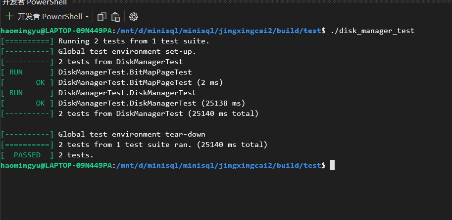

# DISK AND BUFFER POOL MANAGER

## 1. 实验概述

在MiniSQL的设计中，Disk Manager和Buffer Pool Manager模块位于架构的最底层。Disk Manager主要负责数据库文件中数据页的分配和回收，以及数据页中数据的读取和写入。其中，数据页的分配和回收通过位图（Bitmap）这一数据结构实现，位图中每个比特（Bit）对应一个数据页的分配情况，用于标记该数据页是否空闲（0表示空闲，1表示已分配）。当Buffer Pool Manager需要向Disk Manager请求某个数据页时，Disk Manager会通过某种映射关系，找到该数据页在磁盘文件中的物理位置，将其读取到内存中返还给Buffer Pool Manager。而Buffer Pool Manager主要负责将磁盘中的数据页从内存中来回移动到磁盘，这使得我们设计的数据库管理系统能够支持那些占用空间超过设备允许最大内存空间的数据库。

Buffer Pool Manager中的操作对数据库系统中其他模块是透明的。例如，在系统的其它模块中，可以使用数据页唯一标识符page_id向Buffer Pool Manager请求对应的数据页。但实际上，这些模块并不知道该数据页是否已经在内存中还是需要从磁盘中读取。同样地，Disk Manager中的数据页读写操作对Buffer Pool Manager模块也是透明的，即Buffer Pool Manager使用逻辑页号logical_page_id向Disk Manager发起数据页的读写请求，但Buffer Pool Manager并不知道读取的数据页实际上位于磁盘文件中的哪个物理页（对应页号physical_page_id）。

## 2. 位图页实现DISK MANAGER页管理

位图页是Disk Manager模块中的一部分，是实现磁盘页分配与回收工作的必要功能组件。位图页与数据页一样，占用PAGE_SIZE（4KB）的空间，标记一段连续页的分配情况。

Bitmap Page由两部分组成，一部分是用于加速Bitmap内部查找的元信息（Bitmap Page Meta），它可以包含当前已经分配的页的数量（page_allocated_ ）以及下一个空闲的数据页(next_free_page_ )，元信息所包含的内容可以由同学们根据实际需要自行定义。除去元信息外，页中剩余的部分就是Bitmap存储的具体数据，其大小BITMAP_CONTENT_SIZE可以通过PAGE_SIZE - BITMAP_PAGE_META_SIZE来计算，自然而然，这个Bitmap Page能够支持最多纪录BITMAP_CONTENT_SIZE * 8个连续页的分配情况。


与Bitmap Page相关的代码位于src/include/page/bitmap_page.h和src/page/bitmap_page.cpp中，以下函数为重点需要实现功能函数：

● BitmapPage::AllocatePage(&page_offset)：分配一个空闲页，并通过page_offset返回所分配的空闲页位于该段中的下标（从0开始）；
__接口设计说明 :__ 此函数通过模板设计，可以针对不同的PageSize进行特化，AllocatePage的主要作用是维护bitmap中关于页的信息，真正的空白页文件操作在DISK MANAGER中实现分配，此处通过信息维护和更新，使得后续这些页信息可以被找到。此函数通过返回值返回操作的成功与否，通过引用参数返回分配的page_offset，方便BUFFER POOL MANAGER进行调用管理
__实现原理说明 :__ 此函数通过调用遍历bitmap中的page_list，找到下一个空白页，并将此空白页的offset计算进行返回实现，需要注意的是必须要找到空白页并且不能超出bitmap管理的页空间，否则会返回失败。

```cpp
template<size_t PageSize>
bool BitmapPage<PageSize>::AllocatePage(uint32_t &page_offset) {
  bool state=false;
  //Bitmap is not FUll
  if(page_allocated_<GetMaxSupportedSize())
  {
    //Update page_allocatted
    this->page_allocated_++;
    //page_offset is next_free_page
    //if the next_free_page is not deleted before
    while(IsPageFree(this->next_free_page_)==false&&this->next_free_page_<GetMaxSupportedSize())
    {
      this->next_free_page_++;
      //flag=1;
    }
    page_offset=this->next_free_page_;
    //Get the Byte_index and bit_index of the Allocate Page
    uint32_t byte_index=this->next_free_page_/8;
    uint32_t bit_index=this->next_free_page_%8;
    //Update BitMap 
    unsigned char tmp=0x01;
    bytes[byte_index]=(bytes[byte_index]|(tmp<<(7-bit_index)));
    //Update next_free_page
    while(IsPageFree(this->next_free_page_)==false&&this->next_free_page_<GetMaxSupportedSize()){this->next_free_page_++;}
    state=true;
  }
  else{
  //BitMap is Full
    state=false;
  }
  return state;
}
```

● BitmapPage::DeAllocatePage(page_offset)：回收已经被分配的页，此处的回收并不涉及真实的内存空间以及文件操作，仅是维护bitmap内存信息即可，写回文件的操作会由disk manager实现；
__接口设计说明 :__ 此处通过指定一个要释放的页的偏移量，将指定页释放，并通过返回值表示操作是否成功。
__实现原理说明 :__ 此处通过page_offset参数首先计算出具体的byte_offset以及bit_index，否则通过调整位图（使用位运算找到对应的byte_offset & bit_index）进行更新（将对应的bit置为0），并将next_free_page以及page_allocated等成员变量进行更新，返回操作状态即可。

```cpp
template<size_t PageSize>
bool BitmapPage<PageSize>::DeAllocatePage(uint32_t page_offset) {
  //Get the Byte_index and bit_index
  uint32_t byte_index=page_offset/8;
  uint32_t bit_index=page_offset%8;
  bool state=false;
  if(this->page_allocated_==0||IsPageFree(page_offset)==true)
  {
    state= false;
  }
  else 
  {
    unsigned char tmp=0x01;
    tmp=~(tmp<<(7-bit_index));
    bytes[byte_index]=bytes[byte_index]&tmp;
    this->page_allocated_--;
    if(page_offset<this->next_free_page_)this->next_free_page_=page_offset;
    state=true;
  }
  return state;
}
```

● BitmapPage::IsPageFree(page_offset)：判断给定的页是否是空闲（未分配）的；
__接口设计说明 :__ 上层调用仅需要提供page_offset，并通过返回值得知操作的状态即可，注意此处实现的所有函数都仅维护内存中的位图页的相关信息。
__实现原理说明 :__ 此处通过位运算找到page_offset对应的bit处的值进行判断此位图页是否已经分配

```cpp
template<size_t PageSize>
bool BitmapPage<PageSize>::IsPageFree(uint32_t page_offset) const {
  uint32_t byte_index=page_offset/8;
  uint32_t bit_index=page_offset%8;
  unsigned char tmp=0x01;
  unsigned char PageState=(bytes[byte_index]&(tmp<<(7-bit_index)));
  if(PageState==0) return true;
  else return false;
}
```

此外，与该模块相关的测试代码位于test/storage/disk_manager_test.cpp中，测试结果如下：


## 3. 磁盘数据页管理

在实现了基本的位图页后，我们就可以通过一个位图页加上一段连续的数据页（数据页的数量取决于位图页最大能够支持的比特数）来对磁盘文件（DB File）中数据页进行分配和回收。但实际上，这样的设计还存在着一点点的小问题，假设数据页的大小为4KB，一个位图页中的每个字节都用于记录，那么这个位图页最多能够管理32768个数据页，也就是说，这个文件最多只能存储4K * 8 * 4KB = 128MB的数据，这实际上很容易发生数据溢出的情况。

为了应对上述问题，一个简单的解决思路是，把上面说的一个位图页加一段连续的数据页看成数据库文件中的一个分区（Extent），再通过一个额外的元信息页来记录这些分区的信息。通过这种“套娃”的方式，来使磁盘文件能够维护更多的数据页信息。其主要结构如下图所示：


Disk Meta Page是数据库文件中的第0个数据页，它维护了分区相关的信息，如分区的数量、每个分区中已经分配的页的数量等等。接下来，每一个分区都包含了一个位图页和一段连续的数据页。在这样的设计下，我们假设Disk Meta Page能够记录4K/4=1K个分区的信息，那么整个数据库能够维护的数据页的数量以及能够存储的数据数量与之前的设计相比，扩大了1000倍。与Disk Meta Page相关的代码定义在src/include/page/disk_file_meta_page.h中。

不过，这样的设计还存在着一个问题。由于元数据所占用的数据页实际上是不存储数据库数据的，而它们实际上又占据了数据库文件中的数据页，换而言之，实际上真正存储数据的数据页是不连续的。举一个简单例子，假设每个分区能够支持3个数据页，那么实际上真正存储数据的页只有：2, 3, 4, 6, 7, 8...

| 物理页号 | 0          | 1      | 2      | 3      | 4      | 5      | 6      | ...  |
| -------- | ---------- | ------ | ------ | ------ | ------ | ------ | ------ | ---- |
| 职责     | 磁盘元数据 | 位图页 | 数据页 | 数据页 | 数据页 | 位图页 | 数据页 |      |
| 逻辑页号 | /          | /      | 0      | 1      | 2      |        | 3      |      |

但实际上，对于上层的Buffer Pool Manager来说，希望连续分配得到的页号是连续的（0, 1, 2, 3...），为此，在Disk Manager中，需要对页号做一个映射（映射成上表中的逻辑页号），这样才能使得上层的Buffer Pool Manager对于Disk Manager中的页分配是无感知的。

因此，在这个模块中，重点需要实现的函数以及相关解释如下，与之相关的代码位于src/include/storage/disk_manager.h和src/storage/disk_manager.cpp。

● DiskManager::AllocatePage()：从磁盘中分配一个空闲页，并返回空闲页的逻辑页号；
__接口设计说明 :__ 对DISK MANAGER下达AllocatePage指令，DISK MANAGER会将文件中取回的新的一页返回
__实现原理说明 :__ 首先更新meta_page页的信息，然后扫描分区并找到非空的extent分区，随后取出该分区对应的bitmap，调用bitmap的AllocatePage对bitmap信息进行更新，最后通过计算求得对应分区的逻辑页号，写回到文件中，page_id_t 返回找到的分区的物理页号计算得到逻辑页号。

```cpp
page_id_t DiskManager::AllocatePage() {
  //0.Update Disk_File_Meta_page
  //1.We need to linear Search the Extent,and find the Extent which is not full
  //2.After we get the extent,The We need to read bitmap in that Extent from the disk
  //3.Using the bitmap to NextFreePage_id
  //4.Get the Logical_Page_id(Extent_id*BIT_MAP_SIZE+NextFreePage_id)
  //5.Write back to the Physical Disk--------WritePhysicalPage(MapPageId(Logical_Page_id),Page_Data)
  DiskFileMetaPage *meta_page = reinterpret_cast<DiskFileMetaPage *>(this->meta_data_);
  uint32_t NextPage=0;
  //Situation 0: if this is the first Allocation
  if(meta_page->GetExtentNums()==0)
  {
    //First Part-Update Disk_File_Meta_Data
    //Allocate num_extents
    meta_page->num_extents_++;
    //Update num_allocated_page
    meta_page->num_allocated_pages_++;
    //Update extent_used_page
    meta_page->extent_used_page_[0]=1;

    //Second Part-Update the BitMap
    //Read BitMap from the corresponding  extent
    char Page_Data[PAGE_SIZE];//Page_data will record the data read from the disk
    // ReadBitMapPage(0,Page_Data);
    ReadPhysicalPage(1,Page_Data);
    
    //Allocate Page
    BitmapPage<PAGE_SIZE> *Bitmap_page = reinterpret_cast<BitmapPage<PAGE_SIZE> *>(Page_Data);
    bool state=Bitmap_page->AllocatePage(NextPage);
    if(state)
    {
      //In the Disk Storage Layout, page 1 is the First BitMapPage
      //Write Back Page 1 to the Disk
      char *Page_Data = reinterpret_cast<char *>(Bitmap_page);
      WritePhysicalPage(1,Page_Data);
    }
    else
    {
      std::cerr<<"Error----AllocatePage Failed1"<<std::endl;
    }
  }
  //Situation 1: General Case.
  else {
    //First Part: -> Update disk_file_meta_page
    //1.Update num_allocated_pages first
    meta_page->num_allocated_pages_++;
    //2.Find the Last extent which is not full
    int flag=0;
    uint32_t i;
    for (i=0; i < meta_page->num_extents_; i++)
    {
      if (meta_page->extent_used_page_[i] < BITMAP_SIZE)
      {
        flag=1;
        break;
      }
    }
    //3.Check the overflow of the current extents
    if(flag==0)
    {
      //it means the current extents are all full.
      //Used New extent
      i = meta_page->num_extents_++;
      meta_page->extent_used_page_[i]++;
    }
    else
    {
      //it means the current extents are not full.
      meta_page->extent_used_page_[i]++;
    }

    // i is the corresponding extent_id of this allocate

    //Second Part- Read BitMap
    char Page_Data[PAGE_SIZE];
    ReadBitMapPage(i,Page_Data);
    //Thrid Part- Allocate Page
    BitmapPage<PAGE_SIZE> *Bitmap_page = reinterpret_cast<BitmapPage<PAGE_SIZE> *>(Page_Data);
    bool state = Bitmap_page->AllocatePage(NextPage);
    
    if(state==true)
    {
      page_id_t BitMap_page_id=i*(BITMAP_SIZE+1)+1;  
      //Write Back BitMap Page  to the Disk
      char *Page_Data = reinterpret_cast<char *>(Bitmap_page);
      WritePhysicalPage(BitMap_page_id,Page_Data);
      NextPage += i*BITMAP_SIZE; // the extent_id * (number of data pages) + page number in the extent => logical page id.
    }
    else
    {
      std::cerr<<"Error----AllocatePage Failed2"<<std::endl;
    }
  }
  
  return NextPage;
}
```

● DiskManager::DeAllocatePage(logical_page_id)：释放磁盘中逻辑页号对应的物理页；
__接口设计说明 :__ 上层(BUFFER POOL MANAGER) 通过给出逻辑页号，DISK MANAGER将对应的物理页在文件中直接释放，由于文件释放一定可以成功，故不需要返回值指示操作的结果
__实现原理说明 :__ 首先更新meta_page，通过计算得到参数逻辑页号对应的物理页号，并更新DISK MANAGER类中的相关成员函数。随后读取分区对应的位图bitmap并调用bitmap中的DeallocatePage方法实现bitmap信息的管理和更新，最后将对应更新后的信息写回到物理磁盘中实现永久保存。

```cpp
void DiskManager::DeAllocatePage(page_id_t logical_page_id) {
  
  //0.Update Disk_File_Meta_page
  //1.Convert the logical_page_id to Physical_page_id
  //2.if we DeAllocatePage, We may need to update num_extents_
  //3.Then We need to read bitmap in that Extent from the disk
  //4.Using the bitmap to Deallocate the logical_page_id%BITMAX_Size
  //5.Write back to the Physical Disk--------WritePhysicalPage(MapPageId(Logical_Page_id),Page_Data)
  DiskFileMetaPage *meta_page = reinterpret_cast<DiskFileMetaPage *>(this->meta_data_);

  page_id_t Physical_Page_Id = this->MapPageId(logical_page_id);
  //Situation 0: if the extents is Empty, We could not DeAllocate.
  if(meta_page->GetExtentNums()==0)
  {
    return ; // stop the execution of the rest of the function.
  }

  //Situation 1: if the extents only has one page, so if we delete the extents, we need to update diskFileData
  
  //page_id_t physical_page_id=MapPageId(logical_page_id);
  int extent_id=logical_page_id/BITMAP_SIZE;
  //Situation 1.1: if the extents only has one page, and that is not free.
  if(meta_page->extent_used_page_[extent_id]==1&&IsPageFree(logical_page_id)==false)
  {
    //Update the Disk_File_Meta_Data
    meta_page->num_allocated_pages_--;
    meta_page->extent_used_page_[extent_id]=0;
    //Read the Corresponding BitMap From the Disk,DeAllocate the BitMap
    char Page_Data[PAGE_SIZE];
    ReadBitMapPage(extent_id,Page_Data);
    BitmapPage<PAGE_SIZE> *Bitmap_page = reinterpret_cast<BitmapPage<PAGE_SIZE> *>(Page_Data);

    char Init_Page_Data[PAGE_SIZE];
    for (int i = 0; i < PAGE_SIZE; i++) 
    {
      Init_Page_Data[i] = '\0';
    }

    //DeAllocate the bitmap
    bool state=Bitmap_page->DeAllocatePage(logical_page_id%BITMAP_SIZE);
    if(state==true)
    {
      //Write Back to the Disk
      page_id_t BitMap_page_id=extent_id*(BITMAP_SIZE+1)+1;  
      //Write Back BitMap Page  to the Disk
      char *Page_Data = reinterpret_cast<char *>(Bitmap_page);
      WritePhysicalPage(BitMap_page_id,Page_Data);
      WritePhysicalPage(Physical_Page_Id, Init_Page_Data);

    }
    else
    {
      std::cerr<<"Situation 1.1-----disk_manager::DeAllocate()------Failed"<<std::endl;
      WritePhysicalPage(Physical_Page_Id, Init_Page_Data);
      return;
    }
  }
  //Situation 1.2: if the extents only has one page, and that page is free.
  else if(meta_page->extent_used_page_[extent_id]==1&&IsPageFree(logical_page_id)==true)
  {
    std::cerr<<"Situation 1.2-----Can not Deallocate,Page "<<logical_page_id<<" is Free"<<std::endl;
    return;
  }
  //Situation 2: General Case.
  else{
    //First Part: -> Update disk_file_meta_page
    //1.Update num_allocated_pages first
    meta_page->extent_used_page_[extent_id]--;
    meta_page->num_allocated_pages_--;
    //Second Part: -> Read BitMap
    char Page_Data[PAGE_SIZE];
    ReadBitMapPage(extent_id,Page_Data);
    //Thrid Part: -> Allocate Page
    BitmapPage<PAGE_SIZE> *Bitmap_page = reinterpret_cast<BitmapPage<PAGE_SIZE> *>(Page_Data);
    bool state = Bitmap_page->DeAllocatePage(logical_page_id%BITMAP_SIZE);

    char Init_Page_Data[PAGE_SIZE];
    for (int i = 0; i < PAGE_SIZE; i++) {
      Init_Page_Data[i] = '\0';
    }
    
    if(state==true)
    {
      page_id_t BitMap_page_id=(extent_id)*(BITMAP_SIZE+1)+1;  
      //Write Back BitMap Page  to the Disk
      char *Page_Data = reinterpret_cast<char *>(Bitmap_page);
      WritePhysicalPage(BitMap_page_id,Page_Data);
      WritePhysicalPage(Physical_Page_Id, Init_Page_Data);
    }
    else
    {
      std::cerr<<"Situation 2.1-----disk_manager::DeAllocate-----Failed"<<std::endl;
      WritePhysicalPage(Physical_Page_Id, Init_Page_Data);
      return;
    }
  }
}
```

● DiskManager::IsPageFree(logical_page_id)：判断该逻辑页号对应的数据页是否空闲；
__接口设计说明 :__ 调用者通过给出logical_page_id，此函数会给出是否这个页已经被分配或者占用（通过返回值，如果true就是free，如果false就是已经占用）
__实现原理说明 :__ DISK MANAGER会通过逻辑页和物理页之间的映射关系进行计算，找到对应物理页，并通过bitmap找到该物理页是否free的信息。

```cpp
bool DiskManager::IsPageFree(page_id_t logical_page_id) {
  //1.First Find the Corresponding Extent_id.
  //2.Second Read the bitMap.
  //3.Using the bitMap to determine Whether the Logical_page_id is Free or not.

  char Page_Data[PAGE_SIZE];//Page_data will record the data read from the disk
  int extent_id=logical_page_id/BITMAP_SIZE;
  ReadBitMapPage(extent_id,Page_Data);
  //Convert the Logical_page_id to the Every Extent Pageid
  page_id_t Bitmap_page_id=logical_page_id%BITMAP_SIZE;
  BitmapPage<PAGE_SIZE> * bitmap_page = reinterpret_cast<BitmapPage<PAGE_SIZE> *>(Page_Data);
  //Get the state of the page
  bool state=bitmap_page->IsPageFree(Bitmap_page_id);
  return state;
}
```

● DiskManager::MapPageId(logical_page_id)：可根据需要实现。在DiskManager类的私有成员中，该函数可以用于将逻辑页号转换成物理页号；
__接口设计说明 :__ 此函数是给开发者使用，实现函数内部多处使用的逻辑页号和物理页号之间的转换工作，可以设置为private类型函数，对上层和其他模块透明。
__实现原理说明 :__ 通过上表的原理实现，通过逻辑页计算物理页，简单的数学关系。封装起来更加方便简化设计，减少代码冗余。

```cpp
page_id_t DiskManager::MapPageId(page_id_t logical_page_id) {
  //This Functions will map the logical_page_id to physical_page_id
  page_id_t Delta=2;
  //First We need to Know the extent numbers of the logical_page_id
  int extent_id=logical_page_id/BITMAP_SIZE;
  page_id_t physical_page_id=extent_id+Delta+logical_page_id;
  return physical_page_id;
}
```

此外，为了确保系统的其余部分正常工作，Disk Manager框架中提供一些已经实现的功能，如磁盘中数据页内容的读取和写入等等。并且DiskManager类中的meta_data_ 成员实际上是MetaPage在内存中的缓存（类似于BufferPool缓存Page的作用）。使用时，只需通过reinterpret_cast将meta_data_转换成MetaPage类型的对象即可。

测试结果如下：


## 4. 模块相关代码

- `src/include/page/bitmap_page.h`
- `src/page/bitmap_page.cpp`
- `src/include/storage/disk_manager.h`
- `src/storage/disk_manager.cpp`
- `test/storage/disk_manager_test.cpp`