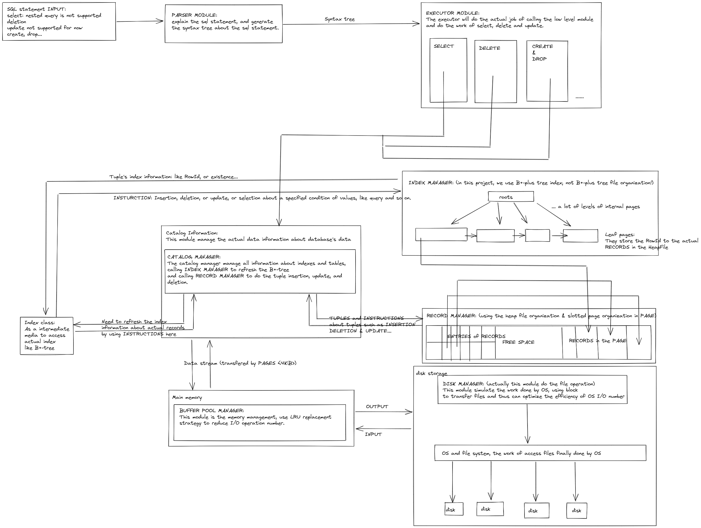
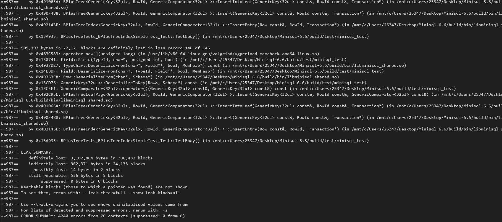

# MINISQL

 ___creator :___

- ***jingxingcai*** 蔡京星 2020级计算机科学与技术学院 软件工程专业
- ***haomingyu*** 余浩鸣 2020级计算机科学与技术学院 计算机科学与技术专业

1. 引言

   1. 1 编写目的

      为了更好地实现MINISQL，首先对系统进行一个总体和层次的设计分析，以便更好理解框架的工作原理和实现方式。这里给出运行时的模块间关系和调用概念图：
      

   1. 2 项目背景

      此MINISQL程序Zhejiang University数据库课程助教修改框架下根据提示完成。本组开发人员由蔡京星和余浩鸣两人完成。

   1. 3 参考资料

      ___数据库系统概念___  Author: Abraham Siberschatz, Henry F.Korth, S.Sudarshan

2. 整体模块架构：

   1. 由于此数据库在 ___Operating System___ 上建立，具体的文件需要通过OS的虚拟内存映射和磁盘管理实现，但是OS的磁盘管理可以对上层透明，故我们可以通过设计 ___DISK MANAGER___ 来进行 PAGE_SIZE 大小的页的读取写入，从而实现整块和OS的存储管理进行交互，减小IO数量
   2. ___BUFFER POOL MANAGER___ 是管理程序的内存池，使用LRU策略进行PAGE的替换，当初始开机的时候，所有的BUFFER POOL都存在于一个FREE LIST中，每次使用一个PAGE，BUFFER POOL MANAGER会首先在BUFFER POOL中查找是否有FREE LIST中的页，如果没有，再使用LRU进行替换。替换的时候，如果该PAGE已经被改写过，其DIRTY PAGE会置为1，当脏页在被替换的时候，需要 ___DISK MANAGER___ 将此页写回到文件中进行永久性存储。（类似cache的write allocate & write back策略结合设计）
      为了支持后续可能拓展的 CONCURRENCY CONTROL 以及方便多个模块协同管理内存BUFFER，此处使用pin机制管理页，当有进程或者模块在使用一个页的时候，其他模块和进程不可以将该页从内存中替换出去，使用pin_count的方式实现，当有进程或者模块在使用某页的时候会将pin_count++；
      这种设计的优点是可以保证多个模块对于BUFFER的协同管理可以正常进行，但是缺点是上层模块需要管理pin_count，如果在使用完之后忘记解锁会导致页不可以被从内存中替换，（类似shared_lock）将会导致内存中的页全部被填满并且不可替换，后续的请求会中断，程序运行崩溃。因此需要调用者对BUFFER进行细致的管理。
   3. ___RECORD MANAGER___ 是用来管理tuples记录的模块，通过提供上层接口对记录中的页进行特化，使用SLOTTED PAGE的方式实现不定长记录的高效存储。
   4. ___INDEX MANAGER___ 是用来管理index记录的模块，在本设计中，使用B+-tree进行index管理，索引页通过ROWID实现类似指针的功能，需要注意的是本设计中并不包含B+-tree file organization的存储模式，最终的索引到的元组还是需要通过ROWID调用 ___RECORD MANAGER___ 进行查找。INDEX MANAGER的所有节点都独占一页，大概可以存储50-200条记录。（取决于索引键值占用的空间大小）其中index的交互接口通过泛型编程支持各种类型的组合索引值键的比较，并通过INDEX CLASS和上层进行交互；为了后续方便拓展其他的index实现方式，所有的index管理、以及具体的index存储管理通过父类INDEX进行管理，其中所有B+树的根节点记录会单独占用一个PAGE进行存储，方便数据库在开机关机的时候将根节点进行存储并在开机的时候找回。
   5. ___CATALOG MANAGER___ 是管理catalog信息的模块，上层所需的关于元组以及index的所有信息都需要通过catalog manager进行索取，并且catalog manager会在一开机的时候就将所有的关于数据的信息，即meta信息以及对应的存储的信息在内存进行构建，并在关机或者sql操作后及时将信息序列化存储到硬盘中。实现上层executor对实现tuple的操作的方便管理。
   6. ___EXECUTOR___ 是MINISQL的核心功能模块，需要调用catalog manager找到具体的元组信息，解析语法树提供的sql语句信息，并将此语句要求的功能通过调用catalog manger，维护catalog manager，调用具体的堆表和index管理完成sql语句要求的功能。此模块需要在设计过程中考虑多样的执行情况，调用前面设计的几乎所有模块，以及解析语法树等，类似一个中央处理器，管理整个数据库的所有操作，因此工作量较为巨大。
   7. ___PARSER___ 语法解释器是executor的辅助模块，对于不同的sql语法，parser模块会根据语义生成对应的语法树，方便语句的解析和处理，以及executor对于语句语法含义的理解。

3. 具体实现

   各个模块的具体实现请参照各个模块的说明，各个模块的分别说明会给出该模块的效用和实现原理，以及具体的实现难点和实现细节，还会对细节的函数实现进行说明，包含详细的代码实现以及算法以及数据结构的设计思路。

4. 最终效果展示
   此部分将会在EXECUTOR，即第五模块中进行分析展示。

5. 设计分工
   本MINISQL实现使用串行设计的方式，由于不同模块之间的依赖性较为巨大，但是具体编写工作基本由单人完成：
   DISK MANAGER                  --- jingxingcai
   BUFFER POOL MANAGER --- haomingyu
   RECORD MANAGER           --- jingxingcai
   INDEX MANAGER               --- jingxingcai
   CATALOG MANAGER         --- haomingyu
   EXECUTOR                           --- TOGETHER
   TEST & DEBUG                    --- jingxingcai

6. 致谢和心得

   组员使用vs2022新支持的wsl连接进行调试开发，较为方便，配置也较为简洁。
   我们能够完成这次MINISQL大程序首先要感谢YCJ助教老师，没有他的付出甚至不会有这样的框架，虽然是改编自Bustub的框架，但是可以看到底层模块和后续的executor以及中间的堆表设计，序列化等核心模块设计仍然是独立的设计，在对助教老师发自内心地崇拜之余，更是对他付出和耐心解答问题的感谢。
   其次需要感谢陈岭老师对于理论课的细心讲解，不仅让我们了解了数据库相关知识，更帮助我们深入了解数据库关联的其他硬件以及操作系统方面的知识，拓宽了眼界
   最后也是最重要的是，感谢组员之间的理解，更是感谢蔡京星同学对于程序编写的投入和引领，没有他的帮助和巨大付出，不可能有MINISQL的成功完成。

7. 不足之处

   + 内存泄露

     通过Valgrind-linux Debug工具对程序内存泄露的情况进行了分析。

     发现内存情况，较为严重，如果导入大容量数据，可能会出现程序崩溃的情况。

     

   + 在批量导入的时候DiskManager的优化

     其实在进行批量导入的话，现在的解决策略是`DISKMANGER`反复读首页，分别找相应分区的`BitMapPage`，从而找到相应的Page，但是在批量导入的情况下，如果一个分区满了，需要找另一个分区，就需要重新从磁盘中读取相应的BitMapPage，每一次都要刷磁盘，在批量导入的情况下，此解决策略影响批量导入的速度。

     解决方案：

     认为应当在DiskManager进行构造的时候，就应当把所有分区的BitMapPage全部读入一个数组中，以提高速度。

   + 小组分工

     其实在小组分工上，在编写完整个项目之后，认为第二模块和第四模块应当分工在一起，由于CatalogManager设计堆表的管理和索引的管理，但是相比于索引和Catalogmanager的联系比较简单，但是堆表和CatalogManager联系比较紧密，因此这两个模块应当一起编写。

     由于第三模块较为独立，第三模块的工作量较大，第一模块工作量较小，因此1，3模块应当一起分工。

     最后就是第五模块，第五模块应该是工作量最大的模块，由于没有学习过编译原理，或者“火山模型”，因此所有的Case都是通过If-Else完成的，因此每个的工作量都很大，认为这一个模块最好是能够分工一下。

   + 事物处理

     我认为缺少事物处理的DBMS，很难称之为关系型数据库，事物回滚和并发控制是数据库区别于文件管理系统的最大特点，虽然现今的Minisql能够完成基本的增删改查，希望能够在暑假的时候，持续完善Minisql

