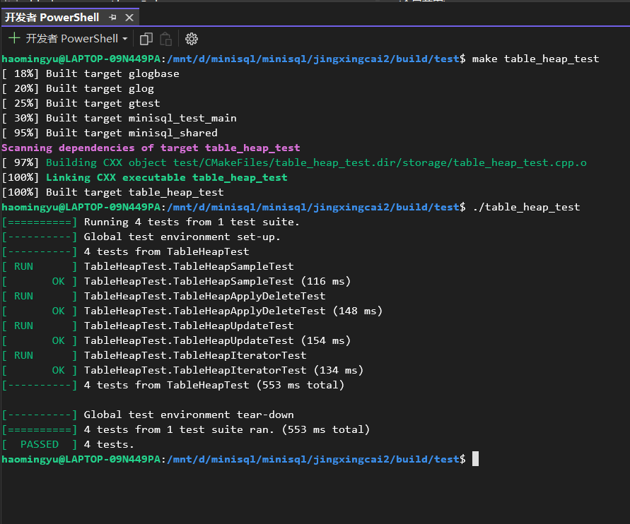

# RECORD MANAGER

## 1. 实验概述

在MiniSQL的设计中，Record Manager负责管理数据表中所有的记录，它能够支持记录的插入、删除与查找操作，并对外提供相应的接口。

与记录（Record）相关的概念有以下几个：

- 列（Column）：在src/include/record/column.h中被定义，用于定义和表示数据表中的某一个字段，即包含了这个字段的字段名、字段类型、是否唯一等等；
- 模式（Schema）：在src/include/record/schema.h中被定义，用于表示一个数据表或是一个索引的结构。一个Schema由一个或多个的Column构成；
- 域（Field）：在src/include/record/field.h中被定义，它对应于一条记录中某一个字段的数据信息，如存储数据的数据类型，是否是空，存储数据的值等等；
- 行（Row）：在src/include/record/row.h中被定义，与元组的概念等价，用于存储记录或索引键，一个Row由一个或多个Field构成。

- 

此外，与数据类型相关的定义和实现位于src/include/record/types.h中。

## 2. 记录与模式

在实现通过堆表来管理记录之前，需要首先实现一个有关数据的序列化和反序列化操作的任务。为了能够持久化存储上面提到的Row、Field、Schema和Column对象，我们需要提供一种能够将这些对象序列化成字节流（char* ）的方法，以写入数据页中。与之相对，为了能够从磁盘中恢复这些对象，我们同样需要能够提供一种反序列化的方法，从数据页的char*类型的字节流中反序列化出我们需要的对象。总而言之，序列化和反序列化操作实际上是将数据库系统中的对象（包括记录、索引、目录等）进行内外存格式转化的过程，前者将内存中的逻辑数据（即对象）通过一定的方式，转换成便于在文件中存储的物理数据，后者则从存储的物理数据中恢复出逻辑数据，两者的目的都是为了实现数据的持久化。下面是一种序列化和反序列化的概念叙述：

```cpp
// 逻辑对象
class A {
    int id;
    char *name;
};

// 以下是序列化和反序列化的伪代码描述
void SerializeA(char *buf, A &a) {
    // 将id写入到buf中, 占用4个字节, 并将buf向后推4个字节
    WriteIntToBuffer(&buf, a.id, 4);
    WriteIntToBuffer(&buf, strlen(a.name), 4);
    WriteStrToBuffer(&buf, a.name, strlen(a.name));
}

void DeserializeA(char *buf, A *&a) {
    a = new A();
    // 从buf中读4字节, 写入到id中, 并将buf向后推4个字节
    a->id = ReadIntFromBuffer(&buf, 4);
    // 获取name的长度len
    auto len = ReadIntFromBuffer(&buf, 4);
    a->name = new char[len];
    // 从buf中读取len个字节拷贝到A.name中, 并将buf向后推len个字节
    ReadStrFromBuffer(&buf, a->name, len);
}
```

为了确保我们的数据能够正确存储，我们在上述提到的Row、Schema和Column对象中都引入了魔数MAGIC_NUM，它在序列化时被写入到字节流的头部并在反序列化中被读出以验证我们在反序列化时生成的对象是否符合预期。
在本节中我们需要完成如下函数：

- `Row::SerializeTo(*buf, * schema)`

  ```cpp
  uint32_t Row::SerializeTo(char *buf, Schema *schema) const { // schema not used actually.
    // Part1->Header
    uint32_t ofs = 0;
    //   1.Write the FieldNumber
    MACH_WRITE_UINT32(buf, this->GetFieldCount());
    ofs += sizeof(uint32_t);
    //   2.Write the NullBitMap
    string NullBitMap; // the null bitmap used here is not actually bitmap, but a string version simulation.
    for (uint32_t i = 0; i < this->GetFieldCount(); i++) {
      if (fields_[i]->IsNull()) {
        // this fields is null
        NullBitMap.push_back('\1');
      } else {
        NullBitMap.push_back('\0');
      }
    }
    MACH_WRITE_STRING(buf + ofs, NullBitMap);
    ofs += NullBitMap.length();
    // Part2->Field Part
    
    //   3.Write the Fields
    for (uint32_t i = 0; i < this->GetFieldCount(); i++) {
      if (!fields_[i]->IsNull()) {
        ofs += fields_[i]->SerializeTo(buf + ofs);
      }
    }
  
    return ofs;
  }
  ```

- `Row::GetSerializedSize(* schema)`

  ```cpp
  uint32_t Row::GetSerializedSize(Schema *schema) const {
    //1.Calculate the FieldNumber
    uint32_t ofs = 0;
    ofs += sizeof(uint32_t);
  
    //2.Calculate the Sizeof NullBitMap
    ofs += this->GetFieldCount();
    
    //3.Calculate the Size of the Field
    for (uint32_t i = 0; i < this->GetFieldCount(); i++) {
      if (!fields_[i]->IsNull()) {
        ofs += fields_[i]->GetSerializedSize();
      }
    }
  
    return ofs;
  }
  ```

- `Row::DeserializeFrom(char *buf, Schema *schema);`

  ```cpp
  uint32_t Row::DeserializeFrom(char *buf, Schema *schema) { 
  // schema is used to test for the compatibility. 
  // And also for integrity of data (complete null data's information)
    uint32_t ofs = 0;
    // if buf is nullptr, nothing to deserialize from.
    if (buf == nullptr) return 0;
    // else do the actual deserialize.
    //   1.Read the Field Num First
    uint32_t FieldNum = MACH_READ_FROM(uint32_t, (buf));
    ASSERT(FieldNum == schema->GetColumnCount(), "Field Count does not match");
    /** can be used to replace the upper statement.
    if (FieldNum != schema->GetColumnCount()) {
      std::cerr << "Field Count does not match" << endl;
    }
    */
    ofs += sizeof(uint32_t);
    //   2.Read the NullBitMap
    string NullBitMap;
    for (uint32_t i = 0; i < FieldNum; i++) {
      NullBitMap.push_back(*(buf+ofs+i));
    }
    ofs += FieldNum;
    
    //   3.Get the Field
    std::vector<Column *> Column = schema->GetColumns(); 
    for (uint32_t i = 0; i < FieldNum; i++) {
      if (NullBitMap[i] == '\1') {
        //it means that this field is null
        Field *tmp = nullptr;
        void *mem = heap_->Allocate(sizeof(Field));
        tmp = new (mem) Field(Column[i]->GetType());
        this->fields_.push_back(tmp);
      } else {
        Field *tmp = nullptr;
        ofs += Field::DeserializeFrom(buf + ofs, Column[i]->GetType(), &tmp, false, heap_);
        this->fields_.push_back(tmp);
      }
    }
  
    return ofs;
  }
  ```

- `Column::SerializeTo(* buf)`

  ```cpp
  uint32_t Column::SerializeTo(char *buf) const {
    uint32_t ofs=0;
  
    //1. Write the MagicNum
    MACH_WRITE_UINT32(buf, COLUMN_MAGIC_NUM);
    ofs += sizeof(uint32_t);
  
    //2. Write the length for the Name
    MACH_WRITE_UINT32(buf+ofs, this->name_.length());
    ofs += sizeof(uint32_t);
  
    //*3. Write the string name to the buf (-> this is a string)
    MACH_WRITE_STRING(buf+ofs, this->name_);
    ofs += this->name_.length();
  
    //4. Write the type_ to the buf
    MACH_WRITE_TO(TypeId, (buf+ofs), (this->type_));
    ofs += sizeof(TypeId);
  
    //5. Write the len_ to the buf
    MACH_WRITE_UINT32(buf+ofs, this->len_);
    ofs += sizeof(uint32_t);
  
    //6. Write the table_ind_
    MACH_WRITE_UINT32(buf+ofs, this->table_ind_);
    ofs += sizeof(uint32_t);
  
    //7. Write the nullable_ to the buf
    MACH_WRITE_BOOL(buf+ofs, this->nullable_);
    ofs += sizeof(bool);
  
    //8. Write the unique_ to the buf
    MACH_WRITE_BOOL(buf + ofs, this->unique_);
    ofs += sizeof(bool);
  
    return ofs;
  }
  ```

- `Column::DeserializeFrom(*buf, *&column, * heap)`

  ```cpp
  uint32_t Column::DeserializeFrom(char *buf, Column *&column, MemHeap *heap) {
    if (column != nullptr) {
      // std::cerr << "Pointer to column is not null in column deserialize." << std::endl;
    } // a warning of covering original column storage in memory.
    if(buf==NULL) return 0; // nothing to deserialize from. 
    
    /* deserialize field from buf */
  
    //1.Read the Magic_Number
    uint32_t Magic_Number = MACH_READ_UINT32(buf);
    ASSERT(Magic_Number == 210928, "COLUMN_MAGIC_NUM does not match"); 
    buf += sizeof(uint32_t); // refresh buf to another member storage.
  
    //2.Read the length of the name_
    uint32_t length = MACH_READ_UINT32(buf);
    buf += sizeof(uint32_t);
  
    //3.Read the Name from the buf
    std::string column_name;
    for(uint32_t i=0;i < length;i++)
    {
      column_name.push_back(buf[i]);
    }
    buf += length; // the storage of string is compact, so just add the length is OK.
  
    //4.Read the type
    TypeId type=MACH_READ_FROM(TypeId, (buf));
    buf += sizeof(TypeId);
  
    //5.Read the len_
    uint32_t len_ = MACH_READ_UINT32(buf);
    buf += sizeof(uint32_t);
  
    //6.Read the col_ind
    uint32_t col_ind = MACH_READ_UINT32(buf);
    buf += sizeof(uint32_t);
  
    //7.Read the nullable
    bool nullable=MACH_READ_FROM(bool,(buf));
    buf += sizeof(bool);
  
    //8.Read the unique
    bool unique=MACH_READ_FROM(bool,(buf));
    buf += sizeof(bool);
  
    // can be replaced by: 
    //		ALLOC_P(heap, Column)(column_name, type, col_ind, nullable, unique);
    
    void *mem = heap->Allocate(sizeof(Column));
    if (type == kTypeInt || type == kTypeFloat) {
      // type is the int or float
      column = new (mem) Column(column_name, type, col_ind, nullable, unique);
    } else if (type == kTypeChar) {
      column = new (mem) Column(column_name, type, len_, col_ind, nullable, unique);
    }
    
    return sizeof(uint32_t) * 4 + sizeof(bool) * 2 + sizeof(TypeId) + length;
  }
  ```

- `Column::GetSerializedSize()`

  ```cpp
  uint32_t Column::GetSerializedSize() const { // calculate the serializedSize of column, maybe used in the upper level estimation.
    uint32_t ofs=0;
    if(this->name_.length()==0)
    {
      return 0;
      // The Column does not have a name, which means that the column does not exist actually. 
      // -> this require the upper level calling to this function must keep the rule that the attribute must have a name.
    }
    else
    {
      ofs = sizeof(uint32_t) * 4 + sizeof(bool) * 2 + sizeof(TypeId);
      ofs += this->name_.length();
    }
    return ofs;
  }
  ```

- `Schema::SerializeTo(* buf)`

  ```cpp
  uint32_t Schema::SerializeTo(char *buf) const {
    uint32_t ofs = 0;
    std::vector<Column *> columns_ = this->GetColumns();
    
    //1.Write the Magic Number
    MACH_WRITE_UINT32(buf, SCHEMA_MAGIC_NUM);
    ofs += sizeof(uint32_t);
  
    //2.Write the size of the columns
    MACH_WRITE_UINT32(buf + ofs, (columns_.size()));
    ofs += sizeof(uint32_t);
  
    //3.Write the Columns the into the buf
    for (uint32_t i = 0; i < columns_.size(); i++) {
      //Write the Serialized Size of the Each column
      MACH_WRITE_UINT32(buf + ofs, (columns_[i]->GetSerializedSize()));
      ofs += sizeof(uint32_t);
      //Write the Serialized Column into the buf
      columns_[i]->SerializeTo(buf + ofs);
      ofs += columns_[i]->GetSerializedSize();
    }
    
    return ofs;
  }
  ```

- `Schema::DeserializeFrom(*buf, *&schema, *heap)`

  ```cpp
  uint32_t Schema::DeserializeFrom(char *buf, Schema *&schema, MemHeap *heap) {
    // First if buf is nullptr, then nothing to deserialize from. And the returned offset is 0 as well.
    if (buf == nullptr) return 0;
  
    // Do the actual deserialization work.
    uint32_t ofs = 0;
    std::vector<Column *> columns_; // Which will be used to construct the schema
  
    // 1. Read the Magic_Number
    uint32_t Magic_Number = MACH_READ_FROM(uint32_t, (buf));
    ofs += sizeof(uint32_t);
    
    // If does not match---Error
    ASSERT(Magic_Number == 200715, "MagicNumber does not match in schema deserialization");
    /** do the check of Magic_number.
    if (Magic_Number != 200715) {
      std::cerr << "MagicNumber does not match" << std::endl;
    }
    */
    // 2. Read the SizeOfColumns From the buf
    uint32_t LengthOfTable = MACH_READ_FROM(uint32_t, (buf + ofs));
    ofs += sizeof(uint32_t);
    // 3. Read the Columns in the Schema
    for (uint32_t i = 0; i < LengthOfTable; i++) {
      ofs += sizeof(uint32_t); // read the size of attributes out (actually redundant.)
      Column *tmp = nullptr;
      ofs += Column::DeserializeFrom(buf + ofs, tmp, heap);
      columns_.push_back(tmp);
    }
    void *mem = heap->Allocate(sizeof(Schema));
    schema = new (mem)Schema(columns_);
    return ofs;
  }
  ```

- `Schema::GetSerializedSize()`

  ```cpp
  uint32_t Schema::GetSerializedSize() const {
    std::vector<Column *> columns_ = this->GetColumns();
    uint32_t LengthOfTable = columns_.size();
    uint32_t Size = 0;
    //1.Calculate the Magic Number and SizeOf(Columns)
    Size += 2 * sizeof(uint32_t);
    //2.Calculate the Total Column
    for (uint32_t i = 0; i < LengthOfTable; i++) {
      //The SerializedSize
      Size += sizeof(uint32_t);
      Size += columns_[i]->GetSerializedSize();
    }
  
    return Size;
  }
  ```

- 测试结果
  

其中，SerializeTo和DeserializeFrom函数的返回值为uint32_t类型，它表示在序列化和反序列化过程中buf指针向前推进了多少个字节。
对于Row类型对象的序列化，可以通过位图的方式标记为null的Field(即 Null Bitmaps)，对于Row类型对象的反序列化，在反序列化每一个Field时，需要将自身的heap_作为参数传入到Field类型的Deserialize函数中，这也意味着所有反序列化出来的Field的内存都由该Row对象维护。对于Column和Schema类型对象的反序列化，将使用MemHeap类型的对象heap来分配空间，分配后新生成的对象于参数column和schema中返回，以下是一个简单的例子：

```cpp
uint32_t Column::DeserializeFrom(char *buf,
                                 Column *&column, 
                                 MemHeap *heap){
  if (column != nullptr) {
    LOG(WARNING) << "Pointer to column is not null in column deserialize." 									 << std::endl;
  }
  /* deserialize field from buf */
  
  // can be replaced by: 
  //		ALLOC_P(heap, Column)(column_name, type, col_ind, nullable, unique);
  void *mem = heap->Allocate(sizeof(Column));
  column = new(mem)Column(column_name, type, col_ind, nullable, unique);
  return ofs;
}
```

此外，在序列化和反序列化中可以用到一些宏定义在`src/include/common/macros.h`中，可根据实际需要使用：

```cpp
#define MACH_WRITE_TO(Type, Buf, Data) \
           do { \
              *reinterpret_cast<Type *>(Buf) = (Data); \
           } while (0)
#define MACH_WRITE_UINT32(Buf, Data) MACH_WRITE_TO(uint32_t, (Buf), (Data))
#define MACH_WRITE_INT32(Buf, Data) MACH_WRITE_TO(int32_t, (Buf), (Data))
#define MACH_WRITE_STRING(Buf, Str)      \
           do {                                       \
              memcpy(Buf, Str.c_str(), Str.length()); \
           } while (0)

#define MACH_READ_FROM(Type, Buf) (*reinterpret_cast<const Type *>(Buf))
#define MACH_READ_UINT32(Buf) MACH_READ_FROM(uint32_t, (Buf))
#define MACH_READ_INT32(Buf) MACH_READ_FROM(int32_t, (Buf))

#define MACH_STR_SERIALIZED_SIZE(Str) (4 + Str.length())

#define ALLOC(Heap, Type) new(Heap.Allocate(sizeof(Type)))Type
#define ALLOC_P(Heap, Type) new(Heap->Allocate(sizeof(Type)))Type
#define ALLOC_COLUMN(Heap) ALLOC(Heap, Column)
```

Note: 本MINISQL实验仅使用了`SimpleMemHeap`用于简单的内存分配和回收。若实现一种新的内存分配和管理方式，可以通过继承`MemHeap`类实现其分配和回收函数进行拓展。

## 3. 通过堆表管理记录

### 3.1 RowId

对于数据表中的每一行记录，都有一个唯一标识符`RowId`（`src/include/common/rowid.h`）与之对应。`RowId`同时具有逻辑和物理意义，在物理意义上，它是一个64位整数，是每行记录的唯一标识；而在逻辑意义上，它的高32位存储的是该`RowId`对应记录所在数据页的`page_id`，低32位存储的是该`RowId`在`page_id`对应的数据页中对应的是第几条记录（详见#2.3.2）。`RowId`的作用主要体现在两个方面：一是在索引中，叶结点中存储的键值对是索引键`Key`到`RowId`的映射，通过索引键`Key`，沿着索引查找，我们能够得到该索引键对应记录的`RowId`，也就能够在堆表中定位到该记录；二是在堆表中，借助`RowId`中存储的逻辑信息（`page_id`和`slot_num`），可以快速地定位到其对应的记录位于物理文件的哪个位置。

### 3.2 堆表

堆表（`TableHeap`，相关定义在`src/include/storage/table_heap.h`）是一种将记录以无序堆的形式进行组织的数据结构，不同的数据页（`TablePage`）之间通过双向链表连接。堆表中的记录通过`RowId`进行定位。`RowId`记录了该行记录所在的`page_id`和`slot_num`，其中`slot_num`用于定位记录在这个数据页中的下标位置。

堆表中的每个数据页（使用`Slotted-page Structure`结构实现，见下图，能够支持存储不定长的记录）都由表头（Table Page Header）、空闲空间（Free Space）和已经插入的数据（Inserted Tuples）三部分组成，与之相关的代码位于`src/include/page/table_page.h`中，表头在页中从左往右扩展，记录了`PrevPageId`、`NextPageId`、`FreeSpacePointer`以及每条记录在`TablePage`中的偏移和长度；插入的记录在页中从右向左扩展，每次插入记录时会将`FreeSpacePointer`的位置向左移动。


当向堆表中插入一条记录时，一种简单的做法是，沿着`TablePage`构成的链表依次查找，直到找到第一个能够容纳该记录的`TablePage`（*First Fit* 策略）。当需要从堆表中删除指定`RowId`对应的记录时，框架中提供了一种逻辑删除的方案，即通过打上Delete Mask来标记记录被删除，在之后某个时间段再从物理意义上真正删除该记录（本节中需要完成的任务之一）。对于更新操作，需要分两种情况进行考虑，一种是`TablePage`能够容纳下更新后的数据，另一种则是`TablePage`不能够容纳下更新后的数据，前者直接在数据页中进行更新即可，后者需要新开一页进行转储。此外，在堆表中还需要实现迭代器`TableIterator`(`src/include/storage/table_iterator.h`)，以便上层模块遍历堆表中的所有记录。

**Note：在**`TablePage::UpdateTuple`**函数中，返回的是**`bool`**类型的结果，其中返回**`true`**表示更新成功，返回**`false`**表示更新失败。但更新失败可能由多种原因造成，只用一个**`false`**无法区分更新失败的原因。可以采取以下两种做法：（1）更改返回值为**`int`**类型；（2）参数列表中增加一个参数表示返回状态；本实验采取了较为简便的做法以减少上层的调用处理负担，仅仅通过bool返回执行状态。**

综上，在本节中，我们需要实现堆表的插入、删除、查询以及堆表记录迭代器的相关的功能，具体需要实现的函数如下：

- `TableHeap:InsertTuple(&row, *txn)`: 向堆表中插入一条记录，插入记录后生成的`RowId`需要通过`row`对象返回（即`row.rid_`）；

  ```cpp
  bool TableHeap::InsertTuple(Row &row, Transaction *txn) {
    // Linear Search the tableHeap, Find the Empty Page
    for (page_id_t i = this->GetFirstPageId(); i != INVALID_PAGE_ID;) {
      auto Page = reinterpret_cast<TablePage *>(buffer_pool_manager_->FetchPage(i));
      // if the Tuple is Larger than PageSize
      if (row.GetSerializedSize(schema_) > Page->SIZE_MAX_ROW) return false;
  
      // If Find one Insert Tuple,and Update RowId
      Page->WLatch();
      bool state = Page->InsertTuple(row, this->schema_, txn, this->lock_manager_, this->log_manager_);
      Page->WUnlatch();
      if (state == true) {
        buffer_pool_manager_->UnpinPage(i, true);
  
        return true;
      } else {
        // it means current page can not allocate thi s page
        buffer_pool_manager_->UnpinPage(i, false);
        // Situation1:if the Current Page's Next Page Id is valid, it means do not need to set the Next Page id
        if (Page->GetNextPageId() != INVALID_PAGE_ID) {
          i = Page->GetNextPageId();
          continue;
        } else {
          // Situation2:if the Current Page's Next Page Id is Invalid, it means need to set the Next Page id
          // Allocate New Page
          i = AllocateNewPage(i, buffer_pool_manager_, txn, lock_manager_, log_manager_);
          Page->SetNextPageId(i);
          buffer_pool_manager_->UnpinPage(i, true);
        }
      }
  
      i = Page->GetNextPageId();
    }
    return false;
  }
  ```

- `TableHeap:UpdateTuple(&new_row, &rid, *txn)`：将`RowId`为`rid`的记录`old_row`替换成新的记录`new_row`，并将`new_row`的`RowId`通过`new_row.rid_`返回；

  ```cpp
  /**
   * if the new tuple is too large to fit in the old page, return false (will delete and insert)
   * @param[in] row Tuple of new row
   * @param[in] rid Rid of the old tuple
   * @param[in] txn Transaction performing the update
   * @return true is update is successful.
   */
  bool TableHeap::UpdateTuple(Row &row, const RowId &rid, Transaction *txn) {
    auto page = reinterpret_cast<TablePage *>(buffer_pool_manager_->FetchPage(rid.GetPageId()));
    // Get OldRow
    Row OldRow(rid);
    // using UpdateTuple to update the Tuple
    int state = page->UpdateTuple(row, &OldRow, schema_, txn, lock_manager_, log_manager_);
    bool result = true;
    // Situation1: it is Invalid_Slot_number
    if (state == INVALID_SLOT_NUMBER) {
      buffer_pool_manager_->UnpinPage(page->GetPageId(), false);
      result = false;
  
    }
    // Situation2: it is Already Deleted.
    else if (state == TUPLE_DELETED) {
      buffer_pool_manager_->UnpinPage(page->GetPageId(), false);
      result = false;
  
    }
    // Situation3: it is not enough Space to Update into Current Page
    else if (state == NOT_ENOUGH_SPACE) {
      // DeleteTuple Insert into Other Page
      page->ApplyDelete(rid, txn, log_manager_);
      buffer_pool_manager_->UnpinPage(page->GetPageId(), true);
      if (this->InsertTuple(row, txn)) {
        result = true;
      } else {
        result = false;
      }
  
    } else if (state == 1) {
      // Replace Record on Original Place
      row.SetRowId(rid);
      // UnpinPage and update page into disk until lru replacer replace it.
      buffer_pool_manager_->UnpinPage(page->GetPageId(), true);
      result = true;
    }
    return result;
  }
  ```

- `TableHeap:ApplyDelete(&rid, *txn)`：从物理意义上删除这条记录；

  ```cpp
  void TableHeap::ApplyDelete(const RowId &rid, Transaction *txn) {
    // Step1: Find the page which contains the tuple.
    auto page = reinterpret_cast<TablePage *>(buffer_pool_manager_->FetchPage(rid.GetPageId()));
  
    // Step2: Delete the tuple from the page.
    page->WLatch();
    page->ApplyDelete(rid, txn, log_manager_);
    page->WUnlatch();
  
    // UnpinPage To Delete Page
    buffer_pool_manager_->UnpinPage(page->GetTablePageId(), true);
  }
  ```

- `TableHeap:GetTuple(*row, *txn)`：获取`RowId`为`row->rid_`的记录；

  ```cpp
  bool TableHeap::GetTuple(Row *row, Transaction *txn) {
    auto page = reinterpret_cast<TablePage *>(buffer_pool_manager_->FetchPage((row->GetRowId()).GetPageId()));
    bool state = page->GetTuple(row, this->schema_, txn, this->lock_manager_);
    buffer_pool_manager_->UnpinPage((row->GetRowId()).GetPageId(), false);
    return state;
  }
  ```

- `TableHeap:FreeHeap()`：销毁整个`TableHeap`并释放这些数据页；

  ```cpp
  void TableHeap::FreeHeap() {
    page_id_t next = GetFirstPageId();
    for (page_id_t i = GetFirstPageId(); i != INVALID_PAGE_ID; i = next) {
      Page *page_orig = buffer_pool_manager_->FetchPage(i);
      auto page = reinterpret_cast<TablePage *>(page_orig->GetData());
      if (page->GetPinCount() > 0) buffer_pool_manager_->UnpinPage(i, false);
      next = page->GetNextPageId();
      bool state = buffer_pool_manager_->DeletePage(i);
      if (state == false) {
        std::cerr << "TableHeap::FreeHeap Failed" << endl;
      }
    }
    // Free All the Schema
    std::vector<Column *> columns = schema_->GetColumns();
    for (size_t i = 0; i < schema_->GetColumnCount(); i++) {
      columns.pop_back();
    }
  }
  ```

- `TableHeap::Begin()`：获取堆表的首迭代器；

  ```cpp
  TableIterator TableHeap::Begin(Transaction *txn) {
    TablePage *Page = nullptr;
    RowId row_id;
    // Find Valid Page
    for (page_id_t i = this->GetFirstPageId(); i != INVALID_PAGE_ID;) {
      Page = reinterpret_cast<TablePage *>(buffer_pool_manager_->FetchPage(i));
      bool state = Page->GetFirstTupleRid(&row_id);
      buffer_pool_manager_->UnpinPage(Page->GetPageId(), false);
      if (state == true) {
        break;
      }
  
      i = Page->GetNextPageId();
    }
    // current Rid,current page tuple count
  
    char *position = nullptr;
    position = Page->GetData() + Page->position_calculate(0);
    buffer_pool_manager_->UnpinPage(this->first_page_id_, false);
    return TableIterator(row_id, position, buffer_pool_manager_, this->schema_, Page);
  }
  ```

- `TableHeap::End()`：获取堆表的尾迭代器；

  ```cpp
  TableIterator TableHeap::End() {
    RowId tmp;
    tmp.Set(INVALID_PAGE_ID, 0);
    return TableIterator(tmp, nullptr, nullptr, nullptr, nullptr);
  }
  ```

- `TableIterator::operator++()`：移动到下一条记录，通过`++iter`调用；

  ```cpp
  TableIterator &TableIterator::operator++() {
    RowId next_rowId;
    if (this->Page_pointer->GetNextTupleRid(this->rowId_, &next_rowId)) {
      this->rowId_.Set(this->rowId_.GetPageId(), next_rowId.GetSlotNum());
      this->Position = this->Page_pointer->GetData() + this->Page_pointer->position_calculate(this->rowId_.GetSlotNum());
    } else {
      if (this->Page_pointer->GetNextPageId() == INVALID_PAGE_ID) {
        this->rowId_.Set(next_rowId.GetPageId(), next_rowId.GetSlotNum());
        return *this;
      } else {
        auto Page = reinterpret_cast<TablePage *>(buffer_pool_manager_->FetchPage(this->Page_pointer->GetNextPageId()));
        RowId first_rowId;
        Page->GetFirstTupleRid(&first_rowId);
        this->rowId_ = first_rowId;
        this->Position = Page->GetData() + Page->position_calculate(this->rowId_.GetSlotNum());
        this->Page_pointer = Page;
        buffer_pool_manager_->UnpinPage(Page->GetPageId(), false);
      }
    }
  
    return *this;
  }
  ```

- `TableIterator::operator++(int)`：移动到下一条记录，通过`iter++`调用。

  ```cpp
  TableIterator TableIterator::operator++(int) {
    TableIterator tmp(*this);
    RowId next_rowId;
    if (this->Page_pointer->GetNextTupleRid(this->rowId_, &next_rowId)) {
      this->rowId_.Set(this->rowId_.GetPageId(), next_rowId.GetSlotNum());
      this->Position = this->Page_pointer->GetData() + this->Page_pointer->position_calculate(this->rowId_.GetSlotNum());
    } else {
      if (this->Page_pointer->GetNextPageId() == INVALID_PAGE_ID) {
        this->rowId_.Set(next_rowId.GetPageId(), next_rowId.GetSlotNum());
        return TableIterator(*this);
      } else {
        auto Page = reinterpret_cast<TablePage *>(buffer_pool_manager_->FetchPage(this->Page_pointer->GetNextPageId()));
        RowId first_rowId;
        Page->GetFirstTupleRid(&first_rowId);
        this->rowId_ = first_rowId;
        this->Position = Page->GetData() + Page->position_calculate(this->rowId_.GetSlotNum());
        this->Page_pointer = Page;
        buffer_pool_manager_->UnpinPage(Page->GetPageId(), false);
      }
    }
  
    return TableIterator(tmp);
  }
  ```

- 测试结果
  

**提示：**一个使用迭代器的例子

```cpp
for (auto iter = table_heap.Begin(); iter != table_heap.End(); iter++) {
    Row &row = *iter;
    /* do some things */
}
```

## #2.4 模块相关代码

- `src/include/record/row.h`
- `src/record/row.cpp`
- `src/include/record/schema.h`
- `src/record/schema.cpp`
- `src/include/record/column.h`
- `src/record/column.cpp`
- `src/include/storage/table_iterator.h`
- `src/storage/table_iterator.cpp`
- `src/include/storage/table_heap.h`
- `src/storage/table_heap.cpp`
- `test/record/tuple_test.cpp`
- `test/storage/table_heap_test.cpp`